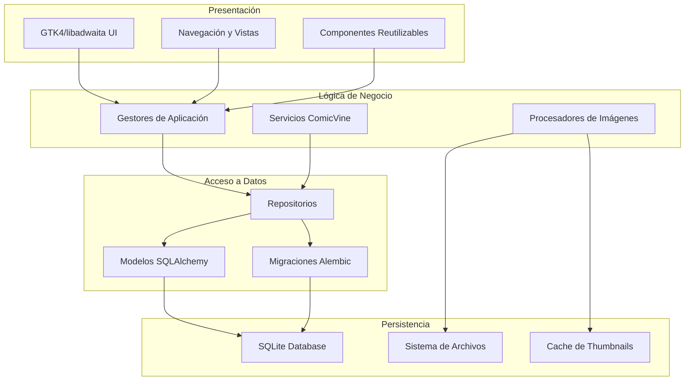
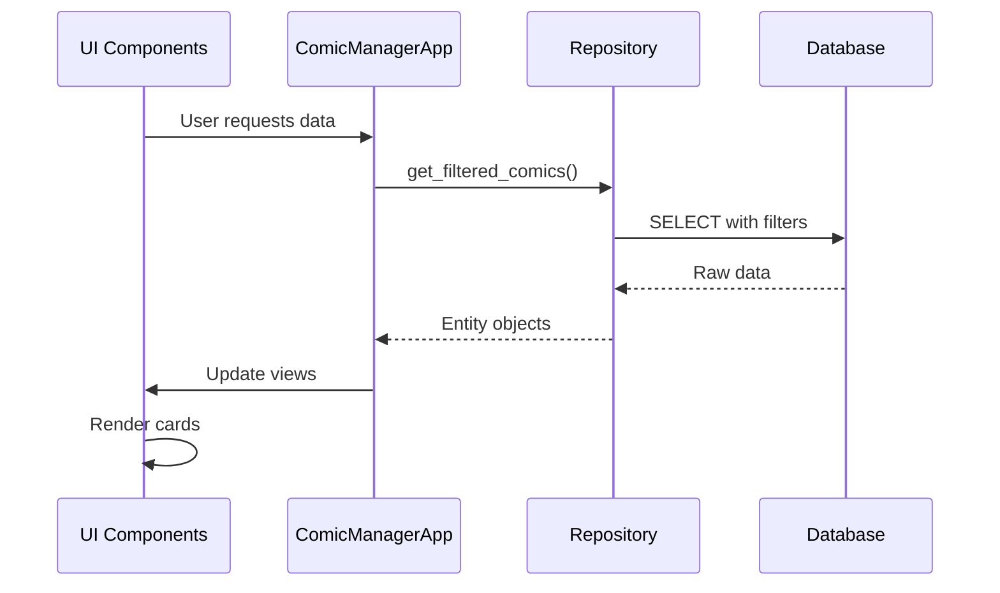
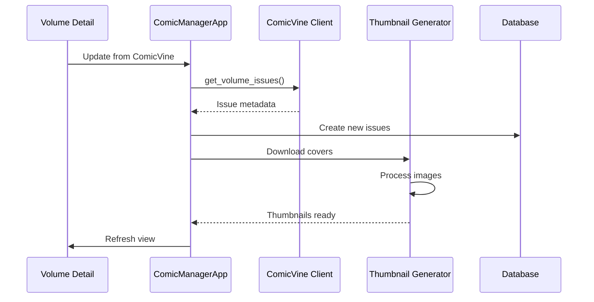
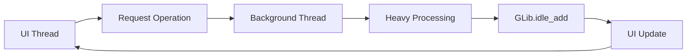

# Arquitectura del Sistema

Babelcomics4 está diseñado con una arquitectura modular y escalable que separa claramente la lógica de negocio, el acceso a datos y la presentación.

## 🏗️ Arquitectura General

### Diagrama de Capas



### Principios de Diseño

#### 1. Separación de Responsabilidades
- **UI**: Solo manejo de interfaz y eventos
- **Lógica**: Procesamiento y reglas de negocio
- **Datos**: Acceso y persistencia

#### 2. Inversión de Dependencias
- Las capas superiores dependen de abstracciones
- Uso de patrones Repository y Service

#### 3. Modularidad
- Componentes independientes y reutilizables
- Bajo acoplamiento entre módulos

#### 4. Escalabilidad
- Threading para operaciones pesadas
- Cache eficiente de recursos
- Paginación de datos

## 📁 Estructura del Proyecto

### Organización de Directorios

```
Babelcomics4/
├── 📄 Babelcomic4.py                 # Aplicación principal y UI
├── 📁 entidades/                     # Modelos de dominio
│   ├── __init__.py                   # Configuración SQLAlchemy
│   ├── comicbook_model.py            # Modelo Comic
│   ├── comicbook_info_model.py       # Modelo Issue/Metadata
│   ├── comicbook_info_cover_model.py # Modelo Cover
│   ├── volume_model.py               # Modelo Volume
│   └── publisher_model.py            # Modelo Publisher
├── 📁 repositories/                  # Capa de acceso a datos
│   ├── base_repository_gtk4.py       # Repositorio base
│   ├── comicbook_repository_gtk4.py  # Repositorio Comics
│   ├── volume_repository.py          # Repositorio Volumes
│   └── publisher_repository.py       # Repositorio Publishers
├── 📁 helpers/                       # Servicios y utilidades
│   ├── comicvine_client.py          # Cliente API ComicVine
│   └── comicvine_helpers.py         # Utilidades ComicVine
├── 📄 db_manager.py                 # Gestor de base de datos
├── 📄 thumbnail_generator.py        # Generador de thumbnails
├── 📄 comic_cards.py               # Componentes UI Cards
├── 📄 filter_dialog.py             # Diálogos de filtro
├── 📄 volume_detail_page.py        # Página detalle volumen
├── 📄 selectable_card.py           # Componente selección
├── 📁 data/                        # Datos y cache
│   ├── babelcomics.db              # Base de datos SQLite
│   └── thumbnails/                 # Cache de imágenes
└── 📁 images/                      # Recursos estáticos
```

### Responsabilidades por Módulo

#### 🎨 Capa de Presentación
```python
# Babelcomic4.py - Aplicación principal
class ComicManagerApp(Adw.Application):
    """Aplicación principal GTK4/libadwaita"""
    - Gestión de ventanas y navegación
    - Manejo de eventos de usuario
    - Coordinación entre componentes UI

# comic_cards.py - Componentes UI
class ComicCard, VolumeCard, PublisherCard:
    """Cards reutilizables para diferentes entidades"""
    - Presentación visual de datos
    - Interacciones básicas (click, hover)
    - Carga de thumbnails

# filter_dialog.py - Diálogos especializados
class AdvancedFilterDialog:
    """Interfaz de filtros avanzados"""
    - Configuración de criterios de filtrado
    - Validación de entrada
    - Comunicación con lógica de negocio
```

#### 🧠 Capa de Lógica de Negocio
```python
# db_manager.py - Gestión de datos
class DatabaseManager:
    """Coordinador de operaciones de datos"""
    - Inicialización de base de datos
    - Transacciones complejas
    - Migraciones de esquema

# thumbnail_generator.py - Procesamiento de imágenes
class ThumbnailGenerator:
    """Generación y cache de thumbnails"""
    - Extracción de imágenes de comics
    - Redimensionado y optimización
    - Cache inteligente

# helpers/comicvine_client.py - Integración externa
class ComicVineClient:
    """Cliente para API ComicVine"""
    - Autenticación y rate limiting
    - Búsqueda y descarga de metadata
    - Manejo de errores y reintentos
```

#### 💾 Capa de Acceso a Datos
```python
# repositories/base_repository_gtk4.py
class BaseRepository:
    """Repositorio base con funcionalidad común"""
    - Operaciones CRUD básicas
    - Sistema de filtrado
    - Paginación y ordenamiento

# repositories/comicbook_repository_gtk4.py
class ComicbookRepository(BaseRepository):
    """Repositorio específico para comics"""
    - Consultas complejas de comics
    - Filtros especializados (clasificación, calidad)
    - Joins con entidades relacionadas
```

## 🔄 Flujos de Datos

### Flujo de Visualización



### Flujo de ComicVine



### Flujo de Threading



## 🎯 Patrones de Diseño

### 1. Repository Pattern

#### Abstracción de Datos
```python
class BaseRepository:
    """Patrón Repository para abstracción de datos"""

    def obtener_pagina(self, modelo, pagina, tamanio, orden, direccion):
        """Paginación genérica"""
        query = self.session.query(modelo)
        query = self._apply_filters(query, modelo)
        query = self._apply_sorting(query, modelo, orden, direccion)

        offset = pagina * tamanio
        return query.offset(offset).limit(tamanio).all()

    def filtrar(self, **kwargs):
        """Sistema de filtrado flexible"""
        self.filtros.update(kwargs)
```

#### Ventajas
- ✅ Separación clara entre lógica y datos
- ✅ Facilita testing con mocks
- ✅ Reutilización de consultas comunes
- ✅ Abstracción del ORM subyacente

### 2. Model-View-Controller (MVC)

#### Separación de Responsabilidades
```python
# Model (entidades/)
class Comicbook(Base):
    """Modelo de datos puro"""
    # Solo definición de estructura y relaciones

# View (UI Components)
class ComicCard(Gtk.Widget):
    """Vista pura, solo presentación"""
    # Solo lógica de rendering y eventos básicos

# Controller (ComicManagerApp)
class ComicManagerApp:
    """Controlador, coordina Model y View"""
    # Lógica de aplicación, coordina operaciones
```

### 3. Observer Pattern

#### Actualización Reactiva
```python
class ThumbnailGenerator:
    """Observable para eventos de thumbnails"""

    def request_thumbnail(self, path, item_id, item_type, callback):
        """Patrón callback para notificación asíncrona"""
        # Procesar en background
        # Notificar via callback cuando esté listo

class ComicCard:
    """Observer de eventos de thumbnails"""

    def on_thumbnail_ready(self, thumbnail_path):
        """Callback cuando thumbnail está listo"""
        GLib.idle_add(self.update_image, thumbnail_path)
```

### 4. Factory Pattern

#### Creación de Cards
```python
class CardFactory:
    """Factory para crear cards según tipo de entidad"""

    @staticmethod
    def create_card(item, item_type, thumbnail_generator):
        if item_type == "comics":
            return ComicCard(item, thumbnail_generator)
        elif item_type == "volumes":
            return VolumeCard(item, thumbnail_generator)
        elif item_type == "publishers":
            return PublisherCard(item, thumbnail_generator)
        else:
            raise ValueError(f"Unknown item type: {item_type}")
```

## 🧵 Gestión de Concurrencia

### Threading Model

#### Hilos de la Aplicación
```python
# 1. Main UI Thread (GTK)
# - Manejo de eventos UI
# - Renderizado de componentes
# - Coordinación general

# 2. Thumbnail Generation Thread
# - Procesamiento de imágenes
# - Extracción de páginas de comics
# - Cache de thumbnails

# 3. ComicVine API Threads (Pool)
# - Requests HTTP concurrentes
# - Descarga de metadata
# - Descarga de imágenes
```

#### Sincronización
```python
# Comunicación Thread-Safe
import queue
from threading import ThreadPoolExecutor

class ThumbnailGenerator:
    def __init__(self):
        self.thumbnail_queue = queue.Queue()
        self.executor = ThreadPoolExecutor(max_workers=3)

    def request_thumbnail(self, path, callback):
        future = self.executor.submit(self._generate_thumbnail, path)
        future.add_done_callback(
            lambda f: GLib.idle_add(callback, f.result())
        )
```

### Gestión de Estado

#### Estado de la Aplicación
```python
class ApplicationState:
    """Estado centralizado de la aplicación"""

    def __init__(self):
        self.current_view = "comics"          # Vista activa
        self.current_filters = {}             # Filtros aplicados
        self.search_text = ""                 # Texto de búsqueda
        self.items_data = []                  # Datos cargados
        self.loaded_items = 0                 # Paginación
        self.selection_mode = False           # Modo selección

    def clear_filters(self):
        """Limpiar filtros manteniendo vista"""
        self.current_filters = {}
        self.search_text = ""
```

## 🔌 Extensibilidad

### Puntos de Extensión

#### 1. Nuevos Tipos de Cards
```python
class NewEntityCard(SelectableCard):
    """Nueva card para tipo de entidad personalizada"""

    def __init__(self, item, thumbnail_generator):
        super().__init__()
        self.setup_ui()

    def request_thumbnail(self):
        """Implementar lógica específica de thumbnails"""
        pass
```

#### 2. Nuevos Repositorios
```python
class CustomRepository(BaseRepository):
    """Repositorio para nueva entidad"""

    def __init__(self, session):
        super().__init__(session)

    def custom_query(self, **kwargs):
        """Consultas específicas del dominio"""
        pass
```

#### 3. Nuevos Servicios Externos
```python
class AlternativeAPIClient:
    """Cliente para API alternativa a ComicVine"""

    def search_volumes(self, query):
        """Implementar búsqueda en API alternativa"""
        pass
```

### Configurabilidad
```python
# config.py - Configuración centralizada
class Config:
    DATABASE_URL = "sqlite:///data/babelcomics.db"
    THUMBNAIL_SIZE = (200, 300)
    COMICVINE_API_URL = "https://comicvine.gamespot.com/api"
    CACHE_EXPIRY_DAYS = 30
    MAX_CONCURRENT_DOWNLOADS = 5
```

## 📊 Métricas y Monitoreo

### Logging
```python
import logging

# Configuración de logging por módulo
logging.basicConfig(
    level=logging.INFO,
    format='%(asctime)s - %(name)s - %(levelname)s - %(message)s'
)

# Loggers específicos
db_logger = logging.getLogger('database')
api_logger = logging.getLogger('comicvine')
ui_logger = logging.getLogger('ui')
```

### Métricas de Performance
```python
import time
import functools

def monitor_performance(func):
    """Decorator para monitorear performance"""
    @functools.wraps(func)
    def wrapper(*args, **kwargs):
        start_time = time.time()
        result = func(*args, **kwargs)
        execution_time = time.time() - start_time

        logger.info(f"{func.__name__} executed in {execution_time:.2f}s")
        return result
    return wrapper
```

## 🛡️ Manejo de Errores

### Estrategia de Errores
```python
# Jerarquía de excepciones
class BabelcomicsError(Exception):
    """Base exception para errores de la aplicación"""
    pass

class DatabaseError(BabelcomicsError):
    """Errores relacionados con base de datos"""
    pass

class ComicVineError(BabelcomicsError):
    """Errores de integración ComicVine"""
    pass

class ThumbnailError(BabelcomicsError):
    """Errores de generación de thumbnails"""
    pass
```

### Recuperación Graceful
```python
def safe_operation(func, fallback=None, log_error=True):
    """Wrapper para operaciones que pueden fallar"""
    try:
        return func()
    except Exception as e:
        if log_error:
            logger.error(f"Error in {func.__name__}: {e}")
        return fallback
```

---

**¿Quieres profundizar en los modelos de datos?** 👉 [Modelos de Datos](modelos.md)