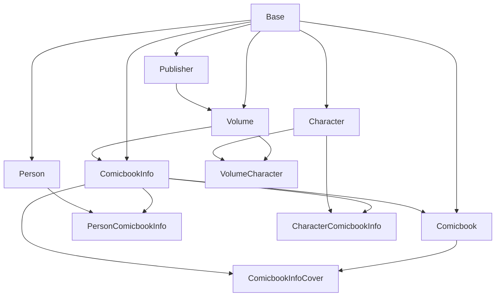

# Modelos de Datos

Los modelos de datos de Babelcomics4 están diseñados usando SQLAlchemy ORM, proporcionando una estructura robusta y escalable para gestionar comics, volúmenes, editoriales y metadatos relacionados con una arquitectura orientada a objetos.

## 🏗️ Arquitectura de Modelos

### Jerarquía de Entidades



### Base de Modelos

#### Clase Base Abstracta
```python
from sqlalchemy import Column, String, DateTime, Boolean, Integer, Float, Text, Date, ForeignKey
from sqlalchemy.ext.declarative import declarative_base
from sqlalchemy.orm import relationship, Session
from sqlalchemy.sql import func
import uuid
from datetime import datetime
from typing import Optional, List, Dict, Any

Base = declarative_base()

class BaseModel(Base):
    """Clase base abstracta para todos los modelos"""

    __abstract__ = True

    # Metadatos comunes
    created_at = Column(DateTime, default=datetime.utcnow, nullable=False)
    updated_at = Column(DateTime, default=datetime.utcnow, onupdate=datetime.utcnow, nullable=False)

    @classmethod
    def generate_uuid(cls) -> str:
        """Generar UUID único para claves primarias"""
        return str(uuid.uuid4())

    def to_dict(self, include_relationships: bool = False) -> Dict[str, Any]:
        """Convertir modelo a diccionario"""
        result = {}

        # Atributos básicos
        for column in self.__table__.columns:
            value = getattr(self, column.name)
            if isinstance(value, datetime):
                value = value.isoformat()
            elif isinstance(value, date):
                value = value.isoformat()
            result[column.name] = value

        # Relaciones si se solicitan
        if include_relationships:
            for relationship_name in self.__mapper__.relationships.keys():
                relationship_value = getattr(self, relationship_name)
                if relationship_value is not None:
                    if isinstance(relationship_value, list):
                        result[relationship_name] = [
                            item.to_dict(include_relationships=False)
                            for item in relationship_value
                        ]
                    else:
                        result[relationship_name] = relationship_value.to_dict(
                            include_relationships=False
                        )

        return result

    def update_from_dict(self, data: Dict[str, Any], exclude_fields: List[str] = None):
        """Actualizar modelo desde diccionario"""
        exclude_fields = exclude_fields or ['id', 'created_at', 'updated_at']

        for key, value in data.items():
            if key not in exclude_fields and hasattr(self, key):
                setattr(self, key, value)

        self.updated_at = datetime.utcnow()

    def __repr__(self):
        """Representación string del modelo"""
        attrs = []
        for key in ['id', 'name', 'title', 'filename']:
            if hasattr(self, key):
                value = getattr(self, key)
                if value is not None:
                    attrs.append(f"{key}='{value}'")
                    break

        return f"<{self.__class__.__name__}({', '.join(attrs)})>"
```

## 📚 Modelos Principales

### Modelo Comicbook

#### Entidad Principal de Comics
```python
class Comicbook(BaseModel):
    """Modelo principal para archivos de comics físicos"""

    __tablename__ = 'comicbooks'

    # Clave primaria
    id_comicbook = Column(String, primary_key=True, default=BaseModel.generate_uuid)

    # Información del archivo físico
    path = Column(String, nullable=False, unique=True, index=True)
    filename = Column(String, nullable=False, index=True)
    tamaño = Column(Integer, nullable=True)  # Tamaño en bytes
    checksum = Column(String, nullable=True)  # Hash MD5 del archivo

    # Estado del comic
    en_papelera = Column(Boolean, default=False, nullable=False, index=True)
    calidad = Column(Integer, default=0, nullable=False, index=True)  # 0-5 estrellas
    cantidad_adquirida = Column(Integer, default=1, nullable=False)  # Copias físicas

    # Metadatos de procesamiento
    fecha_agregado = Column(DateTime, default=datetime.utcnow, nullable=False, index=True)
    fecha_ultimo_acceso = Column(DateTime, nullable=True)
    contador_lecturas = Column(Integer, default=0, nullable=False)

    # Relación con información catalogada (opcional)
    id_comicbook_info = Column(
        String,
        ForeignKey('comicbooks_info.id_comicbook_info', ondelete='SET NULL'),
        nullable=True,
        index=True
    )

    # Relaciones
    comic_info = relationship(
        "ComicbookInfo",
        back_populates="owned_comics",
        lazy='select'
    )

    # Propiedades calculadas
    @property
    def is_cataloged(self) -> bool:
        """Verificar si el comic está catalogado con ComicVine"""
        return (
            self.id_comicbook_info is not None and
            self.id_comicbook_info != '' and
            self.comic_info is not None
        )

    @property
    def file_exists(self) -> bool:
        """Verificar si el archivo físico existe en el disco"""
        import os
        return os.path.exists(self.path) if self.path else False

    @property
    def file_size_mb(self) -> float:
        """Tamaño del archivo en megabytes"""
        return round(self.tamaño / (1024 * 1024), 2) if self.tamaño else 0.0

    @property
    def file_extension(self) -> str:
        """Extensión del archivo"""
        import os
        return os.path.splitext(self.filename)[1].lower() if self.filename else ''

    @property
    def display_title(self) -> str:
        """Título para mostrar en la interfaz"""
        if self.is_cataloged and self.comic_info:
            return self.comic_info.display_title
        return os.path.splitext(self.filename)[0] if self.filename else 'Unknown Comic'

    @property
    def has_physical_copies(self) -> bool:
        """Verificar si hay copias físicas del comic"""
        return self.cantidad_adquirida > 0

    @property
    def quality_stars(self) -> str:
        """Representación visual de la calidad en estrellas"""
        filled_stars = '★' * self.calidad
        empty_stars = '☆' * (5 - self.calidad)
        return filled_stars + empty_stars

    # Métodos de negocio
    def mark_as_read(self):
        """Marcar comic como leído"""
        self.fecha_ultimo_acceso = datetime.utcnow()
        self.contador_lecturas += 1

    def move_to_trash(self):
        """Mover comic a papelera"""
        self.en_papelera = True
        self.updated_at = datetime.utcnow()

    def restore_from_trash(self):
        """Restaurar comic de papelera"""
        self.en_papelera = False
        self.updated_at = datetime.utcnow()

    def set_quality(self, quality: int):
        """Establecer calidad del comic (0-5)"""
        if 0 <= quality <= 5:
            self.calidad = quality
            self.updated_at = datetime.utcnow()
        else:
            raise ValueError("Quality must be between 0 and 5")

    def calculate_checksum(self) -> str:
        """Calcular checksum MD5 del archivo"""
        import hashlib

        if not self.file_exists:
            return None

        hash_md5 = hashlib.md5()
        try:
            with open(self.path, "rb") as f:
                for chunk in iter(lambda: f.read(4096), b""):
                    hash_md5.update(chunk)

            self.checksum = hash_md5.hexdigest()
            return self.checksum
        except Exception as e:
            print(f"Error calculating checksum for {self.path}: {e}")
            return None

    def validate_file(self) -> Dict[str, bool]:
        """Validar integridad del archivo"""
        validation = {
            'exists': self.file_exists,
            'readable': False,
            'valid_format': False,
            'checksum_valid': False
        }

        if validation['exists']:
            try:
                # Verificar legibilidad
                with open(self.path, 'rb') as f:
                    f.read(1)
                validation['readable'] = True

                # Verificar formato
                valid_extensions = ['.cbz', '.cbr', '.pdf', '.zip', '.rar']
                validation['valid_format'] = self.file_extension in valid_extensions

                # Verificar checksum si existe
                if self.checksum:
                    current_checksum = self.calculate_checksum()
                    validation['checksum_valid'] = current_checksum == self.checksum
                else:
                    validation['checksum_valid'] = True  # No checksum to validate

            except Exception as e:
                print(f"Error validating file {self.path}: {e}")

        return validation

    @classmethod
    def create_from_file(cls, file_path: str, session: Session) -> 'Comicbook':
        """Crear nuevo comic desde archivo"""
        import os

        if not os.path.exists(file_path):
            raise FileNotFoundError(f"File not found: {file_path}")

        # Verificar si ya existe
        existing = session.query(cls).filter_by(path=file_path).first()
        if existing:
            return existing

        # Crear nuevo comic
        comic = cls(
            path=file_path,
            filename=os.path.basename(file_path),
            tamaño=os.path.getsize(file_path)
        )

        # Calcular checksum
        comic.calculate_checksum()

        return comic
```

### Modelo ComicbookInfo

#### Información Catalogada de ComicVine
```python
class ComicbookInfo(BaseModel):
    """Información detallada del comic desde ComicVine"""

    __tablename__ = 'comicbooks_info'

    # Clave primaria
    id_comicbook_info = Column(String, primary_key=True, default=BaseModel.generate_uuid)

    # Información básica del issue
    titulo = Column(String, nullable=False, index=True)
    numero = Column(String, nullable=True, index=True)  # "1", "1.1", "Annual 1"
    fecha_tapa = Column(Date, nullable=True, index=True)
    fecha_venta = Column(Date, nullable=True)

    # Contenido
    resumen = Column(Text, nullable=True)
    sinopsis = Column(Text, nullable=True)
    paginas = Column(Integer, nullable=True)

    # URLs y referencias externas
    url_api_detalle = Column(String, nullable=True)
    url_sitio_web = Column(String, nullable=True)
    url_wiki = Column(String, nullable=True)

    # Métricas y valoraciones
    calificacion = Column(Float, default=0.0, nullable=False)  # ComicVine rating
    puntuacion_usuarios = Column(Float, nullable=True)
    numero_votos = Column(Integer, default=0, nullable=False)

    # Referencias a ComicVine
    id_comicvine = Column(Integer, nullable=True, unique=True, index=True)
    ultima_sync_comicvine = Column(DateTime, nullable=True)

    # Relación con volumen
    id_volume = Column(
        String,
        ForeignKey('volumens.id_volume', ondelete='CASCADE'),
        nullable=True,
        index=True
    )

    # Relaciones
    volume = relationship("Volume", back_populates="issues", lazy='select')
    owned_comics = relationship("Comicbook", back_populates="comic_info", lazy='select')
    portadas = relationship(
        "ComicbookInfoCover",
        back_populates="comic_info",
        cascade="all, delete-orphan",
        lazy='select'
    )
    equipo_creativo = relationship(
        "PersonComicbookInfo",
        back_populates="comic_info",
        cascade="all, delete-orphan",
        lazy='select'
    )
    personajes = relationship(
        "CharacterComicbookInfo",
        back_populates="comic_info",
        cascade="all, delete-orphan",
        lazy='select'
    )

    # Propiedades calculadas
    @property
    def display_title(self) -> str:
        """Título completo para mostrar"""
        if self.numero:
            return f"{self.titulo} #{self.numero}"
        return self.titulo

    @property
    def year(self) -> Optional[int]:
        """Año de la fecha de tapa"""
        return self.fecha_tapa.year if self.fecha_tapa else None

    @property
    def month_year(self) -> Optional[str]:
        """Mes y año formateado"""
        if self.fecha_tapa:
            return self.fecha_tapa.strftime("%m/%Y")
        return None

    @property
    def has_cover_image(self) -> bool:
        """Verificar si tiene imagen de portada"""
        return len(self.portadas) > 0

    @property
    def primary_cover_url(self) -> Optional[str]:
        """URL de la portada principal"""
        if self.portadas:
            # Buscar portada principal o tomar la primera
            primary = next((cover for cover in self.portadas if cover.es_principal), None)
            if primary:
                return primary.url_imagen
            elif self.portadas:
                return self.portadas[0].url_imagen
        return None

    @property
    def publisher_name(self) -> str:
        """Nombre de la editorial"""
        if self.volume and self.volume.publisher:
            return self.volume.publisher.nombre
        return "Unknown Publisher"

    @property
    def volume_name(self) -> str:
        """Nombre del volumen"""
        if self.volume:
            return self.volume.display_name
        return "Unknown Volume"

    @property
    def creative_team_summary(self) -> Dict[str, List[str]]:
        """Resumen del equipo creativo"""
        team = {}
        for person_comic in self.equipo_creativo:
            role = person_comic.rol
            if role not in team:
                team[role] = []
            team[role].append(person_comic.person.nombre)
        return team

    @property
    def main_characters(self) -> List[str]:
        """Lista de personajes principales"""
        return [
            char_comic.character.nombre
            for char_comic in self.personajes
            if char_comic.es_principal
        ]

    @property
    def is_owned(self) -> bool:
        """Verificar si se posee físicamente"""
        return len(self.owned_comics) > 0

    @property
    def owned_copies_count(self) -> int:
        """Número de copias físicas poseídas"""
        return sum(comic.cantidad_adquirida for comic in self.owned_comics)

    # Métodos de negocio
    def add_cover_image(self, url: str, is_primary: bool = False):
        """Añadir imagen de portada"""
        if is_primary:
            # Marcar otras portadas como no principales
            for cover in self.portadas:
                cover.es_principal = False

        cover = ComicbookInfoCover(
            url_imagen=url,
            es_principal=is_primary,
            comic_info=self
        )
        self.portadas.append(cover)

    def add_creative_team_member(self, person: 'Person', role: str):
        """Añadir miembro del equipo creativo"""
        person_comic = PersonComicbookInfo(
            person=person,
            comic_info=self,
            rol=role
        )
        self.equipo_creativo.append(person_comic)

    def add_character(self, character: 'Character', is_main: bool = False):
        """Añadir personaje que aparece en el comic"""
        char_comic = CharacterComicbookInfo(
            character=character,
            comic_info=self,
            es_principal=is_main
        )
        self.personajes.append(char_comic)

    def update_from_comicvine(self, comicvine_data: Dict[str, Any]):
        """Actualizar información desde datos de ComicVine"""
        # Mapeo de campos
        field_mapping = {
            'name': 'titulo',
            'issue_number': 'numero',
            'cover_date': 'fecha_tapa',
            'store_date': 'fecha_venta',
            'description': 'resumen',
            'api_detail_url': 'url_api_detalle',
            'site_detail_url': 'url_sitio_web',
            'id': 'id_comicvine'
        }

        for comicvine_field, model_field in field_mapping.items():
            if comicvine_field in comicvine_data:
                value = comicvine_data[comicvine_field]

                # Procesamiento especial para fechas
                if model_field in ['fecha_tapa', 'fecha_venta'] and value:
                    from datetime import datetime
                    if isinstance(value, str):
                        try:
                            value = datetime.strptime(value, '%Y-%m-%d').date()
                        except ValueError:
                            value = None

                setattr(self, model_field, value)

        self.ultima_sync_comicvine = datetime.utcnow()

    def needs_comicvine_update(self, days_threshold: int = 30) -> bool:
        """Verificar si necesita actualización desde ComicVine"""
        if not self.ultima_sync_comicvine:
            return True

        from datetime import timedelta
        threshold_date = datetime.utcnow() - timedelta(days=days_threshold)
        return self.ultima_sync_comicvine < threshold_date
```

### Modelo Volume

#### Volúmenes/Series de Comics
```python
class Volume(BaseModel):
    """Modelo para volúmenes de comics (series)"""

    __tablename__ = 'volumens'

    # Clave primaria
    id_volume = Column(String, primary_key=True, default=BaseModel.generate_uuid)

    # Información básica
    nombre = Column(String, nullable=False, index=True)
    anio_inicio = Column(Integer, nullable=True, index=True)
    anio_fin = Column(Integer, nullable=True, index=True)
    resumen = Column(Text, nullable=True)

    # Metadatos de publicación
    cantidad_numeros = Column(Integer, default=0, nullable=False)
    estado = Column(String, default='unknown', nullable=False)  # ongoing, completed, cancelled
    tipo = Column(String, default='regular', nullable=False)    # regular, mini-series, one-shot

    # URLs y referencias
    url_api_detalle = Column(String, nullable=True)
    url_sitio_web = Column(String, nullable=True)
    imagen_portada = Column(String, nullable=True)

    # ComicVine
    id_comicvine = Column(Integer, nullable=True, unique=True, index=True)
    ultima_sync_comicvine = Column(DateTime, nullable=True)

    # Relación con editorial
    id_publisher = Column(
        String,
        ForeignKey('publishers.id_publisher', ondelete='SET NULL'),
        nullable=True,
        index=True
    )

    # Relaciones
    publisher = relationship("Publisher", back_populates="volumes", lazy='select')
    issues = relationship(
        "ComicbookInfo",
        back_populates="volume",
        cascade="all, delete-orphan",
        order_by="ComicbookInfo.numero",
        lazy='select'
    )
    personajes = relationship(
        "VolumeCharacter",
        back_populates="volume",
        cascade="all, delete-orphan",
        lazy='select'
    )

    # Propiedades calculadas
    @property
    def display_name(self) -> str:
        """Nombre para mostrar con años"""
        if self.anio_inicio:
            if self.anio_fin and self.anio_fin != self.anio_inicio:
                return f"{self.nombre} ({self.anio_inicio}-{self.anio_fin})"
            else:
                return f"{self.nombre} ({self.anio_inicio})"
        return self.nombre

    @property
    def issues_in_collection(self) -> int:
        """Número de issues que se poseen físicamente"""
        return len([issue for issue in self.issues if issue.owned_comics])

    @property
    def total_owned_copies(self) -> int:
        """Total de copias físicas de todos los issues"""
        return sum(
            issue.owned_copies_count for issue in self.issues
        )

    @property
    def completion_percentage(self) -> float:
        """Porcentaje de completitud de la colección"""
        if self.cantidad_numeros == 0:
            return 0.0
        return round((self.issues_in_collection / self.cantidad_numeros) * 100, 1)

    @property
    def is_complete(self) -> bool:
        """Verificar si la colección está completa"""
        return self.completion_percentage >= 100.0

    @property
    def is_ongoing(self) -> bool:
        """Verificar si la serie está en curso"""
        return self.estado.lower() == 'ongoing'

    @property
    def duration_years(self) -> Optional[int]:
        """Duración de la serie en años"""
        if self.anio_inicio:
            end_year = self.anio_fin or datetime.now().year
            return end_year - self.anio_inicio + 1
        return None

    @property
    def missing_issues(self) -> List[str]:
        """Lista de números de issues faltantes"""
        if not self.issues:
            return []

        owned_numbers = set()
        for issue in self.issues:
            if issue.owned_comics:
                try:
                    # Intentar convertir número a entero para comparación
                    num = int(float(issue.numero))
                    owned_numbers.add(num)
                except (ValueError, TypeError):
                    pass

        if not owned_numbers:
            return []

        # Generar lista de números faltantes
        min_num = min(owned_numbers)
        max_num = max(owned_numbers)
        missing = []

        for num in range(min_num, max_num + 1):
            if num not in owned_numbers:
                missing.append(str(num))

        return missing

    @property
    def average_quality(self) -> float:
        """Calidad promedio de los comics en la colección"""
        owned_comics = [
            comic for issue in self.issues
            for comic in issue.owned_comics
        ]

        if not owned_comics:
            return 0.0

        total_quality = sum(comic.calidad for comic in owned_comics)
        return round(total_quality / len(owned_comics), 2)

    # Métodos de negocio
    def add_issue(self, issue_info: ComicbookInfo):
        """Añadir issue al volumen"""
        issue_info.id_volume = self.id_volume
        self.issues.append(issue_info)
        self.update_issue_count()

    def update_issue_count(self):
        """Actualizar contador de issues"""
        self.cantidad_numeros = len(self.issues)
        self.updated_at = datetime.utcnow()

    def get_issues_by_number_range(self, start: int, end: int) -> List[ComicbookInfo]:
        """Obtener issues en un rango de números"""
        return [
            issue for issue in self.issues
            if issue.numero and issue.numero.isdigit() and
            start <= int(issue.numero) <= end
        ]

    def find_gaps_in_collection(self) -> List[Dict[str, Any]]:
        """Encontrar gaps en la colección"""
        gaps = []

        # Obtener números de issues poseídos ordenados
        owned_numbers = []
        for issue in self.issues:
            if issue.owned_comics and issue.numero:
                try:
                    num = int(float(issue.numero))
                    owned_numbers.append(num)
                except (ValueError, TypeError):
                    continue

        owned_numbers.sort()

        if len(owned_numbers) < 2:
            return gaps

        # Encontrar gaps
        for i in range(len(owned_numbers) - 1):
            current = owned_numbers[i]
            next_num = owned_numbers[i + 1]

            if next_num - current > 1:
                gap_start = current + 1
                gap_end = next_num - 1
                gap_size = gap_end - gap_start + 1

                gaps.append({
                    'start': gap_start,
                    'end': gap_end,
                    'size': gap_size,
                    'issues': list(range(gap_start, gap_end + 1))
                })

        return gaps

    def update_from_comicvine(self, comicvine_data: Dict[str, Any]):
        """Actualizar desde datos de ComicVine"""
        field_mapping = {
            'name': 'nombre',
            'start_year': 'anio_inicio',
            'description': 'resumen',
            'count_of_issues': 'cantidad_numeros',
            'api_detail_url': 'url_api_detalle',
            'site_detail_url': 'url_sitio_web',
            'id': 'id_comicvine'
        }

        for cv_field, model_field in field_mapping.items():
            if cv_field in comicvine_data:
                setattr(self, model_field, comicvine_data[cv_field])

        # Procesar imagen de portada
        if 'image' in comicvine_data and comicvine_data['image']:
            self.imagen_portada = comicvine_data['image'].get('original_url')

        self.ultima_sync_comicvine = datetime.utcnow()
```

## 🔗 Modelos de Relaciones

### Tablas de Unión

#### PersonComicbookInfo - Equipo Creativo
```python
class PersonComicbookInfo(BaseModel):
    """Relación entre personas y comics (equipo creativo)"""

    __tablename__ = 'people_comicbooks_info'

    # Clave primaria compuesta
    id_person = Column(
        String,
        ForeignKey('people.id_person', ondelete='CASCADE'),
        primary_key=True
    )
    id_comicbook_info = Column(
        String,
        ForeignKey('comicbooks_info.id_comicbook_info', ondelete='CASCADE'),
        primary_key=True
    )

    # Información específica de la relación
    rol = Column(String, nullable=False, index=True)  # writer, artist, colorist, etc.
    es_principal = Column(Boolean, default=False, nullable=False)
    orden = Column(Integer, default=0, nullable=False)  # Para ordenar créditos

    # Relaciones
    person = relationship("Person", lazy='select')
    comic_info = relationship("ComicbookInfo", back_populates="equipo_creativo", lazy='select')

    @property
    def role_display(self) -> str:
        """Nombre del rol para mostrar"""
        role_names = {
            'writer': 'Guionista',
            'artist': 'Dibujante',
            'penciller': 'Lápiz',
            'inker': 'Tinta',
            'colorist': 'Color',
            'letterer': 'Rotulador',
            'cover': 'Portada',
            'editor': 'Editor'
        }
        return role_names.get(self.rol.lower(), self.rol.title())
```

#### CharacterComicbookInfo - Personajes
```python
class CharacterComicbookInfo(BaseModel):
    """Relación entre personajes y comics"""

    __tablename__ = 'characters_comicbooks_info'

    # Clave primaria compuesta
    id_character = Column(
        String,
        ForeignKey('characters.id_character', ondelete='CASCADE'),
        primary_key=True
    )
    id_comicbook_info = Column(
        String,
        ForeignKey('comicbooks_info.id_comicbook_info', ondelete='CASCADE'),
        primary_key=True
    )

    # Metadatos de aparición
    es_principal = Column(Boolean, default=False, nullable=False)
    tipo_aparicion = Column(String, default='normal', nullable=False)  # normal, cameo, flashback
    descripcion_aparicion = Column(Text, nullable=True)

    # Relaciones
    character = relationship("Character", lazy='select')
    comic_info = relationship("ComicbookInfo", back_populates="personajes", lazy='select')
```

#### VolumeCharacter - Personajes por Volumen
```python
class VolumeCharacter(BaseModel):
    """Relación entre volúmenes y personajes principales"""

    __tablename__ = 'volume_characters'

    # Clave primaria compuesta
    id_volume = Column(
        String,
        ForeignKey('volumens.id_volume', ondelete='CASCADE'),
        primary_key=True
    )
    id_character = Column(
        String,
        ForeignKey('characters.id_character', ondelete='CASCADE'),
        primary_key=True
    )

    # Metadatos
    es_protagonista = Column(Boolean, default=False, nullable=False)
    primera_aparicion = Column(String, nullable=True)  # Número del issue
    descripcion = Column(Text, nullable=True)

    # Relaciones
    volume = relationship("Volume", back_populates="personajes", lazy='select')
    character = relationship("Character", lazy='select')
```

## 🖼️ Modelos de Medios

### ComicbookInfoCover - Portadas
```python
class ComicbookInfoCover(BaseModel):
    """Portadas de comics"""

    __tablename__ = 'comicbooks_info_covers'

    # Clave primaria
    id_cover = Column(String, primary_key=True, default=BaseModel.generate_uuid)

    # Información de la imagen
    url_imagen = Column(String, nullable=False)
    url_thumbnail = Column(String, nullable=True)
    ancho = Column(Integer, nullable=True)
    alto = Column(Integer, nullable=True)

    # Metadatos
    es_principal = Column(Boolean, default=True, nullable=False)
    tipo_portada = Column(String, default='front', nullable=False)  # front, back, variant
    descripcion = Column(String, nullable=True)

    # Información de descarga
    archivo_local = Column(String, nullable=True)  # Ruta local si se descargó
    fecha_descarga = Column(DateTime, nullable=True)
    tamaño_archivo = Column(Integer, nullable=True)

    # Relación con comic
    id_comicbook_info = Column(
        String,
        ForeignKey('comicbooks_info.id_comicbook_info', ondelete='CASCADE'),
        nullable=False,
        index=True
    )

    # Relaciones
    comic_info = relationship("ComicbookInfo", back_populates="portadas", lazy='select')

    @property
    def is_downloaded(self) -> bool:
        """Verificar si la imagen está descargada localmente"""
        import os
        return (
            self.archivo_local is not None and
            os.path.exists(self.archivo_local)
        )

    @property
    def aspect_ratio(self) -> Optional[float]:
        """Proporción de aspecto de la imagen"""
        if self.ancho and self.alto:
            return self.ancho / self.alto
        return None

    @property
    def file_size_mb(self) -> float:
        """Tamaño del archivo en MB"""
        return round(self.tamaño_archivo / (1024 * 1024), 2) if self.tamaño_archivo else 0.0

    def download_image(self, download_directory: str) -> bool:
        """Descargar imagen localmente"""
        import requests
        import os
        from urllib.parse import urlparse

        try:
            response = requests.get(self.url_imagen, timeout=30)
            response.raise_for_status()

            # Generar nombre de archivo
            parsed_url = urlparse(self.url_imagen)
            extension = os.path.splitext(parsed_url.path)[1] or '.jpg'
            filename = f"cover_{self.id_cover}{extension}"
            filepath = os.path.join(download_directory, filename)

            # Crear directorio si no existe
            os.makedirs(download_directory, exist_ok=True)

            # Guardar archivo
            with open(filepath, 'wb') as f:
                f.write(response.content)

            # Actualizar modelo
            self.archivo_local = filepath
            self.fecha_descarga = datetime.utcnow()
            self.tamaño_archivo = len(response.content)

            # Obtener dimensiones si es posible
            try:
                from PIL import Image
                with Image.open(filepath) as img:
                    self.ancho, self.alto = img.size
            except ImportError:
                pass

            return True

        except Exception as e:
            print(f"Error downloading cover image: {e}")
            return False
```

---

**¿Quieres conocer más sobre los repositorios?** 👉 [Repositorios](repositorios.md)