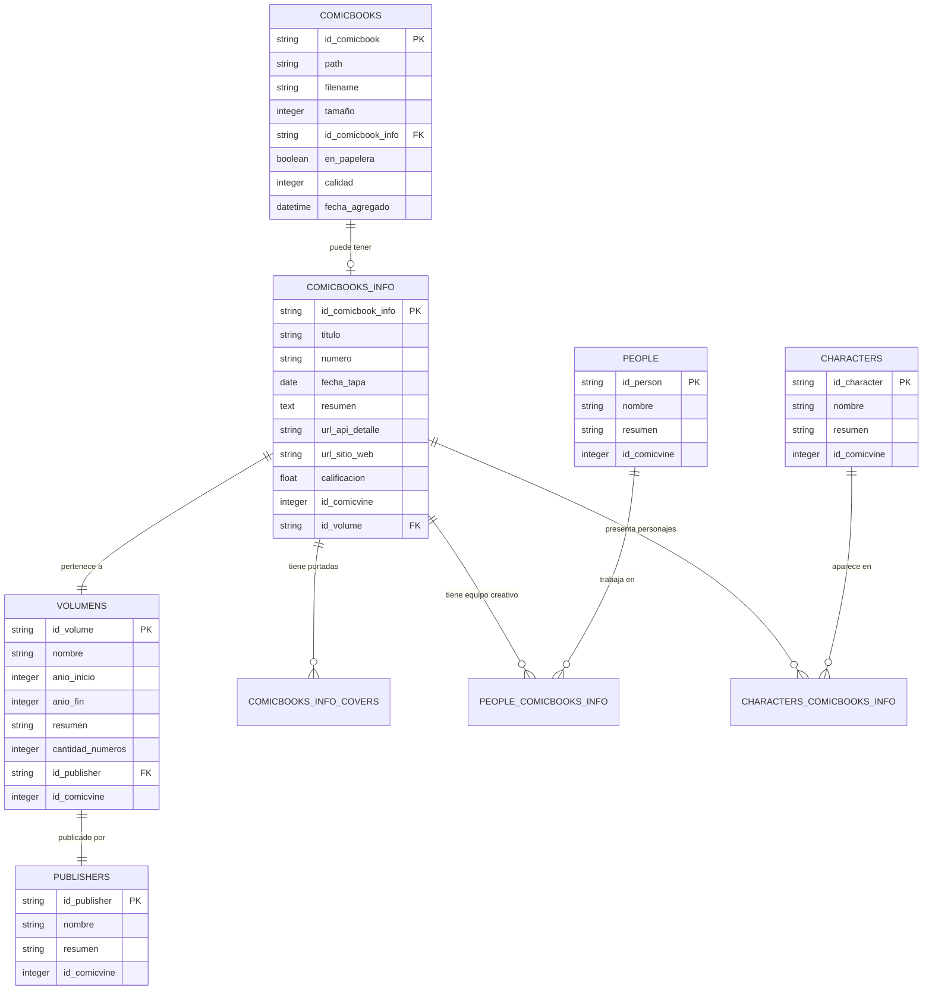

# Base de Datos

Babelcomics4 utiliza un sistema de base de datos robusto basado en SQLAlchemy ORM y SQLite, diseñado para gestionar eficientemente grandes colecciones de comics con integridad referencial y rendimiento optimizado.

## 🗄️ Arquitectura de la Base de Datos

### Modelo Entidad-Relación



### Tecnología y Stack

#### Componentes Principales
```python
# Stack de base de datos
DATABASE_STACK = {
    'ORM': 'SQLAlchemy 2.0+',
    'Engine': 'SQLite 3.x',
    'Connection_Pool': 'SQLAlchemy Pool',
    'Migration': 'Alembic',
    'Schema_Validation': 'Pydantic',
    'Query_Builder': 'SQLAlchemy Core/ORM'
}

# Configuración de conexión
DATABASE_CONFIG = {
    'url': 'sqlite:///data/babelcomics.db',
    'echo': False,  # SQL logging
    'pool_size': 20,
    'max_overflow': 30,
    'pool_timeout': 30,
    'pool_recycle': 3600,
    'isolation_level': 'READ_UNCOMMITTED'
}
```

## 📊 Modelos de Datos

### Modelo Principal: Comicbooks

#### Definición de la Entidad
```python
from sqlalchemy import Column, String, Integer, Boolean, DateTime, ForeignKey
from sqlalchemy.orm import relationship
from sqlalchemy.ext.declarative import declarative_base
import uuid
from datetime import datetime

Base = declarative_base()

class Comicbook(Base):
    """Modelo principal para archivos de comics"""

    __tablename__ = 'comicbooks'

    # Clave primaria
    id_comicbook = Column(String, primary_key=True, default=lambda: str(uuid.uuid4()))

    # Información del archivo
    path = Column(String, nullable=False, unique=True)
    filename = Column(String, nullable=False)
    tamaño = Column(Integer, nullable=True)  # Tamaño en bytes

    # Estado y metadatos
    en_papelera = Column(Boolean, default=False)
    calidad = Column(Integer, default=0)  # 0-5 estrellas
    fecha_agregado = Column(DateTime, default=datetime.utcnow)

    # Relación con información de comic (opcional)
    id_comicbook_info = Column(String, ForeignKey('comicbooks_info.id_comicbook_info'), nullable=True)

    # Relaciones
    comic_info = relationship("ComicbookInfo", back_populates="owned_comics")

    @property
    def is_cataloged(self):
        """Verificar si el comic está catalogado"""
        return self.id_comicbook_info is not None and self.id_comicbook_info != ''

    @property
    def file_exists(self):
        """Verificar si el archivo físico existe"""
        import os
        return os.path.exists(self.path)

    @property
    def file_size_mb(self):
        """Tamaño del archivo en MB"""
        return round(self.tamaño / (1024 * 1024), 2) if self.tamaño else 0

    def __repr__(self):
        return f"<Comicbook(filename='{self.filename}', cataloged={self.is_cataloged})>"
```

### Modelo de Información: ComicbookInfo

#### Metadatos de ComicVine
```python
class ComicbookInfo(Base):
    """Información detallada del comic desde ComicVine"""

    __tablename__ = 'comicbooks_info'

    # Clave primaria
    id_comicbook_info = Column(String, primary_key=True, default=lambda: str(uuid.uuid4()))

    # Información básica
    titulo = Column(String, nullable=False)
    numero = Column(String, nullable=True)  # Puede ser "1", "1.1", "Annual 1", etc.
    fecha_tapa = Column(Date, nullable=True)
    resumen = Column(Text, nullable=True)

    # URLs y referencias
    url_api_detalle = Column(String, nullable=True)
    url_sitio_web = Column(String, nullable=True)

    # Calificación y métricas
    calificacion = Column(Float, default=0.0)  # Calificación de ComicVine

    # Referencias externas
    id_comicvine = Column(Integer, nullable=True, unique=True)
    id_volume = Column(String, ForeignKey('volumens.id_volume'), nullable=True)

    # Relaciones
    volume = relationship("Volume", back_populates="issues")
    owned_comics = relationship("Comicbook", back_populates="comic_info")
    portadas = relationship("ComicbookInfoCover", back_populates="comic_info", cascade="all, delete-orphan")
    equipo_creativo = relationship("PersonComicbookInfo", back_populates="comic_info")
    personajes = relationship("CharacterComicbookInfo", back_populates="comic_info")

    @property
    def display_title(self):
        """Título para mostrar en UI"""
        if self.numero:
            return f"{self.titulo} #{self.numero}"
        return self.titulo

    @property
    def year(self):
        """Año de la fecha de tapa"""
        return self.fecha_tapa.year if self.fecha_tapa else None

    @property
    def has_cover_image(self):
        """Verificar si tiene imagen de portada"""
        return len(self.portadas) > 0

    def __repr__(self):
        return f"<ComicbookInfo(title='{self.titulo}', number='{self.numero}')>"
```

### Modelo de Volúmenes

#### Series y Colecciones
```python
class Volume(Base):
    """Volúmenes de comics (series)"""

    __tablename__ = 'volumens'

    # Clave primaria
    id_volume = Column(String, primary_key=True, default=lambda: str(uuid.uuid4()))

    # Información básica
    nombre = Column(String, nullable=False)
    anio_inicio = Column(Integer, nullable=True)
    anio_fin = Column(Integer, nullable=True)
    resumen = Column(Text, nullable=True)
    cantidad_numeros = Column(Integer, default=0)

    # Referencias externas
    id_comicvine = Column(Integer, nullable=True, unique=True)
    id_publisher = Column(String, ForeignKey('publishers.id_publisher'), nullable=True)

    # Metadatos adicionales
    estado = Column(String, default='unknown')  # ongoing, completed, cancelled
    tipo = Column(String, default='regular')    # regular, mini-series, one-shot

    # Relaciones
    publisher = relationship("Publisher", back_populates="volumes")
    issues = relationship("ComicbookInfo", back_populates="volume")

    @property
    def display_name(self):
        """Nombre para mostrar con años"""
        if self.anio_inicio:
            if self.anio_fin and self.anio_fin != self.anio_inicio:
                return f"{self.nombre} ({self.anio_inicio}-{self.anio_fin})"
            else:
                return f"{self.nombre} ({self.anio_inicio})"
        return self.nombre

    @property
    def issues_in_collection(self):
        """Número de issues en la colección"""
        return len([issue for issue in self.issues if issue.owned_comics])

    @property
    def completion_percentage(self):
        """Porcentaje de completitud de la colección"""
        if self.cantidad_numeros == 0:
            return 0
        return (self.issues_in_collection / self.cantidad_numeros) * 100

    @property
    def is_complete(self):
        """Verificar si la colección está completa"""
        return self.completion_percentage >= 100

    def __repr__(self):
        return f"<Volume(name='{self.nombre}', year={self.anio_inicio})>"
```

### Modelo de Editoriales

#### Publishers y Estudios
```python
class Publisher(Base):
    """Editoriales de comics"""

    __tablename__ = 'publishers'

    # Clave primaria
    id_publisher = Column(String, primary_key=True, default=lambda: str(uuid.uuid4()))

    # Información básica
    nombre = Column(String, nullable=False, unique=True)
    resumen = Column(Text, nullable=True)

    # Referencias externas
    id_comicvine = Column(Integer, nullable=True, unique=True)

    # Metadatos adicionales
    sitio_web = Column(String, nullable=True)
    pais = Column(String, nullable=True)
    anio_fundacion = Column(Integer, nullable=True)

    # Relaciones
    volumes = relationship("Volume", back_populates="publisher")

    @property
    def volume_count(self):
        """Número de volúmenes de esta editorial"""
        return len(self.volumes)

    @property
    def comic_count(self):
        """Número total de comics de esta editorial"""
        return sum(volume.issues_in_collection for volume in self.volumes)

    def __repr__(self):
        return f"<Publisher(name='{self.nombre}')>"
```

## 🔧 Operaciones de Base de Datos

### Gestor de Base de Datos

#### Clase Principal DatabaseManager
```python
from sqlalchemy import create_engine, text
from sqlalchemy.orm import sessionmaker, Session
from sqlalchemy.pool import StaticPool
import os
import sqlite3

class DatabaseManager:
    """Gestor centralizado de la base de datos"""

    def __init__(self, database_url=None):
        self.database_url = database_url or "sqlite:///data/babelcomics.db"
        self.engine = None
        self.SessionLocal = None
        self._initialize_database()

    def _initialize_database(self):
        """Inicializar conexión y configuración de la base de datos"""

        # Crear directorio de datos si no existe
        db_path = self.database_url.replace('sqlite:///', '')
        os.makedirs(os.path.dirname(db_path), exist_ok=True)

        # Configurar engine con optimizaciones para SQLite
        self.engine = create_engine(
            self.database_url,
            echo=False,
            poolclass=StaticPool,
            pool_pre_ping=True,
            connect_args={
                "check_same_thread": False,
                "timeout": 20,
                "isolation_level": None  # Para transacciones manuales
            }
        )

        # Configurar factory de sesiones
        self.SessionLocal = sessionmaker(
            autocommit=False,
            autoflush=False,
            bind=self.engine
        )

        # Crear tablas si no existen
        self._create_tables()

        # Aplicar optimizaciones de SQLite
        self._optimize_sqlite()

    def _create_tables(self):
        """Crear todas las tablas del modelo"""
        try:
            Base.metadata.create_all(bind=self.engine)
            print("Tablas de base de datos creadas/verificadas exitosamente")
        except Exception as e:
            print(f"Error creando tablas: {e}")
            raise

    def _optimize_sqlite(self):
        """Aplicar optimizaciones específicas de SQLite"""

        optimizations = [
            "PRAGMA journal_mode=WAL",           # Write-Ahead Logging
            "PRAGMA synchronous=NORMAL",         # Balance seguridad/rendimiento
            "PRAGMA cache_size=10000",           # Cache de 10MB
            "PRAGMA temp_store=MEMORY",          # Temporales en memoria
            "PRAGMA mmap_size=268435456",        # Memory mapping 256MB
            "PRAGMA optimize"                    # Optimización automática
        ]

        with self.engine.connect() as connection:
            for pragma in optimizations:
                try:
                    connection.execute(text(pragma))
                except Exception as e:
                    print(f"Warning: No se pudo aplicar {pragma}: {e}")

    def get_session(self) -> Session:
        """Obtener nueva sesión de base de datos"""
        return self.SessionLocal()

    def close(self):
        """Cerrar conexiones de base de datos"""
        if self.engine:
            self.engine.dispose()
```

### Repositorios de Datos

#### ComicRepository
```python
from typing import List, Optional, Dict, Any
from sqlalchemy.orm import Session
from sqlalchemy import func, and_, or_

class ComicRepository:
    """Repositorio para operaciones con comics"""

    def __init__(self, session: Session):
        self.session = session

    def get_all_comics(self, include_trash: bool = False) -> List[Comicbook]:
        """Obtener todos los comics"""
        query = self.session.query(Comicbook)

        if not include_trash:
            query = query.filter(Comicbook.en_papelera == False)

        return query.all()

    def get_comic_by_id(self, comic_id: str) -> Optional[Comicbook]:
        """Obtener comic por ID"""
        return self.session.query(Comicbook).filter(
            Comicbook.id_comicbook == comic_id
        ).first()

    def get_comic_by_path(self, path: str) -> Optional[Comicbook]:
        """Obtener comic por ruta de archivo"""
        return self.session.query(Comicbook).filter(
            Comicbook.path == path
        ).first()

    def search_comics(self, search_term: str, filters: Dict[str, Any] = None) -> List[Comicbook]:
        """Buscar comics con filtros"""
        query = self.session.query(Comicbook)

        # Búsqueda por texto
        if search_term:
            search_filter = or_(
                Comicbook.filename.ilike(f'%{search_term}%'),
                Comicbook.path.ilike(f'%{search_term}%')
            )

            # Si el comic tiene información catalogada, buscar también ahí
            query = query.outerjoin(ComicbookInfo)
            search_filter = or_(
                search_filter,
                ComicbookInfo.titulo.ilike(f'%{search_term}%')
            )

            query = query.filter(search_filter)

        # Aplicar filtros
        if filters:
            # Filtro de clasificación
            if 'classification' in filters:
                if filters['classification'] == 'cataloged':
                    query = query.filter(Comicbook.id_comicbook_info.isnot(None))
                elif filters['classification'] == 'uncataloged':
                    query = query.filter(
                        or_(
                            Comicbook.id_comicbook_info.is_(None),
                            Comicbook.id_comicbook_info == ''
                        )
                    )

            # Filtro de calidad
            if 'quality_range' in filters:
                min_quality, max_quality = filters['quality_range']
                query = query.filter(
                    and_(
                        Comicbook.calidad >= min_quality,
                        Comicbook.calidad <= max_quality
                    )
                )

            # Filtro de papelera
            if 'include_trash' in filters:
                if not filters['include_trash']:
                    query = query.filter(Comicbook.en_papelera == False)
            else:
                query = query.filter(Comicbook.en_papelera == False)

            # Filtro de tamaño de archivo
            if 'size_range' in filters:
                min_size, max_size = filters['size_range']
                min_bytes = min_size * 1024 * 1024  # Convertir MB a bytes
                max_bytes = max_size * 1024 * 1024
                query = query.filter(
                    and_(
                        Comicbook.tamaño >= min_bytes,
                        Comicbook.tamaño <= max_bytes
                    )
                )

        return query.all()

    def get_comics_by_volume(self, volume_id: str) -> List[Comicbook]:
        """Obtener comics de un volumen específico"""
        return self.session.query(Comicbook).join(ComicbookInfo).filter(
            ComicbookInfo.id_volume == volume_id
        ).all()

    def get_uncataloged_comics(self) -> List[Comicbook]:
        """Obtener comics sin catalogar"""
        return self.session.query(Comicbook).filter(
            or_(
                Comicbook.id_comicbook_info.is_(None),
                Comicbook.id_comicbook_info == ''
            )
        ).filter(Comicbook.en_papelera == False).all()

    def get_collection_statistics(self) -> Dict[str, Any]:
        """Obtener estadísticas de la colección"""

        # Conteos básicos
        total_comics = self.session.query(func.count(Comicbook.id_comicbook)).scalar()

        cataloged_comics = self.session.query(func.count(Comicbook.id_comicbook)).filter(
            Comicbook.id_comicbook_info.isnot(None),
            Comicbook.id_comicbook_info != ''
        ).scalar()

        trash_comics = self.session.query(func.count(Comicbook.id_comicbook)).filter(
            Comicbook.en_papelera == True
        ).scalar()

        # Distribución por calidad
        quality_distribution = self.session.query(
            Comicbook.calidad,
            func.count(Comicbook.id_comicbook).label('count')
        ).group_by(Comicbook.calidad).all()

        # Tamaño total de la colección
        total_size = self.session.query(func.sum(Comicbook.tamaño)).scalar() or 0

        return {
            'total_comics': total_comics,
            'cataloged_comics': cataloged_comics,
            'uncataloged_comics': total_comics - cataloged_comics,
            'trash_comics': trash_comics,
            'quality_distribution': dict(quality_distribution),
            'total_size_bytes': total_size,
            'total_size_gb': round(total_size / (1024**3), 2),
            'catalog_percentage': round((cataloged_comics / total_comics) * 100, 1) if total_comics > 0 else 0
        }

    def create_comic(self, comic_data: Dict[str, Any]) -> Comicbook:
        """Crear nuevo comic"""
        comic = Comicbook(**comic_data)
        self.session.add(comic)
        self.session.flush()  # Para obtener el ID generado
        return comic

    def update_comic(self, comic_id: str, updates: Dict[str, Any]) -> Optional[Comicbook]:
        """Actualizar comic existente"""
        comic = self.get_comic_by_id(comic_id)
        if comic:
            for key, value in updates.items():
                if hasattr(comic, key):
                    setattr(comic, key, value)
            self.session.flush()
        return comic

    def delete_comic(self, comic_id: str) -> bool:
        """Eliminar comic (físicamente de la BD)"""
        comic = self.get_comic_by_id(comic_id)
        if comic:
            self.session.delete(comic)
            self.session.flush()
            return True
        return False

    def move_to_trash(self, comic_id: str) -> bool:
        """Mover comic a papelera"""
        return self.update_comic(comic_id, {'en_papelera': True}) is not None

    def restore_from_trash(self, comic_id: str) -> bool:
        """Restaurar comic de papelera"""
        return self.update_comic(comic_id, {'en_papelera': False}) is not None
```

## 🚀 Optimización y Rendimiento

### Índices de Base de Datos

#### Índices Estratégicos
```python
def create_performance_indexes():
    """Crear índices para optimizar consultas frecuentes"""

    indexes = [
        # Índices para búsquedas
        "CREATE INDEX IF NOT EXISTS idx_comicbooks_filename ON comicbooks(filename)",
        "CREATE INDEX IF NOT EXISTS idx_comicbooks_path ON comicbooks(path)",
        "CREATE INDEX IF NOT EXISTS idx_comicbooks_quality ON comicbooks(calidad)",

        # Índices para filtros
        "CREATE INDEX IF NOT EXISTS idx_comicbooks_trash ON comicbooks(en_papelera)",
        "CREATE INDEX IF NOT EXISTS idx_comicbooks_cataloged ON comicbooks(id_comicbook_info)",
        "CREATE INDEX IF NOT EXISTS idx_comicbooks_size ON comicbooks(tamaño)",
        "CREATE INDEX IF NOT EXISTS idx_comicbooks_date ON comicbooks(fecha_agregado)",

        # Índices para información de comics
        "CREATE INDEX IF NOT EXISTS idx_comicinfo_title ON comicbooks_info(titulo)",
        "CREATE INDEX IF NOT EXISTS idx_comicinfo_volume ON comicbooks_info(id_volume)",
        "CREATE INDEX IF NOT EXISTS idx_comicinfo_comicvine ON comicbooks_info(id_comicvine)",
        "CREATE INDEX IF NOT EXISTS idx_comicinfo_coverdate ON comicbooks_info(fecha_tapa)",

        # Índices para volúmenes
        "CREATE INDEX IF NOT EXISTS idx_volumes_name ON volumens(nombre)",
        "CREATE INDEX IF NOT EXISTS idx_volumes_publisher ON volumens(id_publisher)",
        "CREATE INDEX IF NOT EXISTS idx_volumes_year ON volumens(anio_inicio)",
        "CREATE INDEX IF NOT EXISTS idx_volumes_comicvine ON volumens(id_comicvine)",

        # Índices compuestos para consultas complejas
        "CREATE INDEX IF NOT EXISTS idx_comics_status ON comicbooks(en_papelera, calidad)",
        "CREATE INDEX IF NOT EXISTS idx_comics_catalog_quality ON comicbooks(id_comicbook_info, calidad)",
    ]

    return indexes
```

### Connection Pooling

#### Gestión de Conexiones
```python
class OptimizedDatabaseManager(DatabaseManager):
    """Versión optimizada del gestor de base de datos"""

    def __init__(self, database_url=None, pool_config=None):
        self.pool_config = pool_config or {
            'pool_size': 20,
            'max_overflow': 30,
            'pool_timeout': 30,
            'pool_recycle': 3600
        }
        super().__init__(database_url)

    def _initialize_database(self):
        """Inicialización optimizada con pooling"""

        db_path = self.database_url.replace('sqlite:///', '')
        os.makedirs(os.path.dirname(db_path), exist_ok=True)

        # Engine optimizado para concurrencia
        self.engine = create_engine(
            self.database_url,
            echo=False,
            poolclass=StaticPool,
            pool_pre_ping=True,
            **self.pool_config,
            connect_args={
                "check_same_thread": False,
                "timeout": 20
            }
        )

        # Configuración de sesiones con autocommit optimizado
        self.SessionLocal = sessionmaker(
            autocommit=False,
            autoflush=True,  # Flush automático para mejor rendimiento
            bind=self.engine,
            expire_on_commit=False  # Evitar consultas innecesarias
        )

        self._create_tables()
        self._optimize_sqlite()
        self._create_indexes()

    def _create_indexes(self):
        """Crear índices de rendimiento"""
        indexes = create_performance_indexes()

        with self.engine.connect() as connection:
            for index_sql in indexes:
                try:
                    connection.execute(text(index_sql))
                except Exception as e:
                    print(f"Warning creando índice: {e}")

    def bulk_insert_comics(self, comics_data: List[Dict[str, Any]]) -> List[str]:
        """Inserción masiva optimizada"""
        with self.get_session() as session:
            try:
                comics = [Comicbook(**data) for data in comics_data]
                session.add_all(comics)
                session.commit()
                return [comic.id_comicbook for comic in comics]
            except Exception as e:
                session.rollback()
                raise e

    def bulk_update_comics(self, updates: List[Dict[str, Any]]) -> int:
        """Actualización masiva optimizada"""
        with self.engine.connect() as connection:
            try:
                result = connection.execute(
                    text("""
                        UPDATE comicbooks
                        SET calidad = :quality,
                            id_comicbook_info = :comic_info_id
                        WHERE id_comicbook = :comic_id
                    """),
                    updates
                )
                return result.rowcount
            except Exception as e:
                raise e
```

## 🔄 Migraciones y Mantenimiento

### Sistema de Migraciones

#### Gestión de Esquema
```python
from alembic import command
from alembic.config import Config
from alembic.script import ScriptDirectory

class MigrationManager:
    """Gestor de migraciones de base de datos"""

    def __init__(self, database_manager: DatabaseManager):
        self.db_manager = database_manager
        self.alembic_cfg = Config("alembic.ini")
        self.alembic_cfg.set_main_option("sqlalchemy.url", database_manager.database_url)

    def check_migration_status(self) -> Dict[str, Any]:
        """Verificar estado de migraciones"""
        script = ScriptDirectory.from_config(self.alembic_cfg)

        with self.db_manager.engine.connect() as connection:
            context = script.get_current_head()
            current = connection.execute(
                text("SELECT version_num FROM alembic_version")
            ).scalar()

            return {
                'current_version': current,
                'latest_version': context,
                'needs_upgrade': current != context
            }

    def upgrade_database(self, revision='head'):
        """Ejecutar migraciones pendientes"""
        try:
            command.upgrade(self.alembic_cfg, revision)
            return True
        except Exception as e:
            print(f"Error en migración: {e}")
            return False

    def create_migration(self, message: str):
        """Crear nueva migración"""
        try:
            command.revision(self.alembic_cfg, message=message, autogenerate=True)
            return True
        except Exception as e:
            print(f"Error creando migración: {e}")
            return False
```

### Mantenimiento de Base de Datos

#### Tareas de Limpieza
```python
class DatabaseMaintenance:
    """Herramientas de mantenimiento de base de datos"""

    def __init__(self, database_manager: DatabaseManager):
        self.db_manager = database_manager

    def vacuum_database(self):
        """Optimizar y compactar base de datos"""
        with self.db_manager.engine.connect() as connection:
            connection.execute(text("VACUUM"))
            connection.execute(text("ANALYZE"))

    def check_integrity(self) -> Dict[str, Any]:
        """Verificar integridad de la base de datos"""
        with self.db_manager.engine.connect() as connection:
            # Verificar integridad SQLite
            integrity_result = connection.execute(text("PRAGMA integrity_check")).fetchall()

            # Verificar foreign keys
            fk_result = connection.execute(text("PRAGMA foreign_key_check")).fetchall()

            return {
                'integrity_ok': len(integrity_result) == 1 and integrity_result[0][0] == 'ok',
                'integrity_errors': [row[0] for row in integrity_result if row[0] != 'ok'],
                'foreign_key_ok': len(fk_result) == 0,
                'foreign_key_errors': [dict(row) for row in fk_result]
            }

    def cleanup_orphaned_records(self) -> Dict[str, int]:
        """Limpiar registros huérfanos"""

        cleanup_counts = {}

        with self.db_manager.get_session() as session:
            try:
                # Limpiar ComicbookInfo sin comics
                orphaned_infos = session.query(ComicbookInfo).filter(
                    ~ComicbookInfo.owned_comics.any()
                ).all()

                for info in orphaned_infos:
                    session.delete(info)

                cleanup_counts['orphaned_comic_infos'] = len(orphaned_infos)

                # Limpiar portadas huérfanas
                orphaned_covers = session.query(ComicbookInfoCover).filter(
                    ~session.query(ComicbookInfo).filter(
                        ComicbookInfo.id_comicbook_info == ComicbookInfoCover.id_comicbook_info
                    ).exists()
                ).all()

                for cover in orphaned_covers:
                    session.delete(cover)

                cleanup_counts['orphaned_covers'] = len(orphaned_covers)

                session.commit()

            except Exception as e:
                session.rollback()
                raise e

        return cleanup_counts

    def update_volume_statistics(self):
        """Actualizar estadísticas de volúmenes"""
        with self.db_manager.get_session() as session:
            try:
                volumes = session.query(Volume).all()

                for volume in volumes:
                    # Contar issues en colección
                    issue_count = session.query(ComicbookInfo).filter(
                        ComicbookInfo.id_volume == volume.id_volume
                    ).count()

                    volume.cantidad_numeros = issue_count

                session.commit()

            except Exception as e:
                session.rollback()
                raise e
```

---

**¿Quieres conocer más sobre la interfaz GTK4?** 👉 [Interfaz GTK4](interfaz.md)