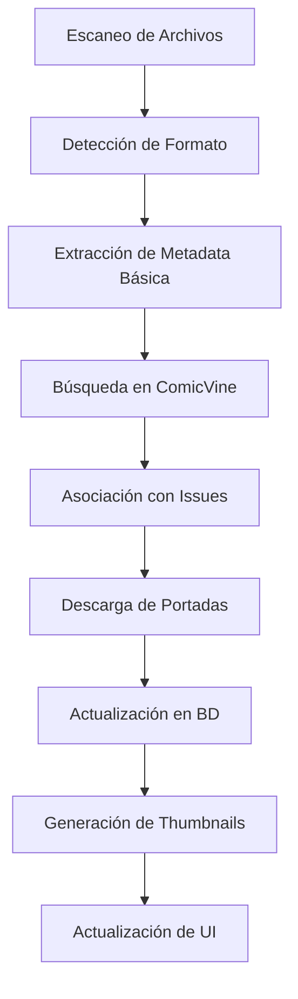

# Sistema de Catalogación

El sistema de catalogación de Babelcomics4 automatiza la organización y enriquecimiento de metadata de tu colección de comics, integrándose con ComicVine para obtener información completa y precisa.

## 🎯 Objetivos del Sistema

### Automatización Inteligente
- **Detección automática** de comics en directorios
- **Extracción de metadata** desde nombres de archivo
- **Asociación inteligente** con base de datos ComicVine
- **Enriquecimiento progresivo** de información

### Gestión Eficiente
- **Catalogación en lote** para grandes colecciones
- **Actualización incremental** de metadata
- **Resolución de conflictos** automática
- **Backup y recuperación** de datos

## 🔄 Flujo de Catalogación

### Proceso Completo



### Etapas Detalladas

#### 1. Escaneo y Detección
```python
def scan_directory_for_comics(directory_path):
    """Escanear directorio buscando comics"""

    supported_extensions = ['.cbz', '.cbr', '.pdf']
    comic_files = []

    for root, dirs, files in os.walk(directory_path):
        for file in files:
            if any(file.lower().endswith(ext) for ext in supported_extensions):
                full_path = os.path.join(root, file)
                comic_files.append({
                    'path': full_path,
                    'filename': file,
                    'size': os.path.getsize(full_path),
                    'modified': os.path.getmtime(full_path)
                })

    return comic_files
```

#### 2. Extracción de Metadata
```python
def extract_metadata_from_filename(filename):
    """Extraer información del nombre de archivo"""

    patterns = [
        # Superman #123 (2018).cbz
        r'(.+?)\s*#(\d+)\s*\((\d{4})\)',

        # Batman - Issue 45 - Title.cbz
        r'(.+?)\s*-\s*Issue\s*(\d+)\s*-\s*(.+)',

        # Spider-Man_001_Amazing.cbz
        r'(.+?)_(\d+)_(.+)',

        # ActionComics123.cbr
        r'([A-Za-z\s]+)(\d+)',
    ]

    metadata = {
        'series': None,
        'issue_number': None,
        'year': None,
        'title': None
    }

    for pattern in patterns:
        match = re.match(pattern, filename)
        if match:
            groups = match.groups()
            metadata['series'] = groups[0].strip()
            metadata['issue_number'] = groups[1]

            if len(groups) > 2:
                if groups[2].isdigit() and len(groups[2]) == 4:
                    metadata['year'] = int(groups[2])
                else:
                    metadata['title'] = groups[2].strip()

            break

    return metadata
```

#### 3. Búsqueda en ComicVine
```python
def search_comicvine_for_comic(metadata):
    """Buscar comic en ComicVine usando metadata extraída"""

    client = ComicVineClient()

    # 1. Buscar volúmenes por nombre de serie
    volume_results = client.search_volumes(metadata['series'])

    # 2. Filtrar por año si disponible
    if metadata['year']:
        volume_results = [
            v for v in volume_results
            if abs(int(v.get('start_year', 0)) - metadata['year']) <= 2
        ]

    # 3. Para cada volumen candidato, buscar issue específico
    for volume in volume_results[:3]:  # Top 3 candidatos
        issues = client.get_volume_issues(volume['id'])

        for issue in issues:
            if issue['issue_number'] == metadata['issue_number']:
                return {
                    'volume': volume,
                    'issue': issue,
                    'confidence': calculate_match_confidence(metadata, volume, issue)
                }

    return None
```

#### 4. Asociación Inteligente
```python
def create_comicbook_info_from_comicvine(issue_data, volume_data):
    """Crear registro ComicbookInfo desde datos ComicVine"""

    comicbook_info = ComicbookInfo(
        titulo=issue_data.get('name', ''),
        numero=str(issue_data.get('issue_number', '')),
        fecha_tapa=parse_cover_date(issue_data.get('cover_date')),
        resumen=clean_description(issue_data.get('description', '')),
        url_api_detalle=issue_data.get('api_detail_url', ''),
        url_sitio_web=issue_data.get('site_detail_url', ''),
        calificacion=0.0,  # Inicial, puede ser actualizada
        id_comicvine=issue_data.get('id'),
        id_volume=get_or_create_volume(volume_data).id_volume
    )

    # Crear entrada de portada si hay imagen
    if issue_data.get('image'):
        cover = ComicbookInfoCover(
            url_imagen=issue_data['image']['original_url'],
            comic_info=comicbook_info
        )
        comicbook_info.portadas.append(cover)

    return comicbook_info
```

## 🧠 Inteligencia de Catalogación

### Algoritmos de Coincidencia

#### Cálculo de Confianza
```python
def calculate_match_confidence(extracted_metadata, volume, issue):
    """Calcular confianza de coincidencia (0.0 - 1.0)"""

    confidence = 0.0

    # Coincidencia de nombre de serie (peso: 40%)
    series_similarity = calculate_string_similarity(
        extracted_metadata['series'],
        volume['name']
    )
    confidence += series_similarity * 0.4

    # Coincidencia exacta de número (peso: 30%)
    if extracted_metadata['issue_number'] == issue['issue_number']:
        confidence += 0.3

    # Coincidencia de año (peso: 20%)
    if extracted_metadata.get('year'):
        year_diff = abs(
            extracted_metadata['year'] - int(volume.get('start_year', 0))
        )
        year_confidence = max(0, 1 - (year_diff / 5))  # Tolerancia de 5 años
        confidence += year_confidence * 0.2

    # Coincidencia de título (peso: 10%)
    if extracted_metadata.get('title') and issue.get('name'):
        title_similarity = calculate_string_similarity(
            extracted_metadata['title'],
            issue['name']
        )
        confidence += title_similarity * 0.1

    return min(confidence, 1.0)

def calculate_string_similarity(str1, str2):
    """Calcular similitud entre strings usando Levenshtein"""
    import difflib
    return difflib.SequenceMatcher(None, str1.lower(), str2.lower()).ratio()
```

#### Resolución de Ambigüedades
```python
def resolve_multiple_matches(comic_file, candidates):
    """Resolver cuando hay múltiples candidatos"""

    if not candidates:
        return None

    # Ordenar por confianza
    candidates.sort(key=lambda x: x['confidence'], reverse=True)

    # Si hay un claro ganador (diferencia > 0.2)
    if len(candidates) > 1:
        best = candidates[0]
        second = candidates[1]

        if best['confidence'] - second['confidence'] > 0.2:
            return best

    # Si las confianzas son similares, usar criterios adicionales
    return apply_tiebreaker_criteria(comic_file, candidates)

def apply_tiebreaker_criteria(comic_file, candidates):
    """Criterios de desempate para candidatos similares"""

    # 1. Preferir volúmenes más recientes
    candidates.sort(key=lambda x: x['volume'].get('start_year', 0), reverse=True)

    # 2. Preferir volúmenes de editoriales principales
    major_publishers = ['DC Comics', 'Marvel Comics', 'Image Comics']
    for candidate in candidates:
        if candidate['volume'].get('publisher', {}).get('name') in major_publishers:
            return candidate

    # 3. Devolver el primero si no hay criterio claro
    return candidates[0]
```

### Catalogación en Lote

#### Procesamiento Asíncrono
```python
class BatchCatalogingManager:
    """Gestor de catalogación en lote"""

    def __init__(self, session, comicvine_client):
        self.session = session
        self.client = comicvine_client
        self.progress_callback = None
        self.error_callback = None

    def catalog_directory(self, directory_path, progress_callback=None):
        """Catalogar directorio completo"""

        self.progress_callback = progress_callback

        # 1. Escanear archivos
        comic_files = scan_directory_for_comics(directory_path)
        total_files = len(comic_files)

        results = {
            'processed': 0,
            'cataloged': 0,
            'errors': [],
            'skipped': 0
        }

        for i, comic_file in enumerate(comic_files):
            try:
                # Actualizar progreso
                if self.progress_callback:
                    self.progress_callback(i + 1, total_files, comic_file['filename'])

                # Verificar si ya existe
                existing = self.session.query(Comicbook).filter_by(
                    path=comic_file['path']
                ).first()

                if existing:
                    results['skipped'] += 1
                    continue

                # Procesar archivo
                success = self.catalog_single_file(comic_file)

                if success:
                    results['cataloged'] += 1
                else:
                    results['skipped'] += 1

                results['processed'] += 1

                # Rate limiting para ComicVine
                time.sleep(0.5)

            except Exception as e:
                results['errors'].append({
                    'file': comic_file['filename'],
                    'error': str(e)
                })

        return results

    def catalog_single_file(self, comic_file):
        """Catalogar archivo individual"""

        # 1. Crear entrada básica de Comicbook
        comic = Comicbook(
            path=comic_file['path'],
            filename=comic_file['filename'],
            tamaño=comic_file['size'],
            id_comicbook_info=''  # Sin catalogar inicialmente
        )

        self.session.add(comic)

        # 2. Intentar catalogación automática
        metadata = extract_metadata_from_filename(comic_file['filename'])

        if metadata['series'] and metadata['issue_number']:
            comicvine_match = search_comicvine_for_comic(metadata)

            if comicvine_match and comicvine_match['confidence'] > 0.7:
                # Crear ComicbookInfo si hay buena coincidencia
                comicbook_info = create_comicbook_info_from_comicvine(
                    comicvine_match['issue'],
                    comicvine_match['volume']
                )

                self.session.add(comicbook_info)
                self.session.flush()  # Para obtener ID

                comic.id_comicbook_info = str(comicbook_info.id_comicbook_info)

        self.session.commit()
        return True
```

## 🎛️ Configuración de Catalogación

### Parámetros Configurables

```python
class CatalogingConfig:
    """Configuración del sistema de catalogación"""

    # Umbrales de confianza
    AUTO_CATALOG_THRESHOLD = 0.8    # Catalogar automáticamente
    MANUAL_REVIEW_THRESHOLD = 0.5   # Requerir revisión manual
    REJECT_THRESHOLD = 0.3          # Rechazar automáticamente

    # Límites de API
    COMICVINE_REQUESTS_PER_HOUR = 200
    REQUEST_DELAY_SECONDS = 0.5

    # Procesamiento
    MAX_CONCURRENT_CATALOGS = 3
    BATCH_SIZE = 50

    # Retry logic
    MAX_RETRIES = 3
    RETRY_DELAY = 2  # seconds

    # Directivos de calidad
    REQUIRE_COVER_IMAGE = True
    REQUIRE_PUBLISHER_INFO = False
    MINIMUM_DESCRIPTION_LENGTH = 50
```

### Perfiles de Catalogación

#### Perfil Conservador
```python
CONSERVATIVE_PROFILE = {
    'auto_catalog_threshold': 0.9,
    'require_manual_review': True,
    'prefer_major_publishers': True,
    'strict_year_matching': True
}
```

#### Perfil Agresivo
```python
AGGRESSIVE_PROFILE = {
    'auto_catalog_threshold': 0.6,
    'require_manual_review': False,
    'accept_fuzzy_matches': True,
    'auto_create_volumes': True
}
```

#### Perfil Balanceado
```python
BALANCED_PROFILE = {
    'auto_catalog_threshold': 0.75,
    'require_manual_review_below': 0.5,
    'prefer_recent_volumes': True,
    'validate_issue_numbers': True
}
```

## 📊 Monitoreo y Estadísticas

### Métricas de Catalogación

```python
def generate_cataloging_report(session):
    """Generar reporte de estado de catalogación"""

    total_comics = session.query(Comicbook).count()
    cataloged_comics = session.query(Comicbook).filter(
        Comicbook.id_comicbook_info != ''
    ).count()

    uncataloged_comics = total_comics - cataloged_comics
    catalog_percentage = (cataloged_comics / total_comics) * 100

    # Distribución por editorial
    publisher_stats = session.query(
        Volume.id_publisher,
        func.count(Comicbook.id_comicbook).label('count')
    ).join(ComicbookInfo).join(Volume).group_by(Volume.id_publisher).all()

    # Distribución por década
    decade_stats = session.query(
        func.floor(Volume.anio_inicio / 10) * 10,
        func.count(Comicbook.id_comicbook).label('count')
    ).join(ComicbookInfo).join(Volume).group_by(
        func.floor(Volume.anio_inicio / 10) * 10
    ).all()

    return {
        'total_comics': total_comics,
        'cataloged_comics': cataloged_comics,
        'uncataloged_comics': uncataloged_comics,
        'catalog_percentage': catalog_percentage,
        'publisher_distribution': publisher_stats,
        'decade_distribution': decade_stats
    }
```

### Dashboard de Catalogación

```
┌─── Estado de Catalogación ────────────────────┐
│                                               │
│ Total de Comics: 1,247                        │
│ Catalogados: 892 (71.5%) ████████████░░░      │
│ Sin Catalogar: 355 (28.5%) ████░░░░░░░░░      │
│                                               │
│ Última Catalogación: 2024-03-15 14:30        │
│ Comics Agregados Hoy: 23                     │
│ Errores Pendientes: 5                        │
│                                               │
├─── Distribución por Editorial ────────────────┤
│ Marvel Comics: 445 (35.7%)                   │
│ DC Comics: 312 (25.0%)                       │
│ Image Comics: 178 (14.3%)                    │
│ Otros: 312 (25.0%)                           │
│                                               │
├─── Acciones Disponibles ──────────────────────┤
│ [🔄 Catalogar Pendientes]                    │
│ [📊 Reporte Detallado]                       │
│ [⚙️ Configurar Perfiles]                     │
│ [🔍 Revisar Conflictos]                      │
└───────────────────────────────────────────────┘
```

## 🛠️ Mantenimiento y Optimización

### Limpieza de Datos

```python
def cleanup_catalog_data(session):
    """Limpiar datos inconsistentes de catalogación"""

    # 1. Eliminar ComicbookInfo huérfanos
    orphaned_infos = session.query(ComicbookInfo).filter(
        ~ComicbookInfo.owned_comics.any()
    ).all()

    for info in orphaned_infos:
        session.delete(info)

    # 2. Corregir asociaciones rotas
    broken_comics = session.query(Comicbook).filter(
        and_(
            Comicbook.id_comicbook_info != '',
            ~session.query(ComicbookInfo).filter(
                ComicbookInfo.id_comicbook_info == Comicbook.id_comicbook_info
            ).exists()
        )
    ).all()

    for comic in broken_comics:
        comic.id_comicbook_info = ''

    # 3. Actualizar contadores de volúmenes
    volumes = session.query(Volume).all()
    for volume in volumes:
        issue_count = session.query(ComicbookInfo).filter(
            ComicbookInfo.id_volume == volume.id_volume
        ).count()
        volume.cantidad_numeros = issue_count

    session.commit()
```

### Optimización de Performance

```python
def optimize_catalog_queries():
    """Optimizaciones para consultas de catalogación"""

    # 1. Índices para búsquedas frecuentes
    CREATE_INDEXES = [
        "CREATE INDEX IF NOT EXISTS idx_comicbook_info_volume ON comicbooks_info(id_volume)",
        "CREATE INDEX IF NOT EXISTS idx_comicbook_info_comicvine ON comicbooks_info(id_comicvine)",
        "CREATE INDEX IF NOT EXISTS idx_comicbook_classified ON comicbooks(id_comicbook_info)",
        "CREATE INDEX IF NOT EXISTS idx_volume_publisher ON volumens(id_publisher)"
    ]

    # 2. Análisis de estadísticas
    ANALYZE_TABLES = [
        "ANALYZE comicbooks",
        "ANALYZE comicbooks_info",
        "ANALYZE volumens"
    ]
```

---

**¿Quieres saber más sobre el sistema de thumbnails?** 👉 [Thumbnails](thumbnails.md)