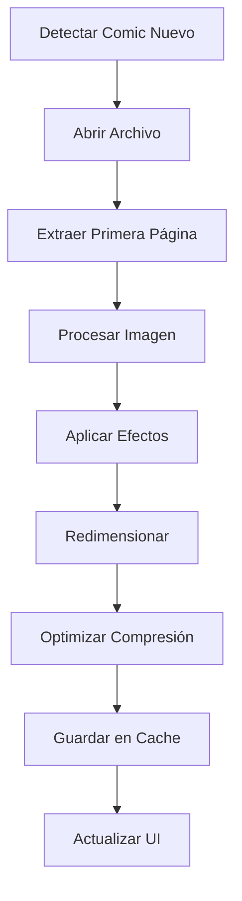

# Sistema de Thumbnails

El sistema de thumbnails de Babelcomics4 genera automáticamente miniaturas de alta calidad para todos los comics de tu colección, aplicando efectos visuales inteligentes para indicar el estado de catalogación y proporcionando una experiencia visual rica.

## 🖼️ Generación de Thumbnails

### Proceso Automático

#### Pipeline de Generación


#### Implementación del Generador
```python
class ThumbnailGenerator:
    """Generador de thumbnails para comics"""

    def __init__(self, config):
        self.config = config
        self.thumbnail_cache = config.get('cache_directory', 'data/thumbnails/comics/')
        self.thumbnail_size = config.get('thumbnail_size', (200, 300))
        self.quality = config.get('jpeg_quality', 85)

    def generate_thumbnail(self, comic_file_path, comic_info=None):
        """Generar thumbnail para un comic"""

        try:
            # 1. Extraer primera página
            first_page_image = self.extract_first_page(comic_file_path)
            if not first_page_image:
                return self.get_default_thumbnail()

            # 2. Redimensionar manteniendo proporción
            thumbnail = self.resize_with_aspect_ratio(
                first_page_image,
                self.thumbnail_size
            )

            # 3. Aplicar efectos según estado
            if comic_info:
                thumbnail = self.apply_status_effects(thumbnail, comic_info)

            # 4. Optimizar y guardar
            thumbnail_path = self.save_thumbnail(thumbnail, comic_file_path)

            return thumbnail_path

        except Exception as e:
            self.logger.error(f"Error generando thumbnail: {e}")
            return self.get_default_thumbnail()

    def extract_first_page(self, comic_path):
        """Extraer primera página del comic"""

        file_extension = os.path.splitext(comic_path)[1].lower()

        if file_extension == '.cbz':
            return self.extract_from_cbz(comic_path)
        elif file_extension == '.cbr':
            return self.extract_from_cbr(comic_path)
        elif file_extension == '.pdf':
            return self.extract_from_pdf(comic_path)
        else:
            return None

    def extract_from_cbz(self, cbz_path):
        """Extraer primera página de archivo CBZ"""

        with zipfile.ZipFile(cbz_path, 'r') as zip_file:
            # Obtener lista de archivos de imagen
            image_files = [f for f in zip_file.namelist()
                          if f.lower().endswith(('.jpg', '.jpeg', '.png', '.webp'))]

            if not image_files:
                return None

            # Ordenar para obtener la primera página
            image_files.sort()
            first_image = image_files[0]

            # Extraer y abrir imagen
            with zip_file.open(first_image) as image_data:
                image = Image.open(io.BytesIO(image_data.read()))
                return image.convert('RGB')

    def extract_from_cbr(self, cbr_path):
        """Extraer primera página de archivo CBR"""

        try:
            with rarfile.RarFile(cbr_path, 'r') as rar_file:
                image_files = [f for f in rar_file.namelist()
                              if f.lower().endswith(('.jpg', '.jpeg', '.png', '.webp'))]

                if not image_files:
                    return None

                image_files.sort()
                first_image = image_files[0]

                with rar_file.open(first_image) as image_data:
                    image = Image.open(io.BytesIO(image_data.read()))
                    return image.convert('RGB')

        except rarfile.RarCannotExec:
            self.logger.warning("RAR support not available")
            return None

    def extract_from_pdf(self, pdf_path):
        """Extraer primera página de archivo PDF"""

        try:
            import fitz  # PyMuPDF

            pdf_document = fitz.open(pdf_path)
            if pdf_document.page_count == 0:
                return None

            # Obtener primera página
            first_page = pdf_document[0]

            # Convertir a imagen con alta resolución
            mat = fitz.Matrix(2.0, 2.0)  # 2x zoom para calidad
            pix = first_page.get_pixmap(matrix=mat)

            # Convertir a PIL Image
            img_data = pix.tobytes("ppm")
            image = Image.open(io.BytesIO(img_data))

            pdf_document.close()
            return image.convert('RGB')

        except ImportError:
            self.logger.warning("PyMuPDF not available for PDF support")
            return None
```

### Redimensionado Inteligente

#### Preservación de Proporción
```python
def resize_with_aspect_ratio(self, image, target_size):
    """Redimensionar imagen manteniendo proporción"""

    original_width, original_height = image.size
    target_width, target_height = target_size

    # Calcular proporción para ajuste
    width_ratio = target_width / original_width
    height_ratio = target_height / original_height

    # Usar la proporción menor para que la imagen quepa completamente
    ratio = min(width_ratio, height_ratio)

    # Calcular nuevo tamaño
    new_width = int(original_width * ratio)
    new_height = int(original_height * ratio)

    # Redimensionar con alta calidad
    resized = image.resize((new_width, new_height), Image.Resampling.LANCZOS)

    # Crear imagen final centrada en el tamaño objetivo
    final_image = Image.new('RGB', target_size, (255, 255, 255))

    # Calcular posición para centrar
    x_offset = (target_width - new_width) // 2
    y_offset = (target_height - new_height) // 2

    final_image.paste(resized, (x_offset, y_offset))

    return final_image
```

#### Configuración de Tamaños
```python
THUMBNAIL_CONFIGURATIONS = {
    'small': {
        'size': (150, 225),
        'use_case': 'Vista de lista compacta',
        'quality': 75
    },
    'medium': {
        'size': (200, 300),
        'use_case': 'Vista de grilla estándar',
        'quality': 85
    },
    'large': {
        'size': (300, 450),
        'use_case': 'Vista detallada y modal',
        'quality': 90
    },
    'extra_large': {
        'size': (400, 600),
        'use_case': 'Pantalla completa y zoom',
        'quality': 95
    }
}
```

## 🎨 Efectos Visuales

### Estados de Clasificación

#### Comics Clasificados (Color Normal)
```python
def apply_classified_effects(self, image):
    """Aplicar efectos para comics clasificados"""

    # Mantener colores originales con ligero realce
    enhanced = ImageEnhance.Color(image).enhance(1.1)  # +10% saturación
    enhanced = ImageEnhance.Contrast(enhanced).enhance(1.05)  # +5% contraste

    return enhanced
```

#### Comics Sin Catalogar (Escala de Grises)
```python
def apply_uncataloged_effects(self, image):
    """Aplicar efectos para comics sin catalogar"""

    # Convertir a escala de grises manteniendo calidad
    if image.mode in ('RGBA', 'LA'):
        # Manejar transparencia
        rgb_image = Image.new('RGB', image.size, (255, 255, 255))
        rgb_image.paste(image, mask=image.split()[-1] if image.mode == 'RGBA' else None)
    else:
        rgb_image = image.convert('RGB')

    # Aplicar escala de grises
    grayscale = rgb_image.convert('L')

    # Convertir de vuelta a RGB para compatibilidad
    final_image = grayscale.convert('RGB')

    # Aplicar ligero tinte azulado para distinguir
    overlay = Image.new('RGB', final_image.size, (230, 235, 240))
    final_image = Image.blend(final_image, overlay, 0.1)

    return final_image
```

#### Comics en Papelera (Desaturado + Overlay)
```python
def apply_trash_effects(self, image):
    """Aplicar efectos para comics en papelera"""

    # Reducir saturación drásticamente
    desaturated = ImageEnhance.Color(image).enhance(0.3)

    # Reducir brillo
    darkened = ImageEnhance.Brightness(desaturated).enhance(0.7)

    # Aplicar overlay semitransparente rojo
    overlay = Image.new('RGBA', darkened.size, (255, 0, 0, 40))
    darkened = darkened.convert('RGBA')

    trash_effect = Image.alpha_composite(darkened, overlay)

    return trash_effect.convert('RGB')
```

#### Comics Corruptos (Efectos de Error)
```python
def apply_corrupted_effects(self, image):
    """Aplicar efectos para archivos corruptos"""

    # Aplicar distorsión digital
    corrupted = image.copy()

    # Crear efecto de "glitch"
    pixels = corrupted.load()
    width, height = corrupted.size

    # Aplicar líneas de ruido aleatorias
    import random
    for _ in range(10):
        y = random.randint(0, height - 1)
        for x in range(width):
            if random.random() < 0.7:
                pixels[x, y] = (255, 0, 255)  # Magenta para errores

    # Aplicar filtro de contraste alto
    corrupted = ImageEnhance.Contrast(corrupted).enhance(2.0)

    return corrupted
```

### Indicadores de Calidad

#### Overlays de Calidad
```python
def add_quality_overlay(self, image, quality_stars):
    """Añadir overlay de calidad visual"""

    if quality_stars == 0:
        return image  # Sin overlay para comics sin calificar

    # Crear overlay transparente
    overlay = Image.new('RGBA', image.size, (0, 0, 0, 0))
    draw = ImageDraw.Draw(overlay)

    # Configuración de estrellas
    star_size = 20
    star_spacing = 25
    star_y = image.height - 30
    star_start_x = 10

    # Dibujar estrellas
    for i in range(5):
        x = star_start_x + (i * star_spacing)

        if i < quality_stars:
            # Estrella llena (dorada)
            star_color = (255, 215, 0, 200)  # Dorado semitransparente
        else:
            # Estrella vacía (gris)
            star_color = (128, 128, 128, 100)  # Gris semitransparente

        self.draw_star(draw, x, star_y, star_size, star_color)

    # Combinar con imagen original
    image_rgba = image.convert('RGBA')
    final_image = Image.alpha_composite(image_rgba, overlay)

    return final_image.convert('RGB')

def draw_star(self, draw, x, y, size, color):
    """Dibujar estrella de 5 puntas"""

    import math

    points = []
    for i in range(10):
        angle = (i * math.pi) / 5
        if i % 2 == 0:
            # Puntas externas
            px = x + size * math.cos(angle - math.pi/2)
            py = y + size * math.sin(angle - math.pi/2)
        else:
            # Puntas internas
            px = x + (size/2) * math.cos(angle - math.pi/2)
            py = y + (size/2) * math.sin(angle - math.pi/2)

        points.append((px, py))

    draw.polygon(points, fill=color)
```

## 💾 Sistema de Cache

### Gestión de Cache

#### Estructura de Directorios
```
data/thumbnails/
├── comics/
│   ├── small/
│   │   ├── [hash_archivo_1].jpg
│   │   ├── [hash_archivo_2].jpg
│   │   └── ...
│   ├── medium/
│   │   ├── [hash_archivo_1].jpg
│   │   └── ...
│   ├── large/
│   └── extra_large/
├── volumes/
│   ├── [volume_id_1].jpg
│   └── [volume_id_2].jpg
└── temp/
    └── processing/
```

#### Gestión de Hash para Cache
```python
def generate_cache_key(self, comic_path, size_category, comic_info=None):
    """Generar clave única para cache de thumbnail"""

    import hashlib

    # Información base del archivo
    file_stat = os.stat(comic_path)
    base_info = f"{comic_path}:{file_stat.st_mtime}:{file_stat.st_size}"

    # Información de estado para efectos
    if comic_info:
        status_info = f":{comic_info.is_cataloged}:{comic_info.quality}:{comic_info.in_trash}"
        base_info += status_info

    # Información de tamaño
    base_info += f":{size_category}"

    # Generar hash MD5
    cache_key = hashlib.md5(base_info.encode()).hexdigest()

    return f"{cache_key}.jpg"

def get_cached_thumbnail(self, cache_key, size_category):
    """Obtener thumbnail desde cache"""

    cache_path = os.path.join(
        self.thumbnail_cache,
        size_category,
        cache_key
    )

    if os.path.exists(cache_path):
        try:
            # Verificar que la imagen sea válida
            with Image.open(cache_path) as img:
                img.verify()
            return cache_path
        except Exception:
            # Eliminar thumbnail corrupto
            os.remove(cache_path)
            return None

    return None

def save_thumbnail(self, image, comic_path, size_category='medium'):
    """Guardar thumbnail en cache"""

    # Generar clave de cache
    cache_key = self.generate_cache_key(comic_path, size_category)

    # Crear directorio si no existe
    cache_dir = os.path.join(self.thumbnail_cache, size_category)
    os.makedirs(cache_dir, exist_ok=True)

    # Ruta completa del archivo
    cache_path = os.path.join(cache_dir, cache_key)

    # Guardar con optimización JPEG
    image.save(cache_path, 'JPEG',
              quality=self.quality,
              optimize=True,
              progressive=True)

    return cache_path
```

### Limpieza de Cache

#### Limpieza Automática
```python
class ThumbnailCacheCleaner:
    """Limpiador automático de cache de thumbnails"""

    def __init__(self, thumbnail_generator):
        self.generator = thumbnail_generator
        self.cache_dir = thumbnail_generator.thumbnail_cache

    def cleanup_orphaned_thumbnails(self, session):
        """Eliminar thumbnails huérfanos"""

        # Obtener todos los paths de comics existentes
        existing_comics = session.query(Comicbook.path).all()
        existing_paths = {comic.path for comic in existing_comics}

        orphaned_count = 0

        for size_category in os.listdir(self.cache_dir):
            size_dir = os.path.join(self.cache_dir, size_category)
            if not os.path.isdir(size_dir):
                continue

            for thumbnail_file in os.listdir(size_dir):
                thumbnail_path = os.path.join(size_dir, thumbnail_file)

                # Verificar si el comic original existe
                is_orphaned = True
                for comic_path in existing_paths:
                    expected_key = self.generator.generate_cache_key(
                        comic_path, size_category
                    )
                    if thumbnail_file == expected_key:
                        if os.path.exists(comic_path):
                            is_orphaned = False
                            break

                if is_orphaned:
                    os.remove(thumbnail_path)
                    orphaned_count += 1

        return orphaned_count

    def cleanup_old_thumbnails(self, days_old=30):
        """Eliminar thumbnails antiguos"""

        import time

        cutoff_time = time.time() - (days_old * 24 * 60 * 60)
        removed_count = 0

        for root, dirs, files in os.walk(self.cache_dir):
            for file in files:
                file_path = os.path.join(root, file)
                if os.path.getctime(file_path) < cutoff_time:
                    os.remove(file_path)
                    removed_count += 1

        return removed_count
```

## ⚡ Optimización de Rendimiento

### Generación Asíncrona

#### Generación en Background
```python
import asyncio
import concurrent.futures
from threading import ThreadPoolExecutor

class AsyncThumbnailGenerator:
    """Generador asíncrono de thumbnails"""

    def __init__(self, config, max_workers=4):
        self.generator = ThumbnailGenerator(config)
        self.executor = ThreadPoolExecutor(max_workers=max_workers)
        self.generation_queue = asyncio.Queue()

    async def generate_thumbnails_batch(self, comic_files):
        """Generar thumbnails en lote de forma asíncrona"""

        tasks = []
        for comic_file in comic_files:
            task = asyncio.create_task(
                self.generate_thumbnail_async(comic_file)
            )
            tasks.append(task)

        # Ejecutar con límite de concurrencia
        semaphore = asyncio.Semaphore(4)

        async def bounded_task(task):
            async with semaphore:
                return await task

        results = await asyncio.gather(
            *[bounded_task(task) for task in tasks],
            return_exceptions=True
        )

        return results

    async def generate_thumbnail_async(self, comic_file):
        """Generar thumbnail individual de forma asíncrona"""

        loop = asyncio.get_event_loop()

        # Ejecutar generación en thread pool
        thumbnail_path = await loop.run_in_executor(
            self.executor,
            self.generator.generate_thumbnail,
            comic_file.path,
            comic_file.comic_info
        )

        return {
            'comic_file': comic_file,
            'thumbnail_path': thumbnail_path,
            'success': thumbnail_path is not None
        }
```

### Lazy Loading

#### Carga Bajo Demanda
```python
class LazyThumbnailLoader:
    """Cargador lazy de thumbnails"""

    def __init__(self, thumbnail_generator):
        self.generator = thumbnail_generator
        self.loaded_thumbnails = {}
        self.loading_queue = []

    def get_thumbnail_lazy(self, comic_id, size='medium'):
        """Obtener thumbnail con carga lazy"""

        cache_key = f"{comic_id}:{size}"

        # Si ya está cargado, devolverlo
        if cache_key in self.loaded_thumbnails:
            return self.loaded_thumbnails[cache_key]

        # Si está en cola de carga, devolver placeholder
        if cache_key in self.loading_queue:
            return self.get_loading_placeholder()

        # Añadir a cola y iniciar carga asíncrona
        self.loading_queue.append(cache_key)
        asyncio.create_task(self.load_thumbnail_async(comic_id, size))

        return self.get_placeholder_thumbnail()

    async def load_thumbnail_async(self, comic_id, size):
        """Cargar thumbnail de forma asíncrona"""

        try:
            # Obtener información del comic
            comic = self.get_comic_by_id(comic_id)

            # Generar thumbnail
            thumbnail_path = await self.generator.generate_thumbnail_async(comic)

            # Guardar en cache de memoria
            cache_key = f"{comic_id}:{size}"
            self.loaded_thumbnails[cache_key] = thumbnail_path

            # Remover de cola de carga
            if cache_key in self.loading_queue:
                self.loading_queue.remove(cache_key)

            # Notificar a la UI para actualización
            self.notify_thumbnail_ready(comic_id, thumbnail_path)

        except Exception as e:
            self.logger.error(f"Error cargando thumbnail para {comic_id}: {e}")
```

## 🎛️ Configuración Avanzada

### Configuración de Calidad

#### Perfiles de Calidad
```python
QUALITY_PROFILES = {
    'economy': {
        'jpeg_quality': 70,
        'thumbnail_size': (150, 225),
        'enable_effects': False,
        'compression_level': 'high',
        'description': 'Mínimo uso de espacio'
    },
    'balanced': {
        'jpeg_quality': 85,
        'thumbnail_size': (200, 300),
        'enable_effects': True,
        'compression_level': 'medium',
        'description': 'Balance calidad/espacio'
    },
    'quality': {
        'jpeg_quality': 95,
        'thumbnail_size': (300, 450),
        'enable_effects': True,
        'compression_level': 'low',
        'description': 'Máxima calidad visual'
    },
    'archive': {
        'jpeg_quality': 100,
        'thumbnail_size': (400, 600),
        'enable_effects': True,
        'compression_level': 'none',
        'format': 'PNG',
        'description': 'Calidad archivo'
    }
}
```

### Configuración de Efectos

#### Personalización de Efectos
```python
EFFECT_CONFIGURATIONS = {
    'uncataloged_effect': {
        'type': 'grayscale',
        'intensity': 1.0,
        'tint_color': (230, 235, 240),
        'tint_opacity': 0.1
    },
    'trash_effect': {
        'type': 'desaturate_overlay',
        'desaturation': 0.7,
        'brightness': 0.7,
        'overlay_color': (255, 0, 0),
        'overlay_opacity': 0.15
    },
    'quality_overlay': {
        'enabled': True,
        'star_size': 20,
        'star_spacing': 25,
        'position': 'bottom_left',
        'colors': {
            'filled_star': (255, 215, 0, 200),
            'empty_star': (128, 128, 128, 100)
        }
    },
    'border_effects': {
        'classified': {
            'enabled': True,
            'color': (0, 255, 0),
            'width': 2
        },
        'uncataloged': {
            'enabled': True,
            'color': (128, 128, 128),
            'width': 1,
            'style': 'dashed'
        }
    }
}
```

## 📊 Monitoreo y Estadísticas

### Métricas de Thumbnails

#### Dashboard de Estado
```
┌─── Estado del Sistema de Thumbnails ──────────────┐
│                                                   │
│ 📊 Estadísticas Generales:                       │
│ ├── Total Comics: 1,247                          │
│ ├── Thumbnails Generados: 1,198 (96.1%)         │
│ ├── Pendientes: 49 (3.9%)                        │
│ └── Corruptos: 3 (0.2%)                          │
│                                                   │
│ 💾 Cache de Thumbnails:                          │
│ ├── Tamaño Total: 245.6 MB                       │
│ ├── Archivos Cache: 4,792                        │
│ ├── Thumbnails Huérfanos: 12                     │
│ └── Última Limpieza: 2024-03-15                  │
│                                                   │
│ ⚡ Rendimiento:                                   │
│ ├── Tiempo Promedio Generación: 1.2s             │
│ ├── Thumbnails/minuto: 48                        │
│ ├── Cache Hit Rate: 94.5%                        │
│ └── Errores Última Hora: 2                       │
│                                                   │
│ 🎨 Distribución de Efectos:                      │
│ ├── Color Normal: 892 (74.5%)                    │
│ ├── Escala Grises: 355 (29.6%)                   │
│ ├── En Papelera: 12 (1.0%)                       │
│ └── Con Errores: 3 (0.2%)                        │
└───────────────────────────────────────────────────┘
```

### Herramientas de Mantenimiento

#### Regeneración de Thumbnails
```python
def regenerate_thumbnails_tool():
    """Herramienta para regenerar thumbnails"""

    options = {
        'all': 'Regenerar todos los thumbnails',
        'corrupted': 'Solo thumbnails corruptos',
        'missing': 'Solo thumbnails faltantes',
        'low_quality': 'Solo thumbnails de baja calidad',
        'uncataloged': 'Solo comics sin catalogar',
        'size_upgrade': 'Actualizar a tamaño mayor'
    }

    filters = {
        'publisher': 'Filtrar por editorial',
        'quality_range': 'Filtrar por rango de calidad',
        'file_size_range': 'Filtrar por tamaño de archivo',
        'date_range': 'Filtrar por fecha de agregado'
    }

    batch_options = {
        'batch_size': 50,
        'parallel_workers': 4,
        'progress_callback': True,
        'error_handling': 'continue'
    }
```

---

**¿Quieres conocer más sobre la base de datos?** 👉 [Base de Datos](base-datos.md)