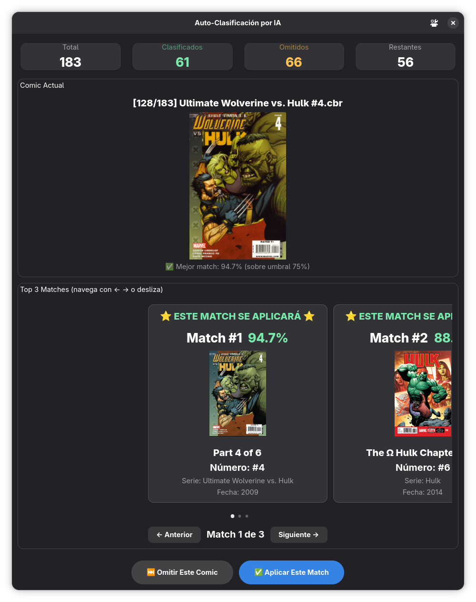

# Proceso de Categorización Automática

La categorización automática utiliza inteligencia artificial para identificar y asignar la categoría correspondiente a cada problema (“issue”) dentro de un volumen. Este proceso se apoya en información previamente registrada y en un mecanismo de análisis automático basado en vectores de características.

---

## 1. Requisitos Previos

Antes de ejecutar la clasificación automática, deben estar cargados en el sistema los valores de referencia que se utilizan para comparar y reconocer los distintos tipos de problemas o crisis.  
Estos valores funcionan como base para que el sistema pueda determinar similitudes y realizar la categorización final.

---

## 2. Proceso de Medición

El proceso de medición analiza cada problema del volumen y genera una representación numérica llamada *vector de características*.

### 2.1. Cálculo del vector

Para cada issue, el sistema calcula un vector que resume sus características principales.  
Este vector será utilizado más adelante para comparar el contenido con otros elementos ya registrados.

### 2.2. Envío al proceso de captura

Una vez que el vector está generado, se envía automáticamente al proceso de captura, que incluye los módulos de Inteligencia Artificial y Microcomputing.  
Estos módulos procesan la información y preparan el contenido para la siguiente etapa del flujo.

---

## 3. Embedding y Comparación

El sistema utiliza técnicas de embeddings para representar cada cover (portada) dentro de un espacio multidimensional.

### 3.1. Generación automática de embeddings

El cálculo de embeddings se ejecuta automáticamente en los siguientes casos:

- Cuando se descarga un volumen completo.
- Cuando se descargan o se preparan covers para subir un volumen al sistema.

En estos escenarios, el sistema genera y actualiza los embeddings sin requerir acciones adicionales por parte del usuario.

### 3.2. Reejecución y recuperación del proceso de embedding

En situaciones excepcionales, pueden producirse inconsistencias en los embeddings.  
Por ejemplo:

- Se borró la columna de embeddings en la base de datos.
- Se realizaron modificaciones manuales en la base.
- Se habilitó la creación manual de códigos u otros datos vinculados a issues o covers.

En estos casos, el sistema permite reejecutar el proceso de embedding de forma más rápida utilizando el mismo mecanismo descrito anteriormente.  
Esta operación funciona como herramienta de recuperación para restablecer los vectores de características y así reactivar la categorización automática.

> **Importante:**  
> Si la información base fue alterada manualmente (códigos creados fuera de flujo, datos incompletos o inconsistentes, o contenido no alineado con el volumen real), la “firma digital” generada por el embedding puede no ser totalmente representativa.  
> Como consecuencia, los resultados de similitud y categorización podrían ser menos precisos.

### 3.3. Búsqueda de similitud

Una vez calculados los embeddings, el sistema compara el embedding generado con los embeddings existentes.  
La categorización automática selecciona la coincidencia cuya distancia sea la menor dentro del espacio vectorial.  
En otras palabras, se elige el elemento más similar según sus características numéricas.

---

## 4. Resultado Final

Una vez identificada la coincidencia más cercana, el sistema asigna la categoría correspondiente al issue evaluado.  
Este proceso se ejecuta de forma completamente automática y no requiere intervención del usuario, salvo en casos especiales donde sea necesario reejecutar el proceso de embedding debido a problemas o modificaciones en la base de datos.

---

# Ventana de Auto-Clasificación por IA

La ventana de auto-clasificación permite supervisar y confirmar los resultados generados automáticamente por el sistema.  
La interfaz se muestra en la siguiente captura:

  
*Figura 1 — Vista general de la ventana de auto-clasificación por IA.*

---

## 1. Indicadores de Progreso

En la parte superior de la ventana (ver Figura 1) se presentan cuatro indicadores:

- **Total:** cantidad total de cómics incluidos como entrada para clasificar.  
- **Clasificados:** cómics a los que ya se les aplicó un match confirmado.  
- **Omitidos:** cómics descartados manualmente mediante “Omitir este cómic”.  
- **Restantes:** cantidad de cómics que aún no fueron revisados.

Estos valores permiten monitorear el avance del proceso en tiempo real.

---

## 2. Vista del Cómic Actual

La sección central de la ventana muestra el cómic actualmente en revisión.  
Esta vista corresponde al cover asociado al archivo CVZ o CVR, tal como se observa en la captura.

> Esta área es útil para comparar visualmente el cómic con las coincidencias sugeridas que se muestran debajo.

---

## 3. Vista de Matches

La parte inferior de la ventana (ver Figura 1) presenta hasta tres coincidencias sugeridas por la IA.  
Cada match incluye:

- Porcentaje de similitud.  
- Nombre del issue.  
- Serie a la que pertenece.  
- Fecha de publicación.

Estas coincidencias se encuentran dentro de una marquesina (carrusel).  
Dependiendo de la posición seleccionada, el usuario podrá aplicar el match 1, 2 o 3.

La navegación puede realizarse mediante:

- La rueda del mouse (scroll).  
- Los botones **Siguiente** y **Anterior**.

Al presionar **Aplicar este match**, el sistema registra esa selección como clasificación definitiva del cómic.

---

## 4. Conclusión

La ventana de auto-clasificación por IA actúa como un punto de control donde el usuario puede confirmar, ajustar u omitir resultados antes de que queden registrados.  
Esta interfaz combina la automatización del sistema con la supervisión humana para asegurar una clasificación precisa.
