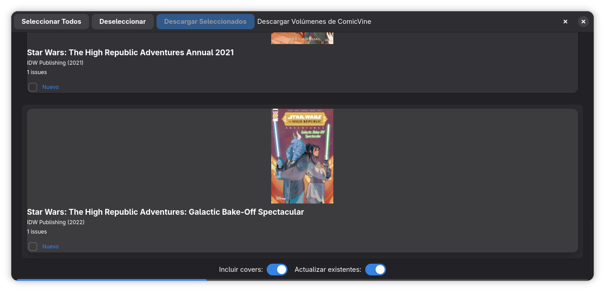

# Ventana de Descarga de Metadata (ComicVine)

Esta ventana presenta los resultados de la búsqueda realizada por el usuario contra la API de ComicVine. Su función principal es permitir la selección, descarga y procesamiento de metadatos, portadas y firmas digitales (embeddings).

## 1. Barra de Herramientas Superior (Toolbar)

Ubicada en la parte superior, gestiona la selección masiva de resultados y muestra el estado del proceso.

* **Botón "Seleccionar Todos":** Marca automáticamente la casilla de verificación de **todos** los resultados listados.
* **Botón "Deseleccionar":** Realiza la acción inversa, recorriendo toda la lista y quitando la marca de selección de cualquier tarjeta activa.
* **Botón "Descargar Seleccionados":** Inicia el **Proceso de Descarga e Ingestión**. El sistema ejecutará las siguientes tareas para cada volumen marcado:
    1.  **Descarga de Metadata:** Obtiene información general (Editorial, fechas, descripción) y genera un ID interno.
    2.  **Descarga de Issues:** Baja la lista de todos los números que componen el volumen. (Vital ejecutarlo periódicamente en series abiertas para capturar números nuevos).
    3.  **Descarga de Portadas:** Obtiene las imágenes de portada del volumen y de cada número individual.
    4.  **Cálculo de Embeddings:** Procesa las imágenes con una red neuronal para generar una firma digital única. Esto permitirá a Babelcomic4 identificar y emparejar tus archivos locales (CBR/CBZ) con la metadata, incluso si los nombres de archivo no coinciden.
* **Indicador de Progreso (Texto):** Durante la descarga, esta zona superior informa mediante texto qué volumen se está procesando en ese momento.

## 2. Área de Resultados (Lista de Volúmenes)

Lista desplazable que muestra las tarjetas de los volúmenes encontrados.

### Tarjeta de Volumen
* **Información Visual:** Portada, título, editorial, año y cantidad de números (issues).
* **Checkbox "Nuevo":** Permite la selección individual del volumen para la descarga. Funciona en conjunto con los botones de selección masiva.

## 3. Barra de Opciones Inferior (Footer)

Contiene configuraciones globales para la gestión de datos y ancho de banda.

* **Switch "Incluir covers":** Habilita o deshabilita la descarga de imágenes.
* **Switch "Actualizar existentes":**
    * **Función:** Fuerza la re-descarga y sobrescritura de toda la metadata e imágenes, ignorando si ya existen en la base de datos local.
    * **Caso de Uso:** Es fundamental activarlo para **reparar archivos corruptos** (ej. imágenes que se bajaron vacías o con errores en un intento anterior).
    * **Optimización:** Si se desactiva, el sistema saltará lo que ya tiene descargado, ahorrando ancho de banda y tiempo de procesamiento.