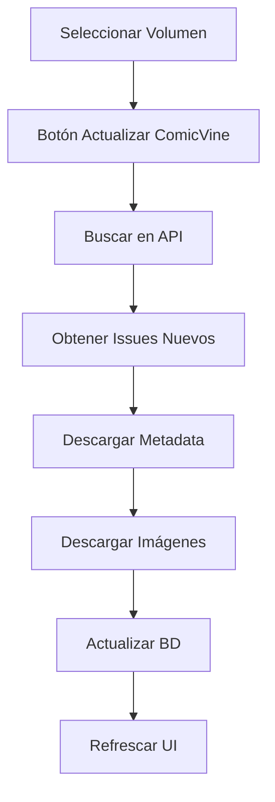

# Integración ComicVine

Babelcomics4 incluye integración completa con la API de ComicVine para automatizar la catalogación y obtener metadata rica de tu colección de comics.

## 🌐 ¿Qué es ComicVine?

[ComicVine](https://comicvine.gamespot.com/) es la base de datos de comics más completa del mundo, mantenida por GameSpot. Incluye:

- **📚 Volúmenes**: Series completas con información detallada
- **📖 Issues**: Números individuales con metadata específica
- **🏢 Publishers**: Información de editoriales
- **👥 Personajes**: Base de datos de personajes
- **🖼️ Imágenes**: Portadas y artwork oficial

## 🔑 Configuración de API

### Obtener API Key

1. **Crear cuenta** en [ComicVine](https://comicvine.gamespot.com/)
2. **Ir a Profile** → **API Key**
3. **Generar nueva clave** de API
4. **Copiar la clave** para configurar en Babelcomics4

### Configurar en Babelcomics4

#### Método 1: Variable de Entorno
```bash
# Agregar a ~/.bashrc o ~/.zshrc
export COMICVINE_API_KEY="tu-clave-de-api-aqui"

# Recargar terminal
source ~/.bashrc
```

#### Método 2: Archivo de Configuración
```python
# helpers/config.py
COMICVINE_API_KEY = "tu-clave-de-api-aqui"
```

#### Método 3: UI de la Aplicación (Futuro)
```
┌─── Configuración ComicVine ───┐
│ API Key: [******************] │
│          [Validar Conexión]   │
│                               │
│ ✅ Conexión exitosa           │
│ Límite: 200 req/hora          │
└───────────────────────────────┘
```

## 📡 Cliente ComicVine

### Arquitectura del Cliente

```python
# helpers/comicvine_client.py
class ComicVineClient:
    def __init__(self):
        self.api_key = os.getenv('COMICVINE_API_KEY')
        self.base_url = 'https://comicvine.gamespot.com/api'
        self.rate_limit = 200  # requests per hour

    def search_volumes(self, query):
        """Buscar volúmenes por nombre"""

    def get_volume_details(self, volume_id):
        """Obtener detalles completos de un volumen"""

    def get_volume_issues(self, volume_id):
        """Obtener todos los issues de un volumen"""

    def download_image(self, image_url, local_path):
        """Descargar imagen desde ComicVine"""
```

### Límites de API
```
┌─── Límites ComicVine ─────────┐
│ • 200 requests/hora           │
│ • 1 request/segundo máximo    │
│ • Timeout: 30 segundos        │
│ • Retry automático: 3 veces   │
└───────────────────────────────┘
```

## 🔄 Actualización de Volúmenes

### Flujo de Actualización



### Botón de Actualización

En la página de detalle de cada volumen:

```
┌─── Acciones del Volumen ──────┐
│ [🔄 Actualizar ComicVine]     │
│                               │
│ • Buscar nuevos issues        │
│ • Actualizar metadata         │
│ • Descargar portadas          │
│ • Sincronizar información     │
└───────────────────────────────┘
```

### Proceso de Actualización

#### 1. Búsqueda en ComicVine
```python
def update_volume_from_comicvine(volume):
    """Actualizar volumen desde ComicVine"""

    # 1. Buscar por ID de ComicVine
    if volume.id_comicvine:
        volume_data = client.get_volume_details(volume.id_comicvine)
    else:
        # 2. Buscar por nombre si no hay ID
        results = client.search_volumes(volume.nombre)
        volume_data = results[0]  # Mejor coincidencia

    # 3. Obtener lista de issues
    issues = client.get_volume_issues(volume_data['id'])

    return volume_data, issues
```

#### 2. Creación/Actualización de Issues
```python
for issue_data in issues:
    # Verificar si el issue ya existe
    existing = session.query(ComicbookInfo).filter_by(
        id_volume=volume.id_volume,
        numero=issue_data['issue_number']
    ).first()

    if existing:
        # Actualizar issue existente con datos de ComicVine
        existing.comicvine_id = issue_data['id']
        existing.url_api_detalle = issue_data['api_detail_url']
        existing.url_sitio_web = issue_data['site_detail_url']
        if not existing.titulo:
            existing.titulo = issue_data['name']
        if not existing.resumen:
            existing.resumen = issue_data['description']
    else:
        # Crear nuevo issue
        new_issue = ComicbookInfo(
            titulo=issue_data['name'],
            numero=issue_data['issue_number'],
            fecha_tapa=parse_date(issue_data['cover_date']),
            resumen=issue_data['description'],
            comicvine_id=issue_data['id'],
            url_api_detalle=issue_data['api_detail_url'],
            url_sitio_web=issue_data['site_detail_url'],
            id_volume=volume.id_volume
        )
        session.add(new_issue)
```

#### 3. Descarga de Múltiples Portadas
```python
def create_issue_cover_records(issue, issue_data):
    """Crear registros de portadas para un issue (principal + associated_images)"""

    covers_created = 0

    # 1. Portada principal desde el campo 'image'
    main_image = issue_data.get('image', {})
    if main_image and main_image.get('medium_url'):
        main_cover = ComicbookInfoCover(
            id_comicbook_info=issue.id_comicbook_info,
            url_imagen=main_image['medium_url'],
            tipo_portada='principal'
        )
        session.add(main_cover)
        covers_created += 1

    # 2. Portadas variantes desde 'associated_images'
    associated_images = issue_data.get('associated_images', [])
    for idx, img in enumerate(associated_images):
        if img.get('medium_url'):
            variant_cover = ComicbookInfoCover(
                id_comicbook_info=issue.id_comicbook_info,
                url_imagen=img['medium_url'],
                tipo_portada=f'variant_{idx + 1}'
            )
            session.add(variant_cover)
            covers_created += 1

    return covers_created

def download_covers_in_background(issues, callback):
    """Descargar todas las portadas en segundo plano"""

    def download_worker():
        with ThreadPoolExecutor(max_workers=5) as executor:
            futures = []

            for issue in issues:
                # Descargar todas las portadas del issue
                for cover in issue.portadas:
                    if cover.url_imagen:
                        future = executor.submit(
                            download_single_cover,
                            cover.url_imagen,
                            issue.id_comicbook_info,
                            cover.tipo_portada
                        )
                        futures.append(future)

            # Esperar a que terminen todas las descargas
            for future in futures:
                future.result()

        # Callback en el hilo principal
        GLib.idle_add(callback)

    # Ejecutar en hilo separado
    Thread(target=download_worker).start()
```

## 🖼️ Gestión de Imágenes

### Estructura de Directorios
```
data/thumbnails/
├── volumes/                      # Portadas de volúmenes
│   ├── 12345.jpg                # volume_id.jpg
│   └── 67890.jpg
├── comicbook_info/              # Portadas de issues (ACTUALIZADO)
│   ├── Superman_12345/          # volumen_nombre_id
│   │   ├── cover_main.jpg       # Portada principal
│   │   ├── cover_variant_1.jpg  # Portada variante 1
│   │   ├── cover_variant_2.jpg  # Portada variante 2
│   │   └── ...
│   └── Batman_67890/
│       ├── cover_main.jpg
│       └── cover_variant_1.jpg
├── comicinfo/                   # Thumbnails para carrusel
│   ├── issue_111701.jpg         # issue_id.jpg (cache)
│   └── issue_114181.jpg
└── comics/                      # Thumbnails de archivos
    ├── 1.jpg                    # comic_id.jpg
    └── 2.jpg
```

### 🆕 Nuevas Funcionalidades

#### Múltiples Portadas por Issue
- **Portada Principal**: Del campo `image` de ComicVine
- **Portadas Variantes**: Del campo `associated_images`
- **Carrusel de Portadas**: Navegación entre portadas en la UI
- **Búsqueda Robusta**: Encuentra archivos con patrones alternativos

#### Navegación Mejorada
```
Volume Details → ComicbookInfo Details → Physical Comics View
     ↑               ↑ (Carousel)           ↑
   Metadata      Multiple Covers      Archivos Físicos
```

### Generación de Rutas
```python
def get_cover_destination_path(volume, issue):
    """Generar ruta de destino para portada de issue"""

    # Limpiar nombre del volumen
    clean_name = clean_volume_name(volume.nombre)

    # Crear directorio del volumen
    volume_dir = f"{clean_name}_{volume.id_volume}"

    # Ruta completa
    return os.path.join(
        "data/thumbnails/comicbookinfo_issues",
        volume_dir,
        f"{issue.id_comicbook_info}-{issue.numero}.jpg"
    )
```

### Descarga con Reintentos
```python
def download_image_with_retry(url, destination, max_retries=3):
    """Descargar imagen con reintentos automáticos"""

    for attempt in range(max_retries):
        try:
            response = requests.get(url, timeout=30)
            response.raise_for_status()

            # Crear directorio si no existe
            os.makedirs(os.path.dirname(destination), exist_ok=True)

            # Guardar imagen
            with open(destination, 'wb') as f:
                f.write(response.content)

            return True

        except Exception as e:
            print(f"Intento {attempt + 1} fallido: {e}")
            if attempt == max_retries - 1:
                return False
            time.sleep(2 ** attempt)  # Backoff exponencial

    return False
```

## 🔍 Búsqueda y Asociación

### Búsqueda Inteligente

#### Por Nombre de Archivo
```python
def smart_search_by_filename(filename):
    """Búsqueda inteligente basada en nombre de archivo"""

    # Extraer información del nombre
    patterns = [
        r"(.+?)[-_](\d+)",              # Serie-Numero
        r"(.+?)\s+#(\d+)",              # Serie #Numero
        r"(.+?)\s+(\d+)",               # Serie Numero
        r"(.+?)\.(\d+)",                # Serie.Numero
    ]

    for pattern in patterns:
        match = re.match(pattern, filename)
        if match:
            serie, numero = match.groups()

            # Buscar en ComicVine
            results = client.search_volumes(serie)
            return results, numero

    return [], None
```

#### Asociación Automática
```python
def auto_associate_comic(comic_file):
    """Asociar automáticamente comic con ComicVine"""

    # 1. Extraer información del nombre
    volume_candidates, issue_number = smart_search_by_filename(
        comic_file.filename
    )

    # 2. Filtrar por coincidencia
    best_match = find_best_volume_match(volume_candidates, comic_file)

    # 3. Buscar issue específico
    if best_match and issue_number:
        issues = client.get_volume_issues(best_match['id'])
        issue_match = find_issue_by_number(issues, issue_number)

        if issue_match:
            # 4. Crear asociación
            return create_comicbook_info(issue_match, comic_file)

    return None
```

## 📊 Seguimiento de Progreso

### Indicadores Visuales

Durante la actualización:

```
┌─── Actualizando desde ComicVine ──┐
│                                   │
│ 🔍 Buscando volumen...            │
│ ████████████████████ 100%        │
│                                   │
│ 📖 Creando 15 issues nuevos...   │
│ ██████████░░░░░░░░░░ 50%         │
│                                   │
│ 🖼️ Descargando portadas...        │
│ ████░░░░░░░░░░░░░░░░ 25%         │
│                                   │
│ [Cancelar] [Minimizar]           │
└───────────────────────────────────┘
```

### Mensajes de Estado
```python
# Ejemplos de mensajes durante actualización
MESSAGES = {
    'searching': "🔍 Buscando en ComicVine...",
    'found_volume': "✅ Volumen encontrado: {name}",
    'fetching_issues': "📖 Obteniendo lista de issues...",
    'creating_issues': "➕ Creando {count} issues nuevos...",
    'downloading_covers': "🖼️ Descargando {count} portadas...",
    'updating_db': "💾 Actualizando base de datos...",
    'complete': "✅ Actualización completada",
    'error': "❌ Error: {message}"
}
```

## 🎯 Casos de Uso

### 1. Volumen Nuevo
```python
# Agregar volumen manualmente desde ComicVine
volume_id = 12345
volume_data = client.get_volume_details(volume_id)

# Crear volumen en BD
new_volume = Volume(
    nombre=volume_data['name'],
    anio_inicio=volume_data['start_year'],
    cantidad_numeros=volume_data['count_of_issues'],
    id_comicvine=volume_data['id']
)

# Crear todos los issues
issues = client.get_volume_issues(volume_id)
for issue_data in issues:
    create_issue_from_comicvine(issue_data, new_volume)
```

### 2. Sincronización Periódica
```python
# Actualizar todos los volúmenes con ID ComicVine
volumes_to_update = session.query(Volume).filter(
    Volume.id_comicvine.isnot(None)
).all()

for volume in volumes_to_update:
    try:
        update_volume_from_comicvine(volume)
        print(f"✅ {volume.nombre} actualizado")
    except Exception as e:
        print(f"❌ Error en {volume.nombre}: {e}")
```

### 3. Catalogación Masiva
```python
# Asociar comics sin clasificar usando ComicVine
unclassified = session.query(Comicbook).filter(
    Comicbook.id_comicbook_info == ''
).all()

for comic in unclassified:
    association = auto_associate_comic(comic)
    if association:
        comic.id_comicbook_info = association.id_comicbook_info
        print(f"✅ {comic.filename} → {association.titulo}")
```

## 🛡️ Manejo de Errores

### Errores Comunes
```python
class ComicVineError(Exception):
    """Errores específicos de ComicVine"""
    pass

class RateLimitError(ComicVineError):
    """Límite de requests excedido"""
    pass

class APIKeyError(ComicVineError):
    """API key inválida o faltante"""
    pass

class NetworkError(ComicVineError):
    """Error de conectividad"""
    pass
```

### Estrategias de Recuperación
```python
def robust_api_call(func, *args, **kwargs):
    """Llamada robusta a la API con manejo de errores"""

    max_retries = 3
    backoff_factor = 2

    for attempt in range(max_retries):
        try:
            return func(*args, **kwargs)

        except RateLimitError:
            # Esperar hasta el siguiente período
            wait_time = 3600  # 1 hora
            print(f"Límite alcanzado, esperando {wait_time}s")
            time.sleep(wait_time)

        except NetworkError:
            # Reintento con backoff exponencial
            wait_time = backoff_factor ** attempt
            print(f"Error de red, reintentando en {wait_time}s")
            time.sleep(wait_time)

        except APIKeyError:
            # Error no recuperable
            print("API key inválida, verificar configuración")
            break

    raise ComicVineError("Máximo de reintentos alcanzado")
```

## 💡 Consejos de Optimización

### Uso Eficiente de la API
1. **Cache local**: Almacenar respuestas para evitar requests duplicados
2. **Batch processing**: Agrupar operaciones relacionadas
3. **Rate limiting**: Respetar límites de 200 req/hora
4. **Requests selectivos**: Solo pedir datos necesarios

### Mejores Prácticas
```python
# ✅ Bueno: Request específico
response = client.get_volume_details(
    volume_id,
    fields=['name', 'start_year', 'issues']
)

# ❌ Malo: Request completo innecesario
response = client.get_volume_details(volume_id)  # Todos los campos
```

---

**¿Listo para dominar la búsqueda?** 👉 [Filtros y Búsqueda](filtros-busqueda.md)