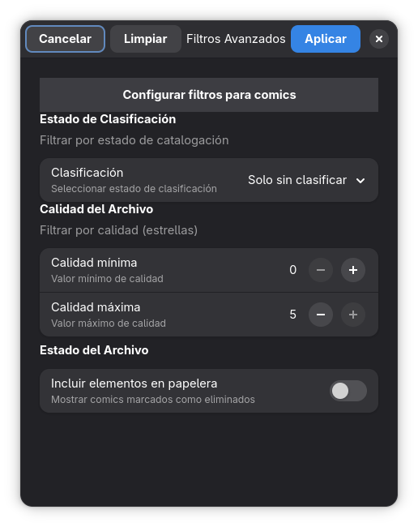

# Filtros Avanzados para Cómics

Esta ventana permite refinar la visualización de los archivos locales (CBR/CBZ) en la grilla principal, aplicando criterios específicos sobre su estado, calidad y ubicación.

## 1. Barra de Acciones Superior

Ubicada en la parte superior del panel, gestiona la aplicación de los criterios seleccionados.

* **Cancelar:** Cierra la ventana sin guardar los cambios.
* **Limpiar:** Restablece todos los campos a sus valores predeterminados (elimina cualquier filtro activo).
* **Aplicar:** (Botón Azul) Confirma la configuración y actualiza la vista principal mostrando solo los cómics que cumplen con los criterios seleccionados.

## 2. Criterios de Filtrado

### **Estado de Clasificación**
Permite filtrar la colección según el trabajo de catalogación realizado por el usuario.
* **Control:** Lista desplegable (Dropdown).
* **Opciones disponibles:**
    * *Todos:* Muestra la colección completa sin importar su estado (valor por defecto).
    * *Solo sin clasificar:* Muestra únicamente los cómics que tienen la advertencia amarilla. Esta opción es fundamental para identificar rápidamente qué archivos requieren atención o edición manual.
    * *Solo clasificados:* Muestra exclusivamente los cómics que ya han sido procesados y catalogados correctamente, ocultando los pendientes.

### **Calidad del Archivo**
Filtra los cómics basándose en la valoración asignada (sistema de estrellas).
* **Controles:** Selectores numéricos de rango (Valor mínimo `-` `+` y Valor máximo `-` `+`).
* **Rango:** de 0 a 5 estrellas.
* **Uso:** Permite encontrar rápidamente los mejores cómics de la colección o filtrar los de baja calidad para su revisión.

### **Estado del Archivo**
Gestiona la visibilidad de archivos que han sido marcados para eliminación pero aún no purgados del disco.
* **Switch "Incluir elementos en papelera":**
    * *Desactivado (Estado en imagen):* Oculta los archivos movidos a la papelera.
    * *Activado:* Muestra los cómics eliminados, permitiendo revisarlos antes de borrarlos definitivamente o restaurarlos.