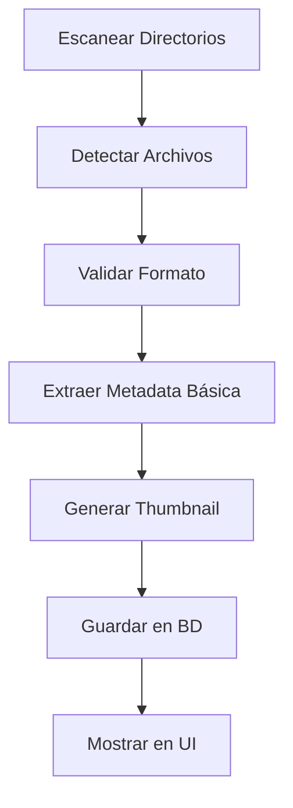

# Gestión de Comics

Esta guía detalla cómo importar, organizar y gestionar tu colección de comics digitales en Babelcomics4.

## 📥 Importación de Comics

### Formatos Soportados
Babelcomics4 es compatible con los siguientes formatos:

- **📗 CBZ**: Comic Book ZIP (recomendado)
- **📘 CBR**: Comic Book RAR
- **📙 PDF**: Documentos PDF con comics
- **🖼️ Imágenes**: JPG, PNG, WEBP (carpetas)

### Métodos de Importación

#### 1. Importación Automática por Escaneo
```bash
# Al iniciar la aplicación
# Babelcomics4 escanea automáticamente:
./Comics/              # Directorio por defecto
$COMICS_PATH/         # Variable de entorno
~/Comics/             # Directorio home del usuario
```

#### 2. Importación Manual
1. **Menú Archivo** → **Importar Comics**
2. **Seleccionar directorio** con tu colección
3. **Confirmar escaneo** recursivo
4. **Esperar procesamiento** automático

#### 3. Arrastrar y Soltar (Futuro)
- Arrastrar archivos desde el explorador
- Soltar en la ventana de Babelcomics4
- Procesamiento automático

### Proceso de Importación



#### Pasos Detallados

1. **🔍 Escaneo**: Búsqueda recursiva de archivos
2. **✅ Validación**: Verificación de formatos soportados
3. **📋 Metadata**: Extracción de información básica:
   - Nombre del archivo
   - Ruta completa
   - Tamaño del archivo
   - Fecha de modificación
4. **🖼️ Thumbnail**: Generación de miniatura:
   - Primera página del comic
   - Redimensionado automático
   - Cache para rendimiento
5. **💾 Base de Datos**: Almacenamiento en SQLite:
   - Información del archivo
   - Estado de clasificación
   - Metadatos básicos

## 📚 Organización de Comics

### Estados de Clasificación

#### 🌈 Comics Clasificados
```
┌─────────────────┐
│   🖼️ Thumbnail  │
│     (Color)     │
│                 │
│ ✅ Superman #1  │
│ 📁 superman.cbz │
│ ⭐⭐⭐⭐⭐     │
│ 📖 DC Comics    │
└─────────────────┘
```

**Características:**
- Thumbnail en **color**
- Metadata completa de ComicVine
- Información de volumen y número
- Editorial y fecha de publicación
- Puntuación de calidad

#### ⚫ Comics Sin Clasificar
```
┌─────────────────┐
│   🖼️ Thumbnail  │
│  (Escala Grises)│
│                 │
│ ❌ comic001.cbz │
│ 📁 comic001.cbz │
│ ⭐ Sin calificar │
│ 📖 Sin catalogar│
└─────────────────┘
```

**Características:**
- Thumbnail en **escala de grises**
- Solo información del archivo
- Pendiente de catalogación
- Sin metadata de ComicVine

### Sistema de Calidad

#### Puntuación por Estrellas
```
⭐     = 1 - Calidad muy baja
⭐⭐   = 2 - Calidad baja
⭐⭐⭐ = 3 - Calidad media
⭐⭐⭐⭐ = 4 - Calidad buena
⭐⭐⭐⭐⭐ = 5 - Calidad excelente
```

#### Criterios de Calidad
- **Resolución**: Calidad de las imágenes
- **Completitud**: Páginas faltantes
- **Compresión**: Nivel de compresión
- **Origen**: Fuente del escaneo
- **Procesamiento**: Limpieza y retoque

## 🔧 Herramientas de Gestión

### Edición Individual

#### Información Básica
```
┌─── Información del Comic ─────┐
│ Título: [Superman #1        ] │
│ Archivo: [superman_001.cbz  ] │
│ Ruta: [/Comics/DC/superman/ ] │
│ Tamaño: [45.2 MB           ] │
└───────────────────────────────┘

┌─── Clasificación ─────────────┐
│ Calidad: ⭐⭐⭐⭐⭐         │
│ Estado: ☑️ Clasificado        │
│ Papelera: ☐ Eliminado        │
└───────────────────────────────┘
```

#### Metadata ComicVine
```
┌─── Información ComicVine ─────┐
│ ID Issue: [38686            ] │
│ Volumen: [Superman (2018)   ] │
│ Número: [1                  ] │
│ Fecha: [2018-07-04         ] │
│ Editorial: [DC Comics       ] │
└───────────────────────────────┘
```

### 🆕 Acciones en Lote Mejoradas

#### Multiselección Avanzada
1. **Activar modo selección**: Click en 📊
2. **Seleccionar comics individuales**: Click en las cards deseadas
3. **Seleccionar todos los comics**: **Ctrl+A** (NUEVO)
4. **Ejecutar acción**: Desde menú contextual unificado

#### Métodos de Selección
```
┌─── Métodos de Selección ──────────────┐
│ 🖱️ Click Individual: Selección manual │
│ 🔗 Ctrl+Click: Agregar a selección   │
│ 🌐 Ctrl+A: Seleccionar TODOS         │
│ ⬜ Shift+Click: Rango de selección    │
└───────────────────────────────────────┘
```

#### Context Menu Unificado
```
┌─── Menú Contextual (1 o N items) ────┐
│ 🗑️ Enviar a Papelera                 │
│ 📋 Catalogar Comics                   │
│ ⭐ Cambiar Calidad                    │
│ 📝 Editar Información                 │
│ 🔄 Actualizar ComicVine               │
│ 📁 Mover Archivos                     │
│ 🏷️ Aplicar Etiquetas                 │
└───────────────────────────────────────┘
```

#### Operaciones Bulk Optimizadas
- **Procesamiento Unificado**: Una sola función maneja 1 o N elementos
- **Transacciones Eficientes**: Batch processing en base de datos
- **Feedback Visual**: Progreso en tiempo real para operaciones largas

### Gestión de Papelera

#### Mover a Papelera
```bash
# Los comics no se eliminan físicamente
# Solo se marcan como "en_papelera = True"
# Permanecen en el disco pero ocultos en la UI
```

#### Recuperar de Papelera
1. **Activar filtros avanzados**
2. **Incluir elementos en papelera** ☑️
3. **Seleccionar comics** a recuperar
4. **Restaurar** desde menú contextual

## 🖼️ Sistema de Thumbnails

### Generación Automática

#### Proceso de Generación


#### Parámetros
- **Tamaño**: 200x300 px (proporción preservada)
- **Formato**: JPEG con compresión optimizada
- **Cache**: Almacenado en `data/thumbnails/comics/`

### Efectos Visuales

#### Escala de Grises Automática
```python
# Comics sin físicos → Escala de grises
if comic.cantidad_adquirida == 0:
    thumbnail = convert_to_grayscale(thumbnail)

# Comics con físicos → Color normal
else:
    thumbnail = original_thumbnail
```

#### Procesamiento con Pillow
```python
def convert_to_grayscale(image):
    """Convierte imagen a escala de grises preservando calidad"""
    # Convertir a RGB si es necesario
    if image.mode in ('RGBA', 'LA'):
        rgb_image = Image.new('RGB', image.size, (255, 255, 255))
        rgb_image.paste(image, mask=image.split()[-1])
    else:
        rgb_image = image.convert('RGB')

    # Aplicar escala de grises
    grayscale = rgb_image.convert('L')
    return grayscale.convert('RGB')
```

## 🔍 Búsqueda y Filtrado

### Búsqueda Básica
```
🔍 [Buscar en tu colección...]
```

#### Campos de Búsqueda
- **Nombre del archivo**: `superman.cbz`
- **Ruta completa**: `/Comics/DC/superman/`
- **Título catalogado**: `Superman #1`
- **Editorial**: `DC Comics`
- **Volumen**: `Superman (2018)`

### Filtros Avanzados

#### Filtros de Clasificación
```
○ Todos los comics        # Mostrar todos
○ Solo clasificados       # Solo con metadata ComicVine
○ Solo sin clasificar     # Solo archivos sin catalogar
```

#### Filtros de Calidad
```
Calidad mínima: [⭐] ────○──── [⭐⭐⭐⭐⭐]
Calidad máxima: [⭐] ──────────○ [⭐⭐⭐⭐⭐]
```

#### Filtros de Estado
```
☐ Incluir elementos en papelera
☑️ Excluir archivos corruptos
☑️ Solo archivos existentes
```

### Combinación de Filtros
```python
# Ejemplo: Comics de alta calidad sin clasificar
{
    'classification': False,    # Sin clasificar
    'quality_range': (4, 5),   # 4-5 estrellas
    'exclude_trash': True      # No en papelera
}
```

## 📊 Estadísticas y Reportes

### Información de Colección
```
┌─── Estadísticas Generales ────┐
│ Total de Comics: 1,247        │
│ Clasificados: 892 (71.5%)     │
│ Sin Clasificar: 355 (28.5%)   │
│ En Papelera: 12 (1.0%)        │
└───────────────────────────────┘

┌─── Distribución por Calidad ──┐
│ ⭐⭐⭐⭐⭐: 234 (18.8%)      │
│ ⭐⭐⭐⭐: 445 (35.7%)        │
│ ⭐⭐⭐: 312 (25.0%)          │
│ ⭐⭐: 178 (14.3%)            │
│ ⭐: 78 (6.3%)                │
└───────────────────────────────┘
```

### Distribución por Formato
```
📗 CBZ: 892 (71.5%)
📘 CBR: 234 (18.8%)
📙 PDF: 89 (7.1%)
🖼️ IMG: 32 (2.6%)
```

## 🛠️ Mantenimiento

### Verificación de Integridad
```bash
# Verificar archivos faltantes
python -c "
from db_manager import DatabaseManager
db = DatabaseManager()
db.verify_file_integrity()
"
```

### Regenerar Thumbnails
```bash
# Forzar regeneración de todas las miniaturas
python -c "
from thumbnail_generator import ThumbnailGenerator
gen = ThumbnailGenerator()
gen.regenerate_all()
"
```

### Limpieza de Cache
```bash
# Limpiar thumbnails huérfanos
rm -rf data/thumbnails/comics/*
# Se regenerarán automáticamente
```

## 💡 Consejos y Mejores Prácticas

### Organización de Archivos
```
Comics/
├── DC/
│   ├── Batman/
│   │   ├── Batman_001.cbz
│   │   ├── Batman_002.cbz
│   │   └── ...
│   └── Superman/
│       ├── Superman_001.cbz
│       └── ...
└── Marvel/
    ├── Spider-Man/
    └── X-Men/
```

### Nomenclatura Recomendada
```bash
# Formato sugerido
[Editorial]_[Serie]_[Número]_[Año].cbz

# Ejemplos
DC_Batman_001_2023.cbz
Marvel_Spider-Man_015_2022.cbz
Image_Walking_Dead_193_2019.cbz
```

### Flujo de Trabajo Eficiente
1. **Organizar archivos** en directorios lógicos
2. **Importar a Babelcomics4** por lotes
3. **Clasificar con ComicVine** usando filtros
4. **Revisar y ajustar** metadata manualmente
5. **Mantener backup** de la base de datos

---

**¿Listo para gestionar volúmenes completos?** 👉 [Gestión de Volúmenes](gestion-volumenes.md)