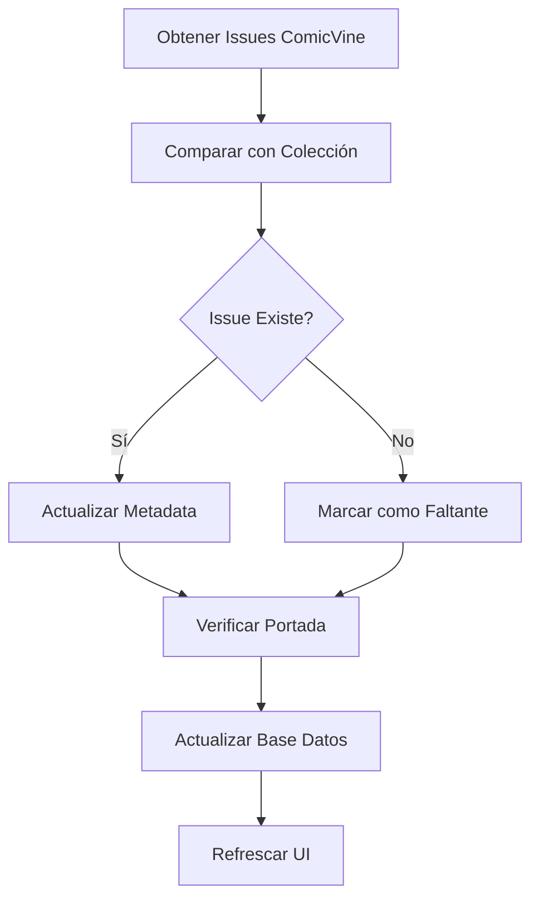

# Gestión de Volúmenes

La gestión de volúmenes en Babelcomics4 permite organizar y administrar series completas de comics, proporcionando una vista integral de tu colección a nivel de volumen y facilitando la catalogación automática con ComicVine.

## 📚 ¿Qué es un Volumen?

### Definición
Un **volumen** es una serie o colección específica de comics que comparten:

- **Título de la serie**: Ej. "Batman", "Spider-Man", "The Walking Dead"
- **Editorial**: DC Comics, Marvel Comics, Image Comics, etc.
- **Período de publicación**: Años de inicio y fin
- **Numeración**: Secuencia específica de issues

### Ejemplos de Volúmenes
```
📗 Batman (2016) - DC Comics
   ├── Batman #1 (2016)
   ├── Batman #2 (2016)
   ├── Batman #3 (2016)
   └── ...

📘 The Amazing Spider-Man (2018) - Marvel Comics
   ├── The Amazing Spider-Man #1 (2018)
   ├── The Amazing Spider-Man #2 (2018)
   └── ...

📙 The Walking Dead (2003) - Image Comics
   ├── The Walking Dead #1 (2003)
   ├── The Walking Dead #2 (2003)
   └── ... hasta #193 (2019)
```

## 🔍 Vista de Volúmenes

### Navegación Principal
```
┌─── Lista de Volúmenes ─────────────────────────┐
│                                               │
│ 📗 Batman (2016) - DC Comics                 │
│ ├── 45/100 issues en colección (45%)         │
│ ├── Último actualizado: 2024-03-15           │
│ └── [🔄 Actualizar ComicVine]                │
│                                               │
│ 📘 Spider-Man (2018) - Marvel Comics         │
│ ├── 23/50 issues en colección (46%)          │
│ ├── Issues faltantes: #5, #12, #18-20        │
│ └── [🔄 Actualizar ComicVine]                │
│                                               │
│ 📙 The Walking Dead (2003) - Image Comics    │
│ ├── 193/193 issues en colección (100%) ✅   │
│ ├── ⭐ Colección completa                    │
│ └── [🔄 Actualizar ComicVine]                │
└───────────────────────────────────────────────┘
```

### Información del Volumen

#### Metadatos Básicos
```
┌─── Batman (2016) ─────────────────────────────┐
│                                               │
│ 📖 Editorial: DC Comics                       │
│ 📅 Período: 2016 - 2021                      │
│ 🔢 Total Issues: 100                          │
│ 💾 En Colección: 45 (45%)                     │
│ 🏷️ ID ComicVine: 91273                       │
│                                               │
│ 📝 Descripción:                               │
│ La serie principal de Batman que comenzó      │
│ durante el evento DC Rebirth, escrita por     │
│ Tom King y otros autores destacados.          │
│                                               │
└───────────────────────────────────────────────┘
```

#### Estadísticas de Colección
```
┌─── Estadísticas de Colección ─────────────────┐
│                                               │
│ 📊 Progreso: ████████████░░░░░░░░ 45%        │
│                                               │
│ ✅ Issues Catalogados: 42                    │
│ ❌ Issues Sin Catalogar: 3                   │
│ 🔍 Issues Faltantes: 55                      │
│ 🗑️ En Papelera: 0                           │
│                                               │
│ ⭐ Calidad Promedio: ⭐⭐⭐⭐ (4.2/5)        │
│ 📁 Tamaño Total: 2.3 GB                      │
│                                               │
└───────────────────────────────────────────────┘
```

## 📋 Lista de Issues del Volumen

### Vista Detallada de Issues
```
┌─── Batman (2016) - Issues ────────────────────┐
│                                               │
│ #1  ✅ Batman #1 - I Am Gotham               │
│     📁 batman_001_2016.cbz | ⭐⭐⭐⭐⭐       │
│     📅 2016-06-15 | 💾 45.2 MB                │
│                                               │
│ #2  ✅ Batman #2 - I Am Gotham               │
│     📁 batman_002_2016.cbz | ⭐⭐⭐⭐         │
│     📅 2016-07-06 | 💾 42.8 MB                │
│                                               │
│ #3  ❌ Batman #3 - I Am Gotham               │
│     📁 batman_003_2016.cbz | Sin catalogar    │
│     📅 2016-07-20 | 💾 41.5 MB                │
│                                               │
│ #4  🔍 Batman #4 - I Am Gotham               │
│     Issue faltante en colección               │
│     📅 2016-08-03                             │
│                                               │
│ #5  ✅ Batman #5 - I Am Gotham               │
│     📁 batman_005_2016.cbz | ⭐⭐⭐⭐⭐       │
│     📅 2016-08-17 | 💾 43.1 MB                │
│                                               │
└───────────────────────────────────────────────┘

🔧 Controles:
[📥 Importar Issues] [🔄 Actualizar ComicVine]
[⭐ Cambiar Calidad] [🗑️ Gestionar Papelera]
```

### Estados de Issues

#### ✅ Issue Catalogado
```
┌─── Batman #1 (2016) ──────────────────────────┐
│ 🖼️ [Thumbnail Color]                         │
│                                               │
│ 📖 Título: Batman #1 - I Am Gotham           │
│ 📁 Archivo: batman_001_2016.cbz              │
│ ⭐ Calidad: ⭐⭐⭐⭐⭐ (5/5)                │
│ 📅 Fecha Tapa: 2016-06-15                    │
│ 💾 Tamaño: 45.2 MB                           │
│ 🏷️ ComicVine ID: 38686                       │
│                                               │
│ 📝 Historia: "I Am Gotham" Part 1            │
│ Two strange new heroes appear in Gotham...    │
│                                               │
│ 👥 Equipo Creativo:                          │
│ ✏️ Guionista: Tom King                       │
│ 🎨 Dibujante: David Finch                    │
│ 🖌️ Entintador: Matt Banning                  │
└───────────────────────────────────────────────┘
```

#### ❌ Issue Sin Catalogar
```
┌─── comic_batman_003.cbz ──────────────────────┐
│ 🖼️ [Thumbnail Escala Grises]                 │
│                                               │
│ 📁 Archivo: comic_batman_003.cbz             │
│ ⭐ Calidad: Sin calificar                     │
│ 📅 Modificado: 2024-03-10                    │
│ 💾 Tamaño: 41.5 MB                           │
│ 🏷️ Estado: Sin catalogar                     │
│                                               │
│ 🔧 Acciones:                                 │
│ [🔍 Buscar en ComicVine]                     │
│ [📝 Catalogar Manualmente]                   │
│ [⭐ Asignar Calidad]                          │
└───────────────────────────────────────────────┘
```

#### 🔍 Issue Faltante
```
┌─── Batman #4 (2016) ──────────────────────────┐
│ 🖼️ [Imagen de ComicVine]                     │
│                                               │
│ 📖 Título: Batman #4 - I Am Gotham           │
│ 📅 Fecha Tapa: 2016-08-03                    │
│ 🏷️ ComicVine ID: 38689                       │
│ 🔍 Estado: No encontrado en colección        │
│                                               │
│ 📝 Historia: "I Am Gotham" Part 4            │
│ Batman teams up with Gotham and Gotham Girl  │
│ to face a new threat to the city.            │
│                                               │
│ 🔧 Acciones:                                 │
│ [📥 Marcar como Adquirido]                   │
│ [🔍 Buscar en Archivos]                      │
│ [🛒 Añadir a Lista de Deseos]                │
└───────────────────────────────────────────────┘
```

## 🔄 Actualización desde ComicVine

### Proceso de Actualización

#### Actualización Manual
```python
def update_volume_from_comicvine(volume_id):
    """Actualizar volumen completo desde ComicVine"""

    # 1. Obtener información actualizada del volumen
    volume_data = comicvine_client.get_volume_details(volume_id)

    # 2. Actualizar metadatos del volumen
    update_volume_metadata(volume_data)

    # 3. Obtener lista completa de issues
    issues_list = comicvine_client.get_volume_issues(volume_id)

    # 4. Sincronizar con issues en colección
    sync_issues_with_collection(issues_list)

    # 5. Descargar portadas faltantes
    download_missing_covers()

    # 6. Actualizar estadísticas
    update_collection_stats()
```

#### Sincronización de Issues


### Configuración de Actualizaciones

#### Actualización Automática
```
┌─── Configuración Auto-Update ─────────────────┐
│                                               │
│ ⏰ Frecuencia: [Semanal ▼]                   │
│ 🕐 Hora: [02:00] AM                          │
│ 📅 Día: [Domingo]                            │
│                                               │
│ ✅ Actualizar metadata de volúmenes          │
│ ✅ Sincronizar lista de issues               │
│ ✅ Descargar portadas nuevas                 │
│ ☐ Marcar issues faltantes como deseados      │
│                                               │
│ 🌐 Límite API: [200] requests/hora           │
│ ⏱️ Delay entre requests: [500] ms            │
│                                               │
│ [💾 Guardar Configuración]                   │
└───────────────────────────────────────────────┘
```

#### Historial de Actualizaciones
```
┌─── Historial de Actualizaciones ─────────────┐
│                                               │
│ 📅 2024-03-15 14:30 - Batman (2016)          │
│ ├── ✅ 5 issues actualizados                 │
│ ├── 📥 3 portadas descargadas                │
│ └── 🔍 2 issues faltantes detectados         │
│                                               │
│ 📅 2024-03-14 18:45 - Spider-Man (2018)      │
│ ├── ✅ 2 issues actualizados                 │
│ ├── ❌ Error API timeout (reintentado)       │
│ └── ✅ Actualización completada               │
│                                               │
│ 📅 2024-03-13 12:20 - Walking Dead (2003)    │
│ ├── ✅ Volumen completo actualizado          │
│ ├── ℹ️ Sin cambios detectados               │
│ └── ✅ Verificación completada               │
└───────────────────────────────────────────────┘
```

## 🛠️ Herramientas de Gestión

### Análisis de Colección

#### Completitud de Volúmenes
```python
def analyze_collection_completeness():
    """Analizar completitud de volúmenes en colección"""

    volumes_stats = []

    for volume in session.query(Volume).all():
        total_issues = volume.cantidad_numeros
        owned_issues = session.query(Comicbook).join(ComicbookInfo).filter(
            ComicbookInfo.id_volume == volume.id_volume
        ).count()

        completeness = (owned_issues / total_issues) * 100 if total_issues > 0 else 0

        volumes_stats.append({
            'volume': volume,
            'total_issues': total_issues,
            'owned_issues': owned_issues,
            'completeness': completeness,
            'missing_issues': total_issues - owned_issues
        })

    # Ordenar por completitud
    return sorted(volumes_stats, key=lambda x: x['completeness'], reverse=True)
```

#### Reporte de Issues Faltantes
```
┌─── Issues Faltantes por Volumen ──────────────┐
│                                               │
│ 📗 Batman (2016) - 55 faltantes (55%)        │
│ ├── #4, #8, #12-15, #18, #20-25             │
│ ├── #30-35, #40, #45-50, #55-60             │
│ └── #65-70, #75-80, #85-100                 │
│                                               │
│ 📘 Spider-Man (2018) - 27 faltantes (54%)    │
│ ├── #5, #8, #12, #18-20, #25                │
│ ├── #30-35, #40, #45-50                     │
│ └── Volumen activo - Issues nuevos           │
│                                               │
│ 📙 X-Men (2019) - 12 faltantes (24%)         │
│ ├── #15, #18, #22-25, #30                   │
│ ├── #35, #40, #42, #45                      │
│ └── Alta prioridad - Nearly complete         │
└───────────────────────────────────────────────┘

🎯 Acciones Sugeridas:
[🛒 Generar Lista de Compras] [📊 Exportar Reporte]
[⭐ Priorizar por Calidad] [💰 Estimar Costo]
```

### Gestión de Duplicados

#### Detección de Duplicados
```python
def detect_duplicate_issues():
    """Detectar issues duplicados en la colección"""

    duplicates = session.query(
        ComicbookInfo.id_volume,
        ComicbookInfo.numero,
        func.count(Comicbook.id_comicbook).label('count')
    ).join(Comicbook).group_by(
        ComicbookInfo.id_volume,
        ComicbookInfo.numero
    ).having(func.count(Comicbook.id_comicbook) > 1).all()

    duplicate_groups = []

    for volume_id, issue_number, count in duplicates:
        comics = session.query(Comicbook).join(ComicbookInfo).filter(
            ComicbookInfo.id_volume == volume_id,
            ComicbookInfo.numero == issue_number
        ).all()

        duplicate_groups.append({
            'volume_id': volume_id,
            'issue_number': issue_number,
            'count': count,
            'comics': comics
        })

    return duplicate_groups
```

#### Resolución de Duplicados
```
┌─── Duplicados Detectados ─────────────────────┐
│                                               │
│ 📗 Batman #15 (2016) - 2 copias             │
│ ├── 📁 batman_015_v1.cbz | ⭐⭐⭐ | 42MB    │
│ ├── 📁 batman_015_v2.cbz | ⭐⭐⭐⭐⭐ | 68MB│
│ └── 🎯 Acción: Conservar v2, mover v1 a papelera │
│                                               │
│ 📘 Spider-Man #8 (2018) - 3 copias          │
│ ├── 📁 spiderman_008_low.cbz | ⭐⭐ | 25MB   │
│ ├── 📁 spiderman_008_med.cbz | ⭐⭐⭐ | 35MB │
│ ├── 📁 spiderman_008_hq.cbz | ⭐⭐⭐⭐⭐ | 55MB │
│ └── 🎯 Acción: Conservar HQ, eliminar otros   │
│                                               │
│ [🔧 Resolver Automáticamente] [📝 Manual]    │
└───────────────────────────────────────────────┘
```

## 📊 Estadísticas de Volúmenes

### Dashboard de Volúmenes
```
┌─── Estadísticas de Colección ─────────────────┐
│                                               │
│ 📚 Total Volúmenes: 45                       │
│ ✅ Completos (100%): 3 (6.7%)                │
│ 🔄 En Progreso (50-99%): 12 (26.7%)          │
│ 🆕 Iniciados (<50%): 30 (66.7%)              │
│                                               │
│ 📊 Completitud Promedio: 34.5%               │
│ 📈 Tendencia: +2.3% este mes                 │
│                                               │
├─── Por Editorial ─────────────────────────────┤
│ 🦇 DC Comics: 18 volúmenes (40%)             │
│ 🕷️ Marvel Comics: 15 volúmenes (33.3%)        │
│ 🌟 Image Comics: 8 volúmenes (17.8%)         │
│ 📚 Otros: 4 volúmenes (8.9%)                 │
│                                               │
├─── Por Década ────────────────────────────────┤
│ 2020s: 20 volúmenes (44.4%) 📈               │
│ 2010s: 15 volúmenes (33.3%) 📊               │
│ 2000s: 8 volúmenes (17.8%) 📉                │
│ 1990s: 2 volúmenes (4.4%) 📉                 │
└───────────────────────────────────────────────┘
```

### Métricas de Calidad
```
┌─── Distribución de Calidad ───────────────────┐
│                                               │
│ ⭐⭐⭐⭐⭐ Excelente: 234 issues (22.3%)     │
│ ⭐⭐⭐⭐ Muy Buena: 412 issues (39.2%)       │
│ ⭐⭐⭐ Buena: 295 issues (28.1%)             │
│ ⭐⭐ Regular: 89 issues (8.5%)                │
│ ⭐ Baja: 21 issues (2.0%)                     │
│                                               │
│ 📊 Calidad Promedio: 3.8/5 ⭐⭐⭐⭐           │
│ 🎯 Meta de Calidad: 4.0/5                    │
│ 📈 Progreso: 95% hacia meta                  │
└───────────────────────────────────────────────┘
```

## 🔍 Búsqueda y Filtrado de Volúmenes

### Filtros Avanzados
```
┌─── Filtros de Volúmenes ──────────────────────┐
│                                               │
│ 🔍 Buscar: [batman rebirth         ] 🔎      │
│                                               │
│ 📊 Completitud:                               │
│ ☐ Completos (100%)                           │
│ ☑️ En progreso (1-99%)                       │
│ ☐ Sin issues (0%)                            │
│                                               │
│ 🏢 Editorial:                                │
│ ☑️ DC Comics         ☑️ Marvel Comics        │
│ ☑️ Image Comics      ☐ Dark Horse            │
│ ☐ IDW Publishing    ☐ Otras                  │
│                                               │
│ 📅 Período:                                  │
│ Desde: [2010] Hasta: [2024]                  │
│                                               │
│ 📊 Estado:                                   │
│ ☑️ Activos           ☐ Finalizados           │
│ ☐ Cancelados         ☐ En pausa              │
│                                               │
│ [🔄 Aplicar Filtros] [❌ Limpiar]           │
└───────────────────────────────────────────────┘
```

### Ordenamiento
```
Ordenar por:
○ Nombre (A-Z)          ○ Nombre (Z-A)
○ Completitud (Mayor)   ○ Completitud (Menor)
○ Fecha Inicio (Nuevo)  ○ Fecha Inicio (Antiguo)
○ Editorial             ○ Issues en Colección
○ Última Actualización  ○ Calidad Promedio
```

## 💡 Consejos para Gestión Eficiente

### Flujo de Trabajo Recomendado

#### 1. Configuración Inicial
1. **Importar colección** existente
2. **Configurar actualizaciones** automáticas
3. **Establecer perfiles** de catalogación
4. **Definir estructura** de directorios

#### 2. Mantenimiento Regular
1. **Revisar duplicados** semanalmente
2. **Actualizar volúmenes** activos
3. **Catalogar issues** sin clasificar
4. **Verificar integridad** de archivos

#### 3. Expansión de Colección
1. **Identificar issues** faltantes
2. **Priorizar por completitud** o calidad
3. **Mantener listas** de deseos
4. **Integrar nuevas** adquisiciones

### Mejores Prácticas

#### Organización de Archivos
```bash
# Estructura recomendada
Comics/
├── DC_Comics/
│   ├── Batman_2016/
│   │   ├── Batman_001_2016.cbz
│   │   ├── Batman_002_2016.cbz
│   │   └── ...
│   └── Superman_2018/
│       └── ...
├── Marvel_Comics/
│   ├── Spider-Man_2018/
│   └── X-Men_2019/
└── Image_Comics/
    └── Walking_Dead_2003/
```

#### Nomenclatura Consistente
```bash
# Formato sugerido para archivos
[Serie]_[Número]_[Año].cbz

# Ejemplos
Batman_001_2016.cbz
Amazing_Spider-Man_001_2018.cbz
Walking_Dead_001_2003.cbz
```

#### Backup y Recuperación
```bash
# Backup regular de metadatos
sqlite3 babelcomics.db ".backup backup_$(date +%Y%m%d).db"

# Backup de configuración
cp -r data/ backup_data_$(date +%Y%m%d)/

# Verificación de integridad
python verify_collection.py --check-files --check-metadata
```

---

**¿Listo para configurar filtros avanzados?** 👉 [Filtros y Búsqueda](filtros-busqueda.md)