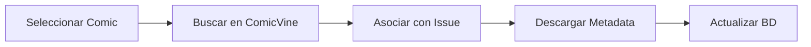

# Primeros Pasos

Esta guía te llevará a través de los conceptos básicos de Babelcomics4 y te ayudará a empezar a gestionar tu colección de comics.

## 🚀 Primer Inicio

### Ejecutar la Aplicación
```bash
# Activar entorno virtual
source .venv/bin/activate

# Ejecutar Babelcomics4
python Babelcomic4.py
```

### Primera Ejecución
En el primer inicio, Babelcomics4:

1. ✅ **Crea la base de datos** automáticamente en `data/babelcomics.db`
2. ✅ **Inicializa las tablas** necesarias con SQLAlchemy
3. ✅ **Crea directorios** de cache y thumbnails
4. ✅ **Configura el entorno** de trabajo

```
🔍 Verificando requisitos...
✓ Pango disponible
✓ Todos los archivos requeridos encontrados
✓ Base de datos encontrada: data/babelcomics.db
✓ Aplicación creada
```

## 🖥️ Interfaz Principal

### Componentes de la Interfaz

```
┌─────────────────────────────────────────────────────────────┐
│ [≡] Babelcomics4           🔍 Buscar...        [⚙️] [📊]     │
├─────────────────────────────────────────────────────────────┤
│ [📚 Comics] [📖 Volúmenes] [🏢 Editoriales]                │
├─────────────────────────────────────────────────────────────┤
│                                                             │
│  ┌─────┐  ┌─────┐  ┌─────┐  ┌─────┐  ┌─────┐              │
│  │ 📗  │  │ 📘  │  │ 📙  │  │ 📕  │  │ 📔  │              │
│  │Comic│  │Comic│  │Comic│  │Comic│  │Comic│              │
│  │  1  │  │  2  │  │  3  │  │  4  │  │  5  │              │
│  └─────┘  └─────┘  └─────┘  └─────┘  └─────┘              │
│                                                             │
│  ┌─────┐  ┌─────┐  ┌─────┐  ┌─────┐  ┌─────┐              │
│  │ 📗  │  │ 📘  │  │ 📙  │  │ 📕  │  │ 📔  │              │
│  │Comic│  │Comic│  │Comic│  │Comic│  │Comic│              │
│  │  6  │  │  7  │  │  8  │  │  9  │  │ 10  │              │
│  └─────┘  └─────┘  └─────┘  └─────┘  └─────┘              │
└─────────────────────────────────────────────────────────────┘
```

### Barra Superior
- **🔍 Búsqueda**: Campo de búsqueda en tiempo real
- **⚙️ Filtros**: Acceso a filtros avanzados
- **📊 Selección**: Modo de selección múltiple

### Pestañas de Navegación
- **📚 Comics**: Vista de comics individuales
- **📖 Volúmenes**: Vista de series/volúmenes
- **🏢 Editoriales**: Vista de editoriales/publishers

## 📚 Vista de Comics

### Información de las Cards
Cada comic muestra:

```
┌─────────────────┐
│   📗 Thumbnail  │
│                 │
│ Título del      │
│ Comic           │
│                 │
│ 📁 Archivo      │
│ ⭐ Calidad      │
│ 🔖 Estado       │
└─────────────────┘
```

- **Thumbnail**: Miniatura generada automáticamente
- **Título**: Nombre del archivo o título catalogado
- **Archivo**: Ruta del archivo físico
- **Calidad**: Puntuación de 1-5 estrellas
- **Estado**: Clasificado ✅ / Sin clasificar ❌

### Estados Visuales
- **🌈 Color**: Comic catalogado con metadata
- **⚫ Escala de grises**: Comic sin catálogo físico
- **🗑️ Papelera**: Comic marcado como eliminado

### Interacciones
- **Click simple**: Seleccionar comic
- **Doble click**: Abrir detalles (futuro)
- **Click derecho**: Menú contextual
- **Arrastrar**: Selección múltiple

## 📖 Vista de Volúmenes

### Información de Volúmenes
```
┌─────────────────┐
│  📖 Cover       │
│                 │
│ Nombre del      │
│ Volumen         │
│                 │
│ 📅 Año          │
│ 📊 Completitud  │
│ 🔢 Issues       │
└─────────────────┘
```

- **Cover**: Portada oficial del volumen
- **Nombre**: Título oficial del volumen
- **Año**: Año de publicación
- **Completitud**: Porcentaje de issues que posees
- **Issues**: Cantidad total de números

### Navegación a Detalle
Al hacer doble click en un volumen:

1. **Navegación**: Se abre la página de detalle
2. **Lista de Issues**: Todos los números del volumen
3. **Metadatos**: Información completa de ComicVine
4. **Acciones**: Botón de actualización ComicVine

## 🔍 Sistema de Búsqueda

### Búsqueda Básica
```
🔍 [Buscar comics, volúmenes, editoriales...]
```

- **Tiempo real**: Resultados mientras escribes
- **Multi-campo**: Busca en títulos, archivos, metadatos
- **Sensible a contexto**: Según la pestaña activa

### Ejemplos de Búsqueda
```bash
# Buscar por título
Superman

# Buscar por archivo
.cbz

# Buscar por editorial
Marvel

# Buscar por año
2023
```

## ⚙️ Filtros Avanzados

### Acceder a Filtros
1. Click en el botón **⚙️** de la barra superior
2. Se abre el diálogo de "Filtros Avanzados"
3. Configurar criterios según la vista activa

### Filtros para Comics
```
┌─── Estado de Clasificación ───┐
│ ○ Todos los comics            │
│ ○ Solo clasificados           │
│ ○ Solo sin clasificar         │
└───────────────────────────────┘

┌─── Calidad del Archivo ───────┐
│ Mínima: [0] ⭐                │
│ Máxima: [5] ⭐                │
└───────────────────────────────┘

┌─── Estado del Archivo ────────┐
│ ☐ Incluir elementos en        │
│   papelera                    │
└───────────────────────────────┘
```

### Filtros para Volúmenes
```
┌─── Año de Publicación ────────┐
│ Desde: [1900]                 │
│ Hasta: [2024]                 │
└───────────────────────────────┘

┌─── Cantidad de Números ───────┐
│ Mínimo: [0]                   │
│ Máximo: [1000]                │
└───────────────────────────────┘

┌─── Estado de Colección ───────┐
│ ▼ Todos los volúmenes         │
│   Colección completa (100%)   │
│   Mayoría completa (>75%)     │
│   Parcialmente completa       │
│   Pocos números (<25%)        │
│   Sin comics (0%)             │
└───────────────────────────────┘
```

## 📊 Modo Selección

### Activar Selección Múltiple
1. Click en el botón **📊** de la barra superior
2. Las cards cambian a modo selección
3. Click en cards para seleccionar/deseleccionar

### Acciones en Lote
```
┌─── Acciones Disponibles ──────┐
│ 🗑️ Mover a Papelera          │
│ 📝 Editar Metadatos           │
│ 🔄 Actualizar desde ComicVine │
│ 📁 Cambiar Ubicación          │
└───────────────────────────────┘
```

## 🎯 Flujo de Trabajo Básico

### 1. Importar Comics


### 2. Catalogar con ComicVine


### 3. Organizar Colección


## 🎨 Personalización

### Temas
- **Claro**: Tema predeterminado
- **Oscuro**: Activación automática según sistema
- **Adaptativo**: Sigue configuración del sistema

### Directorios
```python
# Estructura de datos
data/
├── babelcomics.db          # Base de datos principal
├── thumbnails/             # Cache de miniaturas
│   ├── comics/            # Thumbnails de comics
│   ├── volumes/           # Thumbnails de volúmenes
│   └── comicbookinfo_issues/ # Thumbnails de issues
└── backups/               # Respaldos automáticos
```

## 🔧 Configuración Inicial

### Directorios de Comics
Por defecto, Babelcomics4 busca comics en:
- Directorio actual del proyecto
- Directorios especificados en variables de entorno
- Rutas configuradas en la aplicación

### API ComicVine (Opcional)
```bash
# Configurar API key
export COMICVINE_API_KEY="tu-clave-aqui"

# O configurar en la aplicación
```

## 📈 Estadísticas

### Panel de Información
La aplicación te muestra:
- **Total de comics**: Cantidad en tu colección
- **Clasificados**: Comics con metadata completa
- **Sin clasificar**: Comics pendientes de catalogar
- **Volúmenes**: Series en tu colección
- **Completitud**: Porcentaje medio de colecciones

## 🎯 Próximos Pasos

Ahora que conoces lo básico:

1. **[Gestión de Comics](gestion-comics.md)**: Importa y organiza tu colección
2. **[Gestión de Volúmenes](gestion-volumenes.md)**: Trabaja con series completas
3. **[Filtros y Búsqueda](filtros-busqueda.md)**: Encuentra comics específicos
4. **[Integración ComicVine](comicvine.md)**: Automatiza la catalogación

## 💡 Consejos Útiles

### Atajos de Teclado
- **Ctrl+F**: Enfocar búsqueda
- **Escape**: Salir de modo selección
- **Ctrl+A**: Seleccionar todos (en modo selección)

### Mejores Prácticas
1. **Organiza archivos**: Usa nombres descriptivos
2. **Usa ComicVine**: Para metadata automática
3. **Aplica filtros**: Para encontrar comics específicos
4. **Backup regular**: Protege tu base de datos

---

**¿Listo para organizar tu colección?** 👉 [Gestión de Comics](gestion-comics.md)