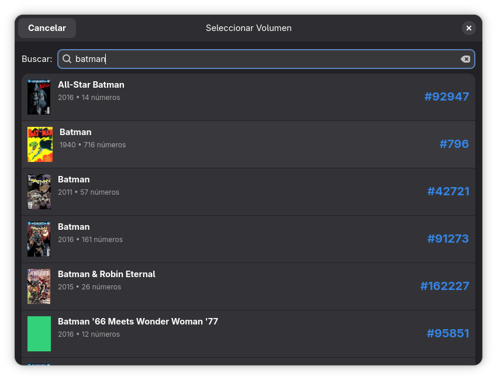
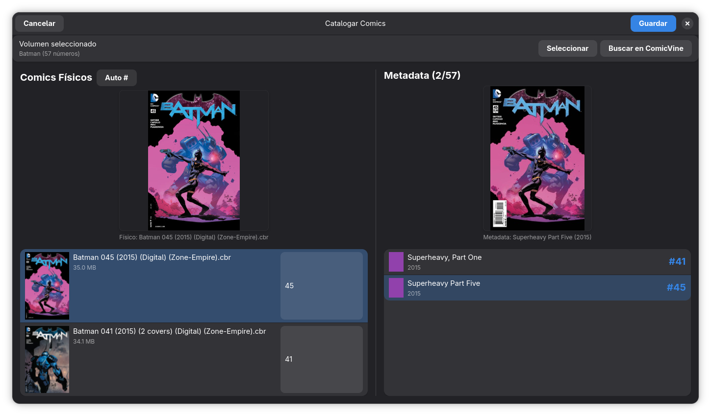

# Catalogación de Cómics (Clasificación Manual)

Aunque BabelComics4 cuenta con algoritmos automáticos, la catalogación manual es la herramienta definitiva de precisión. Permite al usuario vincular archivos físicos específicos con su metadata correcta en Comic Vine cuando el sistema automático no logra determinar la correspondencia (por ejemplo, en archivos con nombres complejos o numeraciones extrañas).

**Acceso:**
Esta ventana se invoca desde la **Ventana Principal**, seleccionando uno o varios archivos en modo lote.
> Para ver cómo activar esta funcionalidad, consulta el apartado de [Modo Selección](ventana_general.md#b-modo-selección).

---

## 1. Selección del Volumen

Lo primero que solicita el sistema es identificar a qué serie o colección pertenecen los archivos seleccionados.

* **Barra de Búsqueda:** Ingresa el nombre de la serie (ej: *"Batman"*).
* **Lista de Resultados:** El sistema mostrará las coincidencias encontradas en tu base de datos de metadatos (previamente descargados).
    * *Dato clave:* Verifica el **Año** y la **Cantidad de números** para asegurarte de elegir el volumen correcto (ej. distinguir entre *Batman (1940)* y *Batman (2011)*).
* **Acción:** Haz clic en el volumen deseado para cargarlo en la interfaz de catalogación.

---

## 2. Interfaz de Emparejamiento (Matching)

Una vez seleccionado el volumen, se abre la ventana de trabajo dividida en dos paneles lógicos: **Físicos (Izquierda)** y **Metadata (Derecha)**.

### **Panel Izquierdo: Cómics Físicos**
Lista los archivos locales que seleccionaste para catalogar.

* **Extrapolación de Números (Botón "Auto #"):**
    * El sistema intenta "adivinar" el número del cómic leyendo el nombre del archivo.
    * *Ejemplo:* Si el archivo es `Batman_v2_045.cbz`, el sistema sugerirá el número **45**.
* **Edición Manual de Número:**
    * Si la extrapolación falla, puedes escribir manualmente el número correcto en la casilla lateral derecha de cada fila.
* **Eliminar de la lista:** Si seleccionaste por error un archivo que no pertenece a este volumen, puedes quitarlo de la lista para no procesarlo.

### **Panel Derecho: Metadata**
Muestra la lista oficial de *issues* (números) que contiene el volumen seleccionado en Comic Vine.

* **Mecanismo de Matching:**
    * El sistema cruza automáticamente el número definido en el panel izquierdo con la lista del panel derecho.
    * Si hay coincidencia (ej. Tienes el archivo #45 y existe el Issue #45 en la metadata), la fila se resalta en azul.

### **Verificación Visual (Covers)**
La parte superior de la ventana es el área de control de calidad.

* **Al seleccionar una fila:** Se muestran lado a lado las dos portadas:
    1.  **Físico (Izquierda):** La primera página de tu archivo local.
    2.  **Metadata (Derecha):** La portada oficial de Comic Vine.
* **Uso:** Compara ambas imágenes visualmente. Si son la misma (o variantes de la misma), el emparejamiento es correcto.

---

## 3. Finalizar el proceso

Una vez que hayas verificado que los números coinciden y las portadas son correctas:

* **Botón "Guardar" (Azul):** Aplica los cambios. El sistema renombrará internamente los registros, asociará la metadata y moverá los cómics al estado "Clasificado" en la ventana principal.