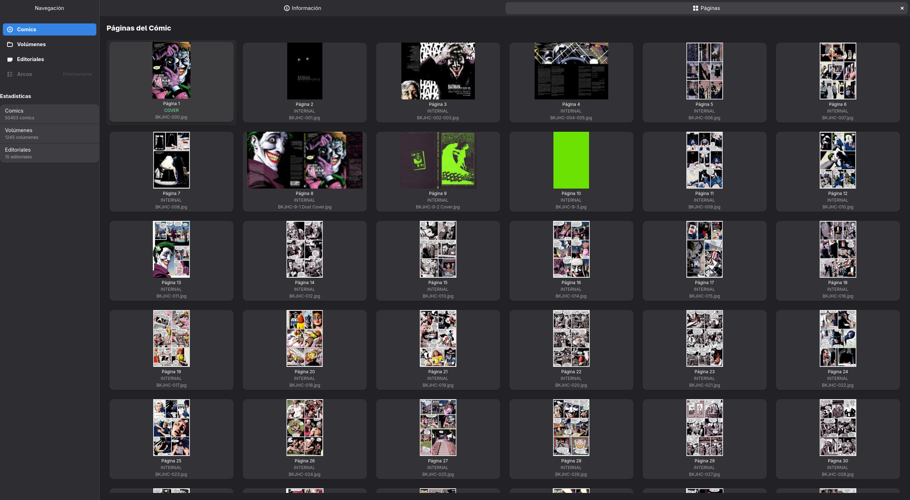

# Vista de Detalle del Cómic

Esta ventana ofrece una visión profunda y técnica de un archivo de cómic específico dentro de la biblioteca. Permite revisar metadatos técnicos, gestionar la ubicación física del archivo y administrar la estructura interna de sus páginas.

**Navegación:**
* **Acceso:** Desde la rejilla principal, haz **doble clic** sobre una portada o selecciona **Clic derecho > Ver detalles**.
* **Salida:** Presiona la tecla **`Esc`** (Escape) para cerrar el detalle y regresar inmediatamente al listado principal.

---

## 1. Pestaña de Información

Es la vista predeterminada al abrir los detalles. Muestra los datos técnicos del archivo físico y sus metadatos básicos.

### **Datos del Archivo**
En la sección superior se presentan los datos inmutables del recurso:

* **Portada Grande:** Visualización ampliada de la imagen designada actualmente como carátula.
* **Nombre del Archivo:** El nombre del archivo (sin la ruta), tal como figura en el disco.
* **ID:** Identificador interno único asignado por BabelComics4.
* **Estado:** Indica si el cómic ha sido procesado (ej. "Clasificado" o "Sin clasificar").
* **Calidad:** Valoración técnica del escaneo, en una escala de 0 a 5 estrellas:
    * *0 estrellas:* Escaneo de baja calidad o antiguo.
    * *5 estrellas:* Calidad Digital HD (estándar moderno).
* **En papelera:** Indica si el archivo está marcado para eliminación (Sí/No).
* **Archivo (Full Path):** Muestra la ruta completa de almacenamiento en el disco duro.

### **Acciones Rápidas**
* **Leer Cómic (Botón Azul):** Abre el visor integrado para comenzar la lectura. [Ver documentación del Lector](lector_comic.md).
* **Abrir Carpeta (Botón Gris):** Abre el administrador de archivos de tu sistema operativo (Explorer, Finder, Nautilus, etc.) directamente en la carpeta que contiene este cómic.

### **Información de Catalogación**
*(Visible solo si el cómic está clasificado)*
Ubicada en la parte inferior, esta sección muestra metadatos enriquecidos, como el **ID de ComicBookInfo**, vinculando el archivo local con la base de datos externa.

---

## 2. Pestaña de Páginas

Esta pestaña permite visualizar y gestionar la estructura interna del archivo (CBZ/CBR). El sistema descompone el cómic mostrando una miniatura por cada página.

> **Nota de Rendimiento:** La carga de miniaturas utiliza **hilos de procesamiento en paralelo**. Esto permite visualizar cómics extensos (600-800 páginas) sin que la aplicación se congele o bloquee, manteniendo la interfaz fluida mientras se generan las imágenes.

### **Gestión de Portadas y Tipos de Página**
Cada miniatura tiene una etiqueta que indica su tipo actual: **COVER** (Portada) o **INTERNAL** (Página interna).

**Funcionalidad:**
Si el escaneo original tiene páginas de publicidad o portadillas antes de la portada real, puedes corregirlo aquí:

1.  Haz **clic derecho** sobre la miniatura deseada.
2.  Se desplegará un menú contextual (popover).
3.  Selecciona el tipo de página:
    * **Cambiar a Cover:** Marca esta imagen como la portada oficial del cómic.
    * **Cambiar a Página:** Convierte una portada en una página interna común.

> **⚠️ Importante: Regenerar Portada**
> Si cambias la portada en esta pantalla, el cambio es interno. Para que se refleje en la biblioteca principal:
> 1. Vuelve a la **Ventana Principal**.
> 2. Haz clic derecho sobre este cómic.
> 3. Selecciona la opción **"Regenerar Portada"**.
> Esto actualizará la miniatura en la rejilla general.