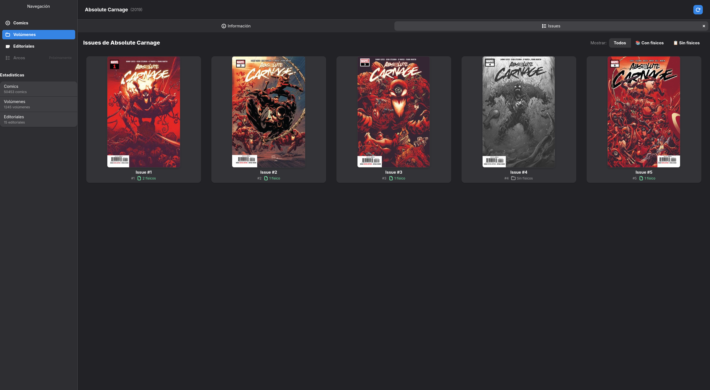
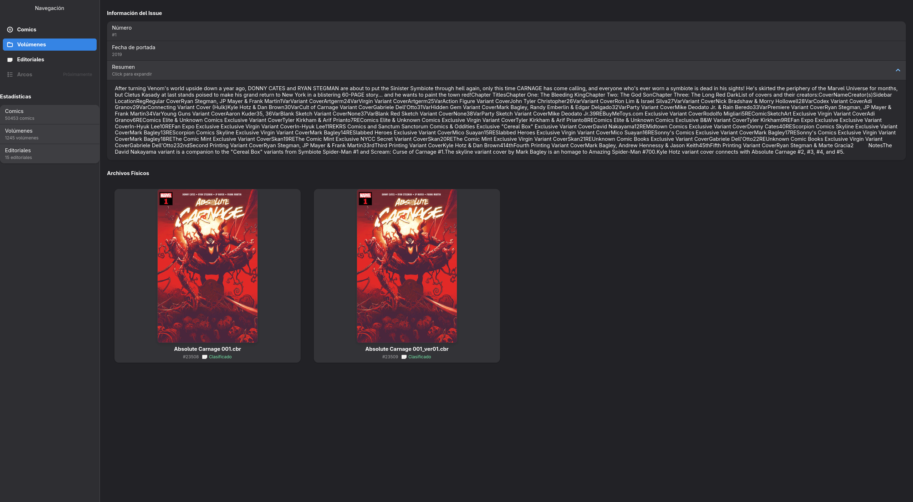

# Vista de Detalle del Volumen

Esta ventana funciona como el centro de control para una serie completa. Permite visualizar la información global del volumen, su estado de completitud y gestionar los números (*issues*) individuales asociados.

**Acceso:** Desde la vista de "Volúmenes" en la ventana principal, haz **doble clic** sobre cualquier tarjeta para abrir este detalle.

---

## 1. Pestaña de Información

Es la pantalla inicial. Muestra los metadatos generales de la serie obtenidos de Comic Vine y el estado de tu colección respecto a ella.

### **Cabecera y Métricas**
* **Resumen (Caja superior):** Espacio reservado para notas breves o *taglines* de la serie.
* **Título del Volumen:** Nombre oficial de la serie (Ej: *Absolute Carnage*).
* **ID:** Identificador interno en BabelComics4.
* **Año de inicio:** Fecha de publicación del primer número.
* **Total de números:** Cantidad de *issues* que componen la colección oficial.
* **Completitud:** Porcentaje que indica qué tan completa está tu colección local respecto a la oficial. (Ej: *4/5 (80.0%)* significa que tienes 4 archivos físicos de los 5 que existen).
* **URL:** Enlace directo a la ficha del volumen en la web de Comic Vine.

### **Detalles Adicionales**
* **Descripción:** Sinopsis completa de la trama o la serie.
* **Editorial:** Información sobre la casa publicadora (Ej: Marvel, DC).

---

## 2. Pestaña Issues (Números)

Esta pestaña despliega la grilla completa de números que componen el volumen. Es la herramienta principal para auditar qué tienes y qué te falta.

### **Indicadores Visuales de Estado**
El sistema utiliza un código visual para facilitar la gestión rápida:

* **Imágenes en Blanco y Negro:** Indican números que **NO** tienes en tu biblioteca. No hay ningún archivo físico asociado a este *issue*.
* **Imágenes a Color:** Indican números que **SÍ** tienes catalogados (existe al menos un archivo físico vinculado).

### **Filtros de Visualización**
Ubicados arriba a la derecha, permiten refinar la vista para tareas específicas:
* **Todos:** Muestra la grilla completa.
* **Con físicos:** Muestra solo lo que ya tienes.
* **Sin físicos:** Muestra solo lo que te falta.

---

## 3. Detalle del Issue Individual (Portadas y Variantes)

Al hacer clic en cualquier tarjeta de la pestaña "Issues" (ya sea en color o blanco y negro), se accede a esta vista intermedia que profundiza en la información editorial del número antes de mostrar los archivos locales.

### **Información Editorial**
En la columna derecha se presentan los datos oficiales:
* **Título y Número:** Identificación del issue.
* **Año:** Año de publicación.
* **Cómics Físicos:** Contador que indica cuántos archivos tienes asociados. Incluye un botón o enlace (Ej: *"Ver 2 comic(s) fisico(s)"*) para saltar a la lista de archivos locales.
* **Enlace Externo:** Hipervínculo directo a la ficha de este *issue* en Comic Vine.
* **Resumen:** Sinopsis de la trama.

### **Carrusel de Portadas (Covers & Variants)**
La parte izquierda destaca por un visualizador interactivo.
* **Funcionalidad:** Muestra la portada principal y permite desplazarse entre **todas las portadas variantes** (Alternative Covers) que se publicaron para este número.

> **🧠 Nota de Inteligencia Artificial (Embeddings):**
> BabelComics4 no solo descarga estas imágenes para mostrarlas. El sistema **calcula un "embedding" (huella digital) para CADA portada variante**.
>
> **¿Por qué es importante?**
> Esto permite que el sistema de clasificación automática reconozca tu archivo de cómic incluso si tu versión digital tiene una portada variante rara o exclusiva, y no la portada estándar.

---

## 4. Archivos Físicos Asociados

Si posees archivos para este número, se listarán en la parte inferior (o al hacer clic en el botón de ver físicos).

* **Lista de Archivos:** Muestra las tarjetas de los archivos locales (CBR/CBZ) vinculados a este metadato.
* **Lectura:** Haciendo **doble clic** sobre cualquiera de ellos, se abrirá el [Lector de Cómics](lector_comic.md).