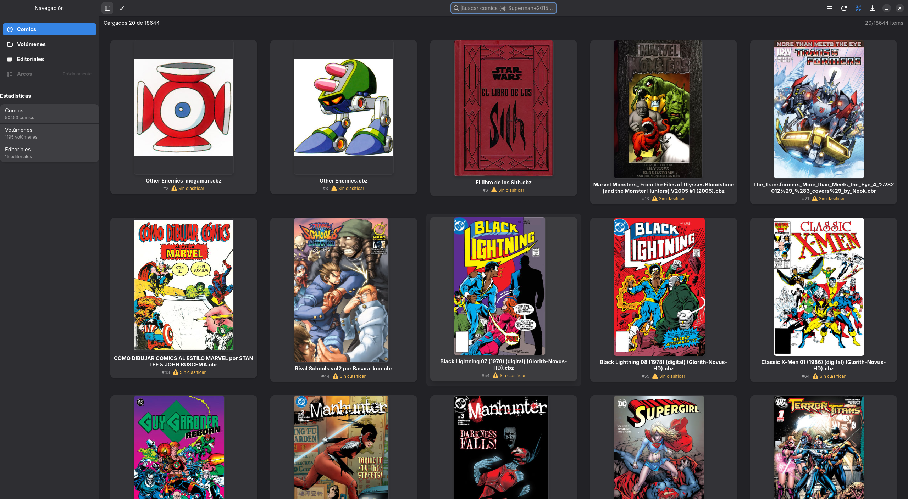
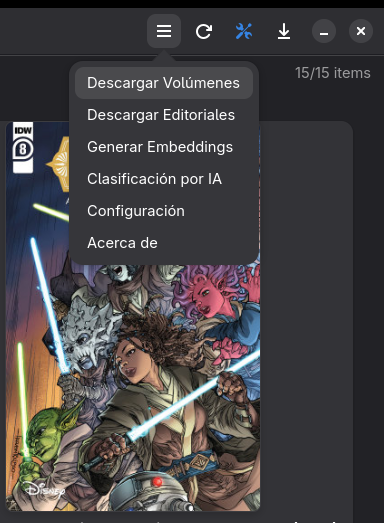

# Ventana Principal de BabelComics4

La ventana principal de BabelComics4 es la interfaz central desde la cual se accede a todos los recursos y funcionalidades del sistema.

Desde esta pantalla, el usuario puede:

- Navegar entre los diferentes tipos de recursos: **Cómics**, **Volúmenes** y **Editoriales**.
- Revisar portadas y metadatos asociados.
- Consultar estadísticas generales de la biblioteca.
- Utilizar la barra de búsqueda con operadores avanzados para localizar recursos.
- Identificar rápidamente el estado de clasificación de cada cómic.
- Iniciar flujos de trabajo tales como clasificación automática, revisión manual o edición.

Esta ventana funciona como tablero principal de la aplicación, integrando en un solo lugar la exploración, filtrado y acceso a todos los elementos gestionados por BabelComics4.

---

## 1. Panel de Navegación Lateral

El panel de navegación lateral permite acceder a los distintos tipos de recursos administrados por la aplicación. Cada vista muestra información diferente según su naturaleza:

### **1.1 Cómics**
Esta vista muestra únicamente los archivos locales almacenados en el sistema, específicamente en formatos **CBZ y CBR**.
Desde aquí se puede:
- Navegar entre todos los cómics cargados.
- Ver su estado (clasificado, sin clasificar, omitido).
- Acceder al detalle de cada archivo.
- Iniciar procesos automáticos de clasificación o revisión.

> **Nota:** Esta vista siempre muestra archivos reales existentes en el dispositivo. No incluye datos provenientes de Comic Vine.

---

### **1.2 Volúmenes**
Esta vista muestra la metadata descargada desde Comic Vine sobre series o colecciones.
Incluye:
- Nombre del volumen
- Año de inicio
- Número total de issues
- Editorial vinculada

Los volúmenes representan la estructura oficial del catálogo, más allá de los archivos locales del usuario.

> **Para saber cómo cargar y actualizar estos datos:** Consulta la documentación de la [Ventana de Descarga de Volúmenes](Descargar_volumenes_Comicvine.md).

---

### **1.3 Editoriales**
Esta vista muestra las editoriales registradas en Comic Vine, con su metadata correspondiente.
Permite:
- Ver editoriales disponibles
- Navegar sus volúmenes asociados
- Organizar la colección por origen editorial

---

### **1.4 Estadísticas**
Muestra un resumen numérico de la biblioteca (visible en la parte inferior del panel):
- **Cantidad total de cómics**
- **Cantidad total de volúmenes**
- **Cantidad total de editoriales**

---

## 2. Encabezado Superior y Herramientas

El encabezado presenta las herramientas principales de gestión, visualización y búsqueda.

### **2.1 Controles de Visualización (Izquierda)**

Ubicados a la izquierda de la barra de búsqueda, estos dos botones permiten ajustar el área de trabajo y el modo de interacción.

#### **A. Alternar Panel Lateral (Sidebar Toggle)**
Este botón permite mostrar u ocultar el Panel de Navegación Lateral (descrito en la sección 1).
* **Función:** Al ocultar el panel, se expande el área de la grilla principal.
* **Beneficio:** Permite ganar espacio en pantalla para visualizar más columnas de cómics simultáneamente.

#### **B. Modo Selección**
Permite cambiar el comportamiento de la interfaz para realizar acciones sobre múltiples elementos a la vez.
* **Activación:** Se puede activar haciendo clic en el botón con el ícono de "Check" o mediante el atajo de teclado **`Ctrl + M`**.

> **Comportamiento del Modo Selección:**
> Cuando este modo está activo, la interfaz cambia visualmente para facilitar la gestión en lote:
> * Aparece un **checkbox** en la esquina superior derecha de cada tarjeta.
> * Al seleccionar un cómic, la tarjeta se resalta con un **borde azul** y el checkbox se marca.
> * Se habilita un **menú contextual (popover)** con opciones grupales.
>
> 
>
> **Acciones disponibles en lote:**
> * **Catalogar cómics:** Inicia el proceso de catalogación manual para los items seleccionados.
> * **Clasificar cómics por IA:** Envía los items seleccionados a la cola de procesamiento automático.
> * **Mover items a papelera:** Elimina o descarta los archivos seleccionados.

---

### **2.2 Barra de búsqueda (Centro)**
La barra de búsqueda permite localizar elementos filtrando por los **campos principales** de la vista activa.

La funcionalidad de búsqueda está unificada y siempre opera sobre la información clave del recurso seleccionado (Cómics, Volúmenes o Editoriales), permitiendo localizar elementos rápidamente mediante texto libre.

---

### **2.3 Comportamiento de la búsqueda según la vista**

#### **Vista Cómics**
En esta vista, la búsqueda examina simultáneamente los siguientes campos de los archivos locales:
1.  **Título** del cómic.
2.  **Nombre de la Editorial**.
3.  **Nombre del Volumen**.
4.  **Ruta completa del archivo (Full Path):** Permite encontrar cómics buscando por carpetas o nombres de archivo específicos.

*Ejemplos:* `supergirl`, `carpeta_descargas`, `transformers - idw`.

#### **Vista Volúmenes**
Busca sobre el nombre principal del volumen descargado desde Comic Vine.

> **Caso especial:** Las búsquedas simples se separan en palabras. Por ejemplo, `x-men` se interpreta como `x` y `men`.

Para obtener correctamente resultados de "X-Men", se debe usar:
`x + men`

*Ejemplos adicionales:* `marvel + knights`, `batman - detective`.

#### **Vista Editoriales**
Busca sobre el nombre de la editorial.
*Ejemplos:* `press`, `marvel - comics`.

---

### **2.4 Operadores de búsqueda**

#### **Operador AND (`+`) — búsqueda por palabras independientes**
Permite buscar varias palabras sin importar el separador existente en el título.
*Ejemplo:* `invincible + ironman`
Coincide con: *Invincible Ironman*, *Invincible-Ironman*, *Invincible_Ironman*.

#### **Operador NOT (`-`) — exclusión**
Excluye resultados que contengan una palabra.
*Ejemplo:* `hulk - thor` (Muestra resultados de Hulk que no contengan Thor).

#### **Resumen práctico**

| Situación | Operador recomendado | Ejemplo |
| :--- | :--- | :--- |
| Buscar coincidencia exacta con separadores conocidos | Búsqueda simple | `invincible ironman` |
| Buscar palabras sin importar separadores | `+` | `invincible + ironman` |
| Evitar falsos positivos en nombres compuestos (X-Men) | `+` | `x + men` |
| Excluir una palabra del resultado | `-` | `spider - amazing` |

---

### **2.5 Indicador de carga (Derecha)**
Ejemplo: **Cargados 20 de 18.644**

Refleja cuántos elementos se han cargado visualmente en la grilla. A medida que el usuario hace scroll, la aplicación continúa cargando cómics dinámicamente.

---

### **2.6 Barra de Herramientas del Sistema (Extremo Derecho)**

En la esquina superior derecha se encuentran los accesos a las funciones globales de mantenimiento, filtrado y configuración.

#### **Botones de la barra:**
1.  **Menú Principal (Hamburguesa):** Despliega el menú global con las siguientes opciones:
    * **Descargar Volúmenes:** Abre la ventana para obtener metadata de series desde Comic Vine.
    * **Descargar Editoriales:** Inicia la actualización del catálogo de editoriales.
    * **Generar Embeddings:** Ejecuta el proceso de cálculo de firmas digitales para reconocimiento de imágenes.
    * **Clasificación por IA:** Acceso directo a las herramientas de inteligencia artificial.
    * **Configuración:** Abre el panel de preferencias de BabelComics4.
    * **Acerca de:** Información de la versión y créditos.
2.  **Refrescar (Flecha circular):** Recarga la vista actual y actualiza el listado de cómics desde el disco.
3.  **Filtros Avanzados (Icono de herramientas azul):** Despliega un panel con opciones de filtrado específicas para la vista actual. Estas opciones cambian dinámicamente según el recurso que se esté explorando:
    * **Si estás en Cómics:** [Ver Filtros Avanzados para Cómics](filtros_avanzados_comics.md)
    * **Si estás en Volúmenes:** [Ver Filtros Avanzados para Volúmenes](filtros_avanzados_volumenes.md)
    * **Si estás en Editoriales:** [Ver Filtros Avanzados para Editoriales](filtros_avanzados_editorial.md)
4.  **Descargas (Icono flecha abajo):** Muestra el estado o cola de descargas activas.
5.  **Controles de Ventana:** Botones estándar para minimizar y cerrar la aplicación.

---

## 3. Área Principal de Contenido (Grilla de Cómics)

La sección principal muestra una rejilla de portadas. Cada tarjeta representa un cómic.

### **3.1 Elementos de cada tarjeta**
- **Portada:** miniatura del archivo.
- **Nombre del archivo:** (Ej: *Other Enemies-megaman.cbz*).
- **ID interno:** Identificador único en la base de datos (Ej: *#352*).
- **Estado:** Indicador visual (Ej: Icono de alerta amarillo para "Sin clasificar").

La distribución de columnas es responsive y se ajusta al ancho de la ventana.

---

## 4. Interacción y Menús Contextuales

BabelComics4 ofrece diferentes opciones dependiendo de si se interactúa con un solo cómic o con un grupo de ellos.

### **4.1 Scroll infinito**
La aplicación carga más cómics automáticamente a medida que el usuario se desplaza hacia abajo, permitiendo manejar grandes colecciones sin paginación manual.

### **4.2 Menú de Acciones Individuales (Popover Simple)**
Al interactuar con un único cómic (fuera del "Modo Selección"), se despliega un menú contextual con opciones específicas para la gestión granular de ese archivo.

Este menú incluye herramientas exclusivas que no están disponibles en la selección masiva:

* **Leer Comic:** Abre el visor de lectura para disfrutar del contenido.
* **Catalogar:** Abre la ficha de edición para asignar metadatos manualmente.
* **Clasificar por IA:** Envía este único cómic a la cola de procesamiento de inteligencia artificial.
* **Regenerar Portada:** Fuerza la creación de una nueva miniatura (útil si la portada actual se ve negra, corrupta o incorrecta).
* **Mover a papelera:** Elimina el archivo del sistema.
* **Ver detalles:** Accede a la vista completa de información técnica y metadatos del cómic.

---

## 5. Descripción general

La Vista de Cómics funciona como un explorador visual rápido y eficiente. Permite recorrer la biblioteca completa, identificar archivos pendientes de clasificación (marcados con advertencia amarilla) y trabajar con miles de portadas sin pérdida de rendimiento, ofreciendo herramientas tanto para la lectura individual como para la gestión masiva de la colección.